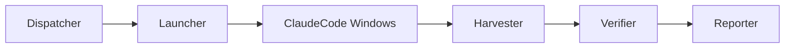

# Tianting-Lite (v0.2-MVP)

[](https://github.com/kokomida/tianting-lite/actions)
[](https://opensource.org/licenses/MIT)

AI-driven personal productivity platform —— "一句话，召唤一支 AI 开发团队"。

## ⚡ Quick Start

```bash
# 1. 安装依赖
pnpm install
pip install -r requirements.txt

# 2. 配置环境
cp .env.example .env
# 编辑 .env 填入你的 API 密钥

# 3. 运行完整流水线
pnpm start
```

> `pnpm start` 会自动执行完整的 AI 开发流水线：规划 → 编码 → 测试 → 报告，并在 `delivery/report.md` 生成交付报告。

## 🏗️ 架构概览



5个核心模块实现「一句话 → 可交付项目」的完整流水线：

| 模块 | 职责 | 技术栈 |
|------|------|--------|
| **Dispatcher** | 需求解析，生成OES任务 | Node.js + AI |
| **Launcher** | 并发启动Claude Code窗口 | tmux + child_process |
| **Harvester** | 监控变化，自动测试 | chokidar + pytest |
| **Verifier** | 多阶段验收测试 | Docker + shell |
| **Reporter** | 汇总交付报告 | Markdown + ZIP |

## 📖 文档

- 📋 [项目路线图](docs/00-roadmap.md) - 版本规划与里程碑
- 🎯 [需求分析](docs/01-requirements-analysis.md) - FR/NFR与优先级
- 🏛️ [架构设计](docs/03-overall-design.md) - 系统架构与模块关系
- ⚙️ [技术选型](docs/04-technical-selection.md) - 技术栈与依赖策略
- 📝 [OES规范](docs/06-oes-spec.md) - 任务定义标准
- 🧪 [测试计划](docs/07-testing-plan.md) - 质量保证策略
- 🛠️ [CLI使用指南](docs/cli-usage.md) - MemoryHub CLI 工具
- 🔒 [资源管理](docs/resource-management.md) - 内存与文件句柄管理

完整文档索引：[docs/index.md](docs/index.md)

## 🚀 开发指南

### 核心命令
```bash
# 开发模式
pnpm dev

# 代码检查
pnpm run lint

# 运行测试
pnpm test

# 生成规划
pnpm run plan "创建一个FastAPI Todo应用"

# 手动执行各阶段
pnpm run launch    # 启动AI窗口
pnpm run harvest   # 监控测试
pnpm run report    # 生成报告
```

### 贡献代码
请阅读 [CONTRIBUTING.md](CONTRIBUTING.md) 了解开发流程、代码规范和提交要求。

## 📊 项目状态

当前版本：**v0.2-MVP** (Demo可用)

- ✅ 核心流水线已实现
- ✅ FastAPI示例验证通过  
- 🔄 多AI评审系统 (v0.3计划)
- 📋 桌面UI界面 (v0.4计划)

详细进度：[docs/10-retrospective.md](docs/10-retrospective.md)

## 🤝 社区

- 💬 [GitHub Discussions](https://github.com/kokomida/tianting-lite/discussions) - 交流讨论
- 🐛 [Issues](https://github.com/kokomida/tianting-lite/issues) - 问题反馈
- 📖 [Wiki](https://github.com/kokomida/tianting-lite/wiki) - 知识库

## 📄 许可证

[MIT License](LICENSE) - 详见许可证文件。

---
*Maintained by AI PM & Developer Assistants with ❤️* 