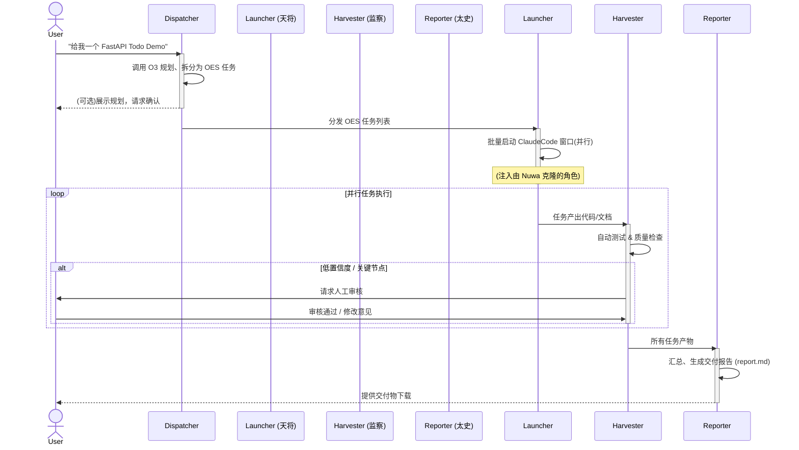
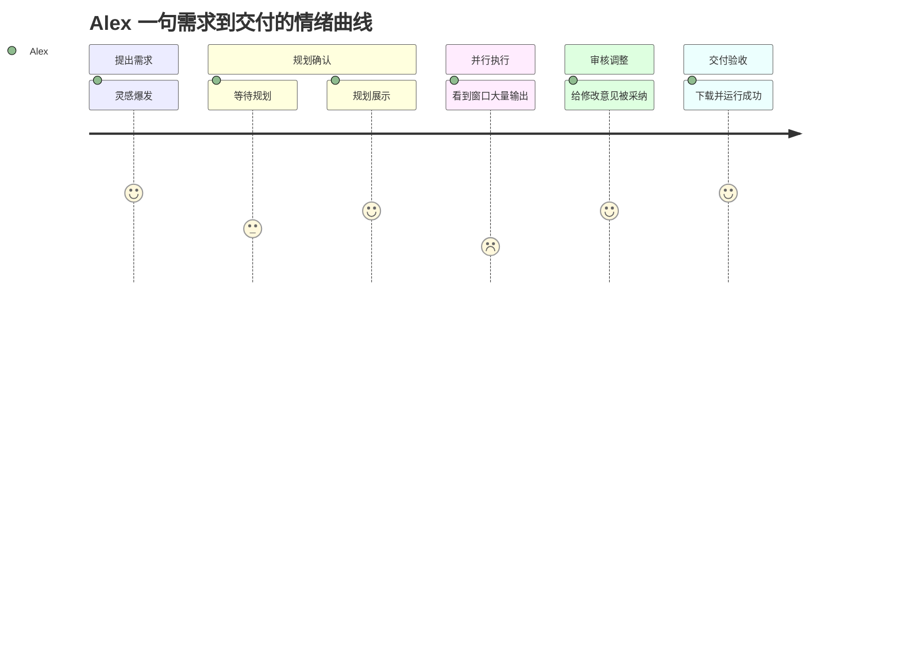

<!-- status: done -->
# 02. 用户旅程 (User Journey)

> 本章定义了不同类型的用户如何与「天庭」系统交互，以完成他们的核心目标。

## 1. 用户画像 (Persona)

为了确保设计和开发始终围绕真实需求，我们定义了三个核心用户画像：

| 画像 | 角色 | 核心诉求 (Pain Point) | 使用「天庭」的目标 (Goal) |
| :--- | :--- | :--- | :--- |
| **P1** | **个人开发者 (Alex)** | 厌倦了为每个新想法重复搭建环境、编写大量样板代码。时间宝贵，希望专注于核心业务逻辑。 | **一句话生成原型**：快速验证技术方案或业务想法，获得可运行、结构良好的项目骨架。 |
| **P2** | **计算机系学生 (Bella)** | 面对课程项目或毕业设计，对如何应用规范的软件工程方法感到困惑，缺乏实践经验。 | **学习与实践**：借助 AI 辅助，理解从需求到代码的完整流程，学习最佳实践，并生成高质量的参考代码。 |
| **P3** | **产品经理 (Chris)** | 具备产品和业务思维，但技术能力有限。需要快速构建可交互的技术原型（PoC）来向团队或客户演示。 | **快速构建 PoC**：通过自然语言描述需求，将产品设想转化为可交互的、功能正确的应用，无需编写一行代码。 |

## 2. 核心用户旅程：一句话需求到交付物

本节使用泳道图（Sequence Diagram）描述一个典型的用户旅程。

### 旅程分解说明：

1.  **需求提出 (User → Dispatcher)**：用户以自然语言提出一个模糊或明确的需求。
2.  **规划与拆分 (Dispatcher)**：调度器调用大模型（如 O3）进行意图理解、技术选型，并将宏大目标拆解成一系列结构化的、可执行的 OES 任务。此阶段可能需要与用户交互以澄清需求。
3.  **并行执行 (Launcher)**：启动器根据 OES 任务列表，像"天将"一样，并发地启动多个 ClaudeCode 窗口，每个窗口被赋予一个具体的角色（通过 Nuwa 克隆）和任务（注入的 Prompt）。
4.  **持续集成与验证 (Harvester)**：监察模块像代码世界的"纪委"，实时监控工作区中生成的代码，自动运行单元测试、代码规范检查等质量门禁。对于需要人工决策的环节（如 API 设计确认），它会主动暂停并请求用户审核。
5.  **汇总与交付 (Reporter)**："太史官"模块在所有任务完成后，自动收集所有产物（代码、文档、测试结果），整理成一份优雅的 Markdown 报告和可直接运行的项目压缩包，最终交付给用户。

这个闭环流程将用户从繁琐的实现细节中解放出来，使其能专注于"提出问题"和"验证结果"。 

## 3. Persona Journey 分阶段体验

### 3.1 个人开发者 (Alex)
| 阶段 | 用户目标 | 用户操作 | 系统响应 | 情绪/痛点 | 机会点 |
|------|----------|----------|----------|----------|--------|
| 触发需求 | 将灵感快速变成代码原型 | 打开 CLI 输入一句需求 | Dispatcher 输出规划草稿 (<5s) | 好奇伴随怀疑 | 提供成功案例或 Demo 提升信任 |
| 规划确认 | 明确技术栈与产物范围 | 浏览规划，点击"确认" | Launcher 开窗执行 | 逐渐放心 | 高亮里程碑 & ETA 让等待可预期 |
| 并行执行 | 监控进度 | 查看实时进度条 | Harvester 推送测试状态 | 略焦虑 | WebSocket 日志流可切换详细/简洁 |
| 审核调整 | 把控关键设计决策 | 当置信度低时给意见 | AI 重跑子任务 | 成就感 | One-Click "接受全部建议" |
| 交付验收 | 拿到可运行项目 | 下载 report.zip | Reporter 输出 Markdown+ZIP | 满意 | 一键推 GitHub / Vercel 部署 |

### 3.2 计算机系学生 (Bella)
| 阶段 | 用户目标 | 用户操作 | 系统响应 | 情绪/痛点 | 机会点 |
|------|----------|----------|----------|----------|--------|
| 触发需求 | 完成课程项目选题 | 输入题目需求 | 规划展示 UML+技术选型 | 不确定 | 自动推荐学习资料链接 |
| 规划确认 | 学习最佳实践 | 点击"展开细节" | 显示分层架构解释 | 求知 | Tooltip 补充规范引用 |
| 并行执行 | 观察代码生成 | 关注 Claude 代码片段 | 测试覆盖率实时更新 | 兴奋 | Code Walkthrough 视频 |
| 审核调整 | 理解测试失败原因 | 阅读 pytest 输出 | AI 解说错误并建议 | 困惑 | 一键"修复并解释"按钮 |
| 交付验收 | 生成报告提交老师 | 下载 report.md | 格式符合 IEEE | 轻松 | 导出 PDF/LaTeX 模板 |

### 3.3 产品经理 (Chris)
| 阶段 | 用户目标 | 用户操作 | 系统响应 | 情绪/痛点 | 机会点 |
|------|----------|----------|----------|----------|--------|
| 触发需求 | 验证商业想法 | 在 UI 聊天框输入需求 | 快速规划展示商业可行性提示 | 激动 | 商业模板推荐 ROI 计算 |
| 规划确认 | 理解用户流程 | 查看 Journey Wireframe | UI 原型图 + API 列表 | 满足 | 连接 Figma 快速预览 |
| 并行执行 | 关注核心功能 | 观看任务看板 | 显示关键进度 TopBar | 焦虑 | "风险预警"弹窗提前通知 |
| 审核调整 | 做产品决策 | 批准/否决设计点 | 系统标记更改 | 掌控感 | AB 测试生成对比文档 |
| 交付验收 | 展示可交互 PoC | 点击"启动 Demo" | 自动启动本地服务器 | 自豪 | 一键录屏 Demo |

## 4. Success Metrics (关键成功指标)
| 阶段 | 指标 | 目标值 | 备注 |
|------|------|--------|------|
| Dispatcher | 规划时长 | \<= 5 s | 用户等待时间 |
| Launcher | 上窗成功率 | \>= 99% | CLI exit code=0 |
| Harvester | 测试通过率 | \>= 90% | 第一次运行 |
| Reporter | 报告构建时间 | \<= 10 s | 压缩+渲染 |
| 整体 | 用户 NPS | \>= 60 | 交付后调查 |

## 5. 本章 Checklist
- [x] Persona 定义
- [x] 核心泳道图
- [x] Persona Journey 表
- [x] Success Metrics
- [ ] 未来：异常分支示例
- [x] 与 User Story 映射表 (见 docs/03a-user-story.md)

## 6. 用户情绪曲线 (Emotion Curve)

*图 6-1* 示意了个人开发者（Alex）在各阶段的情绪高低（1=极差,5=极好），学生和产品经理的情绪变化类似，数据详见附录。

## 7. 服务蓝图 (Service Blueprint)

| 阶段 | 用户可见界面 (Frontstage) | 支撑流程 (Backstage) | 支持系统 | 触点 & 工具 |
|------|---------------------------|-----------------------|-----------|--------------|
| 提出需求 | CLI / UI 输入框 | Dispatcher 调用 O3 | O3 API, SQLite | Terminal / Electron |
| 规划确认 | 规划 Markdown 输出 | Dispatcher 写 tasks | Nuwa, tasks.sqlite | Markdown Viewer |
| 并行执行 | 任务进度条 | Launcher 开窗, ClaudeCode 执行 | tmux, ClaudeCode CLI | WebSocket UI |
| 质量评审 | 测试结果、Reviewer 反馈 | Harvester + ReviewAgents | pytest, ESLint, GPT-4 | Terminal / Web UI |
| 交付验收 | 下载 report.zip | Reporter 打包 | Pandoc, zip | Browser save |

*表 7-1* 显示了前台可见步骤与后台支撑动作以及所依赖的系统。

## 8. 更新 Checklist
- [x] Persona 定义
- [x] 核心泳道图
- [x] Persona Journey 表
- [x] Success Metrics
- [x] Emotion Curve
- [x] Service Blueprint
- [ ] 异常分支示例
- [x] 与 User Story 映射表 (见 docs/03a-user-story.md) 