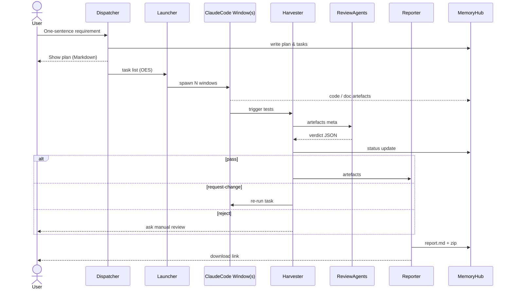
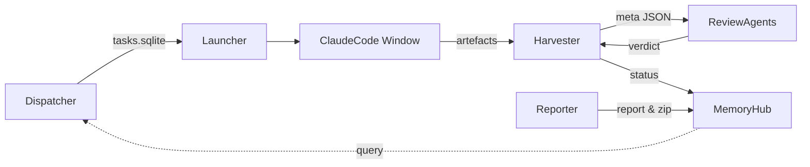

<!-- status: done -->
# 03. 总体设计 (Overall Design)

> 本章给出 Tianting-Lite v0.x 的高层架构视图，覆盖运行链路、功能模块切分与部署拓扑。遵循 IEEE-42010"架构描述"与 C4 Model 的 Context / Container 视角。

---

## 3.1 运行链路 (End-to-End Workflow)

下图整合了 **v0.3 ASCII 图** 与 **v0.2 运行链路**，展示"一句话需求 → Artefact 交付"的全流程。



*图 3-1* Tianting-Lite 端到端时序图。

---

## 3.2 功能模块视图 (Container View)



*图 3-2* 五大核心模块及数据流。

| 模块 | 职责 | 主要技术 | 关键接口 |
|------|------|---------|-----------|
| Dispatcher | 解析需求、生成 OES、写任务表 | OpenAI/O3, SQLite | `plan(sentence)` → OES JSON |
| Launcher | 并发启动 ClaudeCode 窗口 | Node child_process / tmux | `spawn(task_id)` |
| Harvester | CI / 测试 / Gate | pytest, pylint | `harvest(task_id)` |
| ReviewAgents | 多 AI 评审 | GPT-4, eslint-gpt | `review(meta)` → verdict |
| Reporter | 汇总 artefacts 输出报告 | Pandoc, JSZip | `build(task_id)` |
| MemoryHub | 持久化四层记忆 | SQLite, JSONL, XML | REST/IPC 查询 |

---

## 3.3 部署拓扑 (Deployment Topology)

```mermaid
graph TD
  subgraph Host OS (Win/macOS/Linux)
    subgraph Container: tianting-core
      Dsp[Dispatcher]
      Lch[Launcher]
      Hrv[Harvester]
      Rpt[Reporter]
      MHub[MemoryHub(SQLite/JSONL)]
    end
    subgraph Native
      CC[ClaudeCode CLI]
      Editor[tmux / terminal]
    end
  end
  Dsp-->Lch
  Lch-->CC
  CC-->Hrv
  Hrv-->Rpt
  MHub<-->|IPC|Dsp
  CC<-->|stdin/out|Editor
```

*图 3-3* 单机部署：核心模块在 Node 进程；ClaudeCode 以本地 CLI 运行，MemoryHub 嵌入式 SQLite。云部署时可将 MemoryHub & ReviewAgents 拆成独立 Docker 服务。

---

## 3.4 质量属性与设计权衡
| 属性 | 设计手段 | 备注 |
|------|----------|------|
| 性能 | 并行 Launcher + 稀疏 AI 评审 | 窗口数 <= CPU 核心*2 |
| 可维护 | 模块化 & Adapter 层 | 替换 ClaudeCode → VSCode-AI |
| 可扩展 | ReviewAgents 插件 | YAML 注册表加载 |
| 可观测 | Prometheus Exporter | metrics: task_duration_seconds |
| 安全 | 本地运行 / 无遥测 | 可配置 Proxy |

---
> **版本记录**：overall-design-init 2025-07-04 