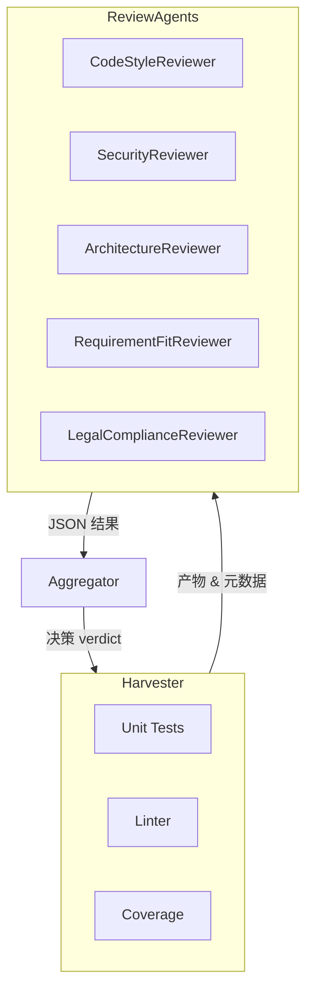
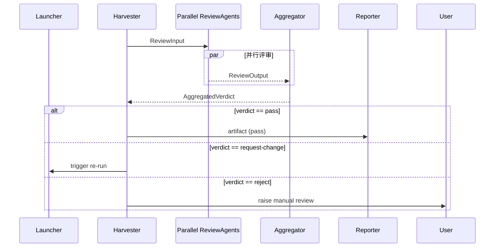
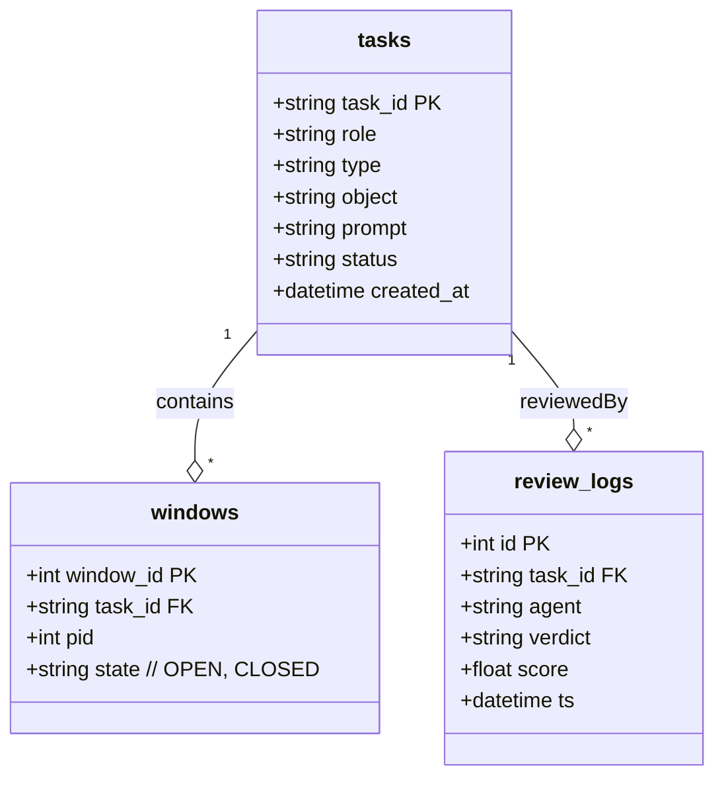
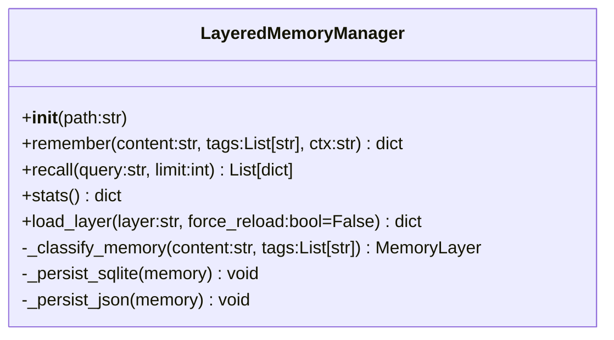
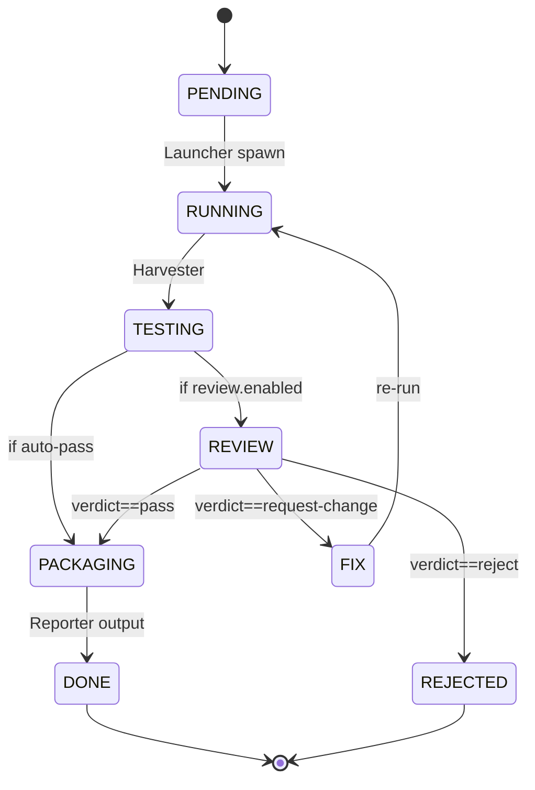
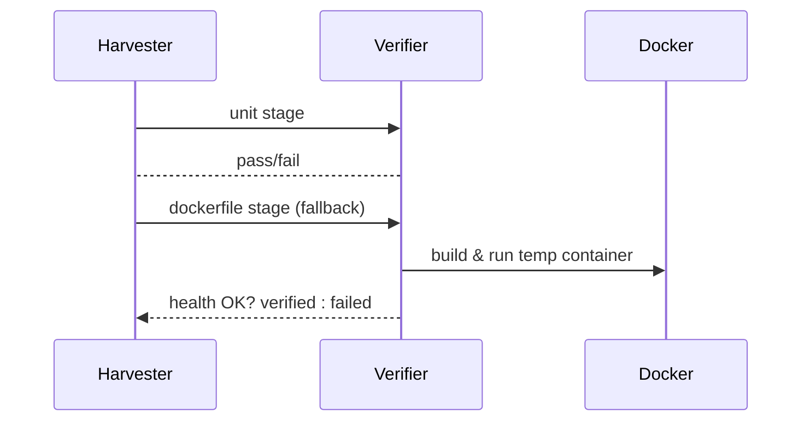

<!-- status: in_progress -->
# 05. 详细设计 (Detailed Design)

> 本章遵循 IEEE 1016-2009 软件设计说明书规范，采用分层视图（模块图、时序图、数据结构）对 Tianting-Lite 的关键实现进行说明。

---

## 5.1 模块视图 (Module View)

### 5.1.1 AI 多专家评审子系统 (ReviewAgents)

本子系统负责在 Harvester 完成基础 CI 之后，自动对产物进行多维度审查，并给出合并/修改/拒绝建议。



*图 5-1* ReviewAgents 模块关系图。

- **Harvester**：生成 `build/<task_id>/artifact.json`，包含源代码路径、测试结果等。
- **ReviewAgents**：并行运行 N 条独立流程，每个流程可在独立 ClaudeCode 窗口、子进程或线程内执行。
- **Aggregator**：聚合各 Reviewer 结果，输出统一 verdict(`pass` `request-change` `reject`) 与置信得分。

### 5.1.2 关键数据结构
```typescript
interface ReviewInput {
  taskId: string;
  artifactsPath: string;
  summary: string;      // Harvester 生成的简要描述
}

interface ReviewOutput {
  agent: string;        // reviewer name
  verdict: "pass" | "request-change" | "reject";
  score: number;        // 0 ~ 1 置信度
  comments: string[];
}

interface AggregatedVerdict {
  taskId: string;
  verdict: "pass" | "request-change" | "reject";
  avgScore: number;
  details: ReviewOutput[];
}
```

---

## 5.2 时序视图 (Sequence View)



*图 5-2* 多专家评审时序图。

---

## 5.3 配置与策略

配置由 `tianting-lite.yaml` 提供，示例：
```yaml
review:
  enabled: true
  agents:
    - code-style
    - security
    - architecture
  strategy: weighted-average   # majority | weighted-average
  threshold: 0.75
```

- **strategy**=`weighted-average` 时，Aggregator 会根据历史准确率为各 Reviewer 分配权重，公式：
\[ score_{weighted} = \sum_i w_i * s_i \]
- **threshold**：若 `avgScore < threshold` 则视为 `request-change`。

---

## 5.4 运行时注意事项
1. Reviewer 运行环境采用 **子进程隔离**，防止依赖冲突。默认 Node child_process + virtualenv。  
2. 若 Reviewer 需访问外部 LLM，即使失败也不得中断主流程，应回退到默认 `request-change`。
3. Aggregator 结果将写入 SQLite `review_logs`，用于后续统计准确率与权重更新。

---

## 5.5 开放问题 & 下一步
- [ ] 权重自适应算法：初期均分，后期按 *F1 score* 更新。  
- [ ] Reviewer Prompt 自动优化（RL-HF）。  
- [ ] 与 CI 服务（GitHub Actions / GitLab CI）集成，提供评审结果徽章。  

---

## 5.6 MemoryHub 数据模型 (ER Diagram)



*图 5-3* MemoryHub SQLite 表结构与关系。

- **tasks**：Layer-2 主表，记录所有 OES 任务及当前状态。  
- **windows**：Launcher 产生的窗口实例；用于崩溃恢复。  
- **review_logs**：每次 AI 评审输出存档，供权重自适应算法与审计。

### 5.6.1 四层记忆架构 (4-Layer Memory Architecture)

1. **Session Layer** (Layer-1): 当前会话临时记忆，进程结束自动清理
2. **Core Layer** (Layer-2): 核心业务数据 (tasks, windows, review_logs) 存储在 SQLite
3. **Application Layer** (Layer-3): 应用日志与检索索引，存储在 JSONL 文件
4. **Archive Layer** (Layer-4): 历史数据归档，压缩存储供长期查询

### 5.6.2 LayeredMemoryManager 类概览

*图 5-3b* MemoryHub 主类对外 API。

**记忆分类规则 (`_classify_memory`)**:
- 包含 "task_id" 或 "window_id" → Core Layer (SQLite)
- 包含 "log" 或 "trace" → Application Layer (JSONL)  
- 标签包含 "archive" → Archive Layer (ZIP)
- 其他 → Session Layer (内存)

### 5.6.3 Public Python API
| 方法 | 输入 | 输出 | 说明 |
|------|------|------|------|
| `remember(content, tags, context_path)` | 文本、标签 | 记忆字典 | 存储记忆并返回记录 |
| `recall(query, limit=10)` | 查询词 | 记忆列表 | 多层级检索，优先 Core → Application |
| `stats()` | - | 统计 Dict | 返回已加载层、总记忆数、性能指标 |
| `load_layer(layer, force_reload=False)` | `core/ application/ archive` | Dict | 按需加载层级 |

> 以上 API 必须在 core-02 任务中实现并通过单元测试。

+### 5.6.4 性能策略与数据规模假设
+
+**存储规模假设**：
+| 层级 | 年增长 | 10 年累积 | 特性 |
+|------|--------|-----------|------|
+| Session | ≈ 100/天 | *不持久* | 仅进程内，随进程终止 | 
+| Core (SQLite) | ≈ 50 _tasks_/天 | ≈ 200 k 行 | 高度结构化，可索引 |
+| Application (JSONL) | ≈ 5 MB/天 | ≈ 18 GB | 追加写、偶发查询 |
+| Archive (JSONL) | ≈ 10 GB/年 (压缩) | ≈ 100 GB | 低频查询，批量导出 |
+
+**读写路径优化**
+1. Application / Archive 层采用 **行级 offset 索引文件** (`.idx`)，记录每条 JSONL 的 byte offset，recall 时 `seek()` + `readline()` O(log n)。
+2. `update_recall_count` 不再重写整文件；改为在同层另建 **metrics side-file** (`.meta`) 累积计数，定期 batch merge。  
+3. 当单文件 > 256 MB 时自动 rollover → `app_logs-YYYYMMDD.jsonl` 并生成同名 `.idx/.meta`。
+4. 提供 CLI `tianting memory compact`：将长尾 (LastRecall > 180 d) JSONL 转 ZIP，写入 Archive 层。
+
+**stats() API V2 拆分**
+| 名称 | 说明 |
+|------|------|
+| `storage_stats()` | 跨实例可重建：各层计数、文件大小、最近 rollover | 
+| `runtime_stats()` | 仅进程内：recall TPS、平均延迟、缓存命中率 |
+
+**性能指标**
+| 指标 | SLO |
+|-------|----|
+| avg_recall_latency_ms (10k 数据集) | ≤ 50 ms |
+| P95_recall_latency_ms | ≤ 120 ms |
+| recall_qps (单线程) | ≥ 30 | 
+| write_qps (Application 层) | ≥ 5 MB/s |
+
+> 以上指标由 `benchmark_memoryhub.py` Gate 在 CI 中强制执行；未达标直接 fail。
+
+**未来优化路线图**：
+1. 引入 **DuckDB** 外部表读取 JSONL，实现向量检索。
+2. 应用层热数据迁移至 SQLite FTS5；Archive 保持冷数据 JSONL + Zstandard。 
+3. 支持 **mmap** + `simdjson` 加速大文件解析。
+

---

## 5.7 任务状态机 (Task Lifecycle)



*图 5-4* 任务状态机覆盖正常与异常分支，可扩展自定义状态。

状态定义：
| 状态 | 说明 |
|-------|------|
| PENDING | Dispatcher 写入 tasks 后等待启动 |
| RUNNING | ClaudeCode 窗口执行中 |
| TESTING | Harvester 运行测试/质量门禁 |
| REVIEW | AI 多专家评审阶段 |
| FIX | 评审 request-change 后自动重跑 |
| PACKAGING | Reporter 汇总 artefacts |
| DONE | 交付完成 |
| REJECTED | 需人工介入 |

MemoryHub 通过 **SQLite 触发器** 保证状态迁移合法，并写入 Layer-3 JSONL 作为审计日志。

---

## 5.8 Learning Assistant Subsystem  <!-- status: draft -->
> 目的：在人工审核过程中为用户提供逐层讲解、概念卡片与互动问答，加速个人成长。

### 架构
```
Harvester ──┐
            │  (raw code diff)
            ▼
   Explainer Agent  ──▶  Summary (20 lines)
            │            Q&A JSON
            │            Concept Cards (md)
            ▼
   Knowledge Writer ──▶  docs/knowledge/YYYY-MM-DD-topic.md
```
- **Explainer Agent**：基于 GPT-4o，role = `code-explainer`。
- **Knowledge Writer**：负责去重同日主题、追加到知识库文件。

### 数据模型 (`explainer_output.schema.json`)
```jsonc
{
  "task_id": "api-05",
  "summary": "...20 lines...",
  "qa": [
    {"q": "为什么这里要用事务？", "a": "保证一致性..."}
  ],
  "concept_cards": [
    {"title": "ACID", "url": "https://...", "note": "数据库事务四大特性"}
  ]
}
```
### 交互流程
1. Reviewer 标记 "需要讲解" → Launcher 触发 Explainer Agent。
2. 输出写入 knowledge 文件夹；CLI 提供 `tianting learn today` 命令阅读。
3. Harvester 将 `summary` 附在测试报告里，便于快速浏览。

### 指标
- 解释覆盖率 ≥ 90 %（`summary` + 至少 1 QA）
- 概念卡片平均阅读时长 ≥ 30 s (由前端埋点统计)

### Storage & Retention Strategy
- 目录结构：`docs/knowledge/YYYY/MM/DD/<topic>.md`
- 文件命名：`<concept-slug>.md`（小写、短横线）
- 索引文件：`docs/knowledge/index.json` 自动生成，每日 CI 更新，字段 `title, path, tags, added_at`。
- 保留策略：
  • 活跃卡片（近 90 天阅读 >3 次）永久保留。
  • 冷卡片归档为 ZIP，存 `archive/knowledge-YYYYQ.zip`。
- 搜索：CLI `tianting learn search <keyword>` 基于 Lunr.js 离线索引。

---

```json
<!-- learning-output-schema -->
{
  "$schema": "http://json-schema.org/draft-07/schema#",
  "title": "LearningOutput",
  "type": "object",
  "required": ["task_id", "summary", "qa", "concept_cards"],
  "properties": {
    "task_id": {"type": "string"},
    "summary": {"type": "string"},
    "qa": {
      "type": "array",
      "items": {
        "type": "object",
        "required": ["q", "a"],
        "properties": {
          "q": {"type": "string"},
          "a": {"type": "string"}
        }
      }
    },
    "concept_cards": {
      "type": "array",
      "items": {
        "type": "object",
        "required": ["title", "url", "note"],
        "properties": {
          "title": {"type": "string"},
          "url": {"type": "string"},
          "note": {"type": "string"}
        }
      }
    }
  },
  "additionalProperties": false
}
```

---

## 5.8 Verification Pipeline v2 (Planned)  <!-- status: draft -->
Tianting-Lite 的交付可靠性依赖于 **Verification Pipeline**。V1 已支持 `unit` 与 `compose`，V2 将全面对齐业界 DevSecOps 实践。

### Stage Types
| Type | 目的 | 工具 / 默认命令 | 备注 |
|------|------|----------------|------|
| lint | 代码格式 / 静态规则 | eslint / black / flake8 | 可并行执行 |
| unit | 单元测试 + coverage | pytest / jest + `--cov` | 覆盖率阈值 80% |
| dockerfile | 单容器集成测试 | `docker build/run` + health | compose缺失时自动 fallback |
| compose | 多容器集成测试 | `docker compose up` + health | 需 docker-compose.yml |
| testcontainers | 隔离容器测试 | Testcontainers Node / Py | 首选方式，端口随机 |
| contract | API 合约回归 | Schemathesis / Dredd | 需 OpenAPI spec |
| security | 镜像漏洞扫描 | Trivy severity ≥ HIGH fail | 输出 trivy.json |

### Fallback & Error Flow


### CI Integration
GitHub Actions DAG：`lint → unit → dockerfile|compose → security → report`。
失败即 stop-early，reporter 上传 artefact（junit.xml, coverage.xml, trivy.json, project.zip）。

### 端口探测
Verifier 检测 8000 是否占用 → 递增查找空闲端口 → 注入 `HOST_PORT` 环境变量供 app 读取，同时更新 health probe URL。

### Tech-Debt Cleanup
* demo 代码升级至 `sqlalchemy.orm.declarative_base()`、`model_dump()` 等 2.x API。
* 替换 `dict()` / `declarative_base()` 警告。

---
> **版本记录**：memoryhub-design 2025-07-04 