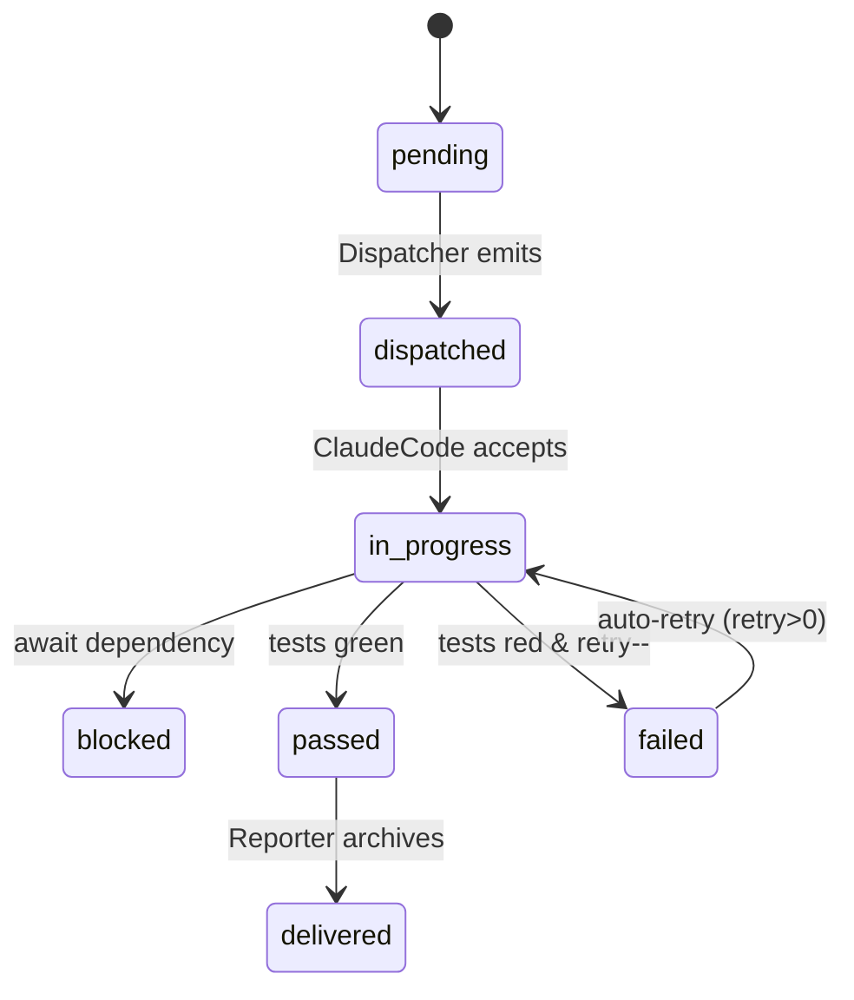

<!-- status: done -->
# 06 OES 拆分规范

> 本章汇总 Tianting-v2 的任务设计方法论，直接引用 `../OES.md` 中的完整规则，并给出项目级约束与模板路径，使 OES 真正融入「一句话→拆分→执行」流水线。

## 1. 框架来源
`OES.md` 提供了目标 (Objective) – 环境 (Environment) – 实现指导 (Implementation Guide) – 成功标准 (Success Criteria) 的四层结构，已经非常完整，下面仅补充与 Tianting-v2 适配的约束：

| 约束 | 描述 |
|------|------|
| JSON Schema | 每个任务文件同时给出 `task.json`，验证字段见附录 A |
| 文件命名 | `tasks/<module>/<ordinal>-<role>-<type>.task.md`，示例 `api/01-backend-dev-base.task.md` |
| 默认角色 | 若缺角色自动触发 `NuwaFactory.clone()`，生成垂直女娲子角色 |
| 成功标准 | 必须至少包含 1 条测试用例 ID，以便 Harvester 关联 |
| 审核流程 | UI Dialog 显示 O/E/S 三栏，人工可修改任何段落后再下发 |
| **新增字段**（v1.1）：`task_type`、`required_stage`、`token_budget` 说明详见附录 A。

## 2. 目录组织
```
packages/
  <pkg>/
    tasks/
      api/
        01-backend-dev-base.task.md
        02-backend-dev-integration.task.md
      ui/
        01-frontend-dev-base.task.md
...
```

## 3. 任务生命周期
1. Dispatcher 根据规划生成 OES Markdown + `task.json` → 入库 DuckDB。
2. Launcher 读取任务 → 若 role 缺失, 走 NuwaFactory → ClaudeCode。
3. Harvester 跑测试 → 更新 `status` 字段；若失败且 `retry>0` 自动重试。
4. Reporter 汇总 artefact，并将 OES 文档移至 `delivery/<task_id>/` 归档。

## 4. 与 Hybrid Memory 的关系
- Layer-2：存 `tasks`、`windows`、`status`、`metrics`。
- Layer-3：把 O/E/S 全文追加至 `YYYY-MM-DD-tasks.jsonl`，便于全文检索。

## 5. 开发者 Checklist
- [ ] 创建任务文件前，检查是否已有重复 ID
- [ ] 填写 `objective` 时，结果可验证 & 价值明确
- [ ] 引用所有必要测试文件路径
- [ ] 成功标准含测试用例 ID & 覆盖率说明
- [ ] 本地通过 `npm run test:lint-oes`（待实现）

## 6. 示例 (示范片段)
下方给出 *backend-dev-base* 任务的 Markdown 片段与对应 `task.json`，便于快速对照：

```markdown
# OES – Backend 基础搭建 (api/01-backend-dev-base)

## Objective
- 初始化 NestJS 项目 skeleton
- 接入 ESLint + Husky 预提交钩子

## Environment
- 参考 `packages/api` 目录空白模板
- 技术栈：Node 20 + NestJS 10

## Implementation Guide
1. `pnpm dlx nest new` 生成项目
2. 配置 `eslintrc`，启用 Airbnb 规则
3. 提交前跑 `pnpm lint`

## Success Criteria
- 单元测试通过：`packages/api/tests/app.unit.spec.ts`
- CI 绿灯
```

对应 `task.json`：

```json
{
  "id": "api-01",
  "module": "api",
  "role": "java-backend-developer",
  "objective": "初始化 NestJS skeleton...",
  "environment": "参考 packages/api ...",
  "implementation_guide": "1. pnpm ...",
  "success_criteria": "单元测试通过...",
  "literature_review": [],
  "status": "pending",
  "retry": 1,
  "tags": ["bootstrap"],
  "created_at": "2025-07-04T00:00:00Z",
  "priority": "P1",
  "requires_human_review": true,
  "learning_mode": true,
  "task_type": "design",
  "required_stage": ["memoryhub", "unit", "security"],
  "token_budget": 1000
}
```

## 7. 质量保证 (QA)
- 本地校验：`npm run test:lint-oes` → 调用 AJV 校验 `task.json`。
- Pre-commit：`.husky/pre-commit` 增加 `pnpm test:lint-oes`。
- CI：GitHub Actions 在 `push` & `pull_request` 上执行同样脚本。

## 8. Task-Splitting Workflow
> **目标**：输入一句业务需求，产出一组最小可执行 OES 任务 + `task.json`，同时满足可并行开发、单任务可在 4 小时内完成。

| 步骤 | 说明 |
|------|------|
| 1. Chunk | 将需求按领域模块拆分（api / ui / core / integration）。 |
| 2. Filter | 丢弃已实现或非本迭代范围的功能；合并重复目标。 |
| 3. Map | 对每个模块，映射为 1..N 个故事卡；遵循 *一功能一验证* 原则。 |
| 4. Estimate | 估算 `story_points` (1‒13) 与 `complexity` (S/M/L/XL)。 |
| 5. Order | 根据 `dependencies` 生成 DAG，拓扑排序。 |
| 6. Verify | 检查粒度：≤4 h / ≤300 LOC / 不含跨 DB migration。 |
| 7. Emit | 生成 `tasks/<module>/<ordinal>-<role>-<type>.task.md` + `task.json`。 |

### 拆分 Heuristics
- 若功能依赖外部系统 → 单独任务。  
- DB Migration 必须独立任务，优先完成。  
- UI 调整跟 API 变动分开，避免阻塞。  
- 估点 ≥ 8 且不可再拆时，标记 `complexity: XL` 并进入人工 Review。

## 9. 状态机


## 10. Human Review Gates
- **安全**：涉及密钥 / 权限提升的改动。  
- **计费**：影响成本或付费 API 调用量的逻辑。  
- **数据**：DB schema 变更 / 大规模数据迁移。  
- **法规**：用户隐私、合规模块（GDPR、PCI）。

## 4. Verification Pipeline (NEW in v1.1)
每张任务卡可声明 `verification`，定义一组自动验收阶段（lint / unit / compose / contract / security 等）。Runner 会严格按顺序执行，任何阶段失败即任务失败。

### OES Task Schema (实际使用)
```json
{
  "$id": "https://tianting.ai/schema/oes-task.json",
  "type": "object",
  "required": ["id", "objective", "implementation_guide", "success_criteria"],
  "properties": {
    "id": { "type": "string" },
    "module": { "type": "string" },
    "role": { "type": "string" },
    "objective": { "type": "string" },
    "environment": { "type": "string" },
    "implementation_guide": { "type": "string" },
    "success_criteria": { "type": "string" },
    "acceptance": {
      "type": "object",
      "properties": {
        "type": { "type": "string" },
        "cmd": { "type": "string" },
        "timeout": { "type": "number" }
      },
      "additionalProperties": false
    },
    "verification": {
      "type": "object",
      "properties": {
        "timeout": { "type": "number" },
        "stages": {
          "type": "array",
          "items": {
            "type": "object",
            "required": ["type"],
            "properties": {
              "type": { "type": "string" },
              "cmd": { "type": "string" },
              "file": { "type": "string" },
              "health": {
                "type": "array",
                "items": { "type": "string" }
              },
              "timeout": { "type": "number" }
            },
            "additionalProperties": false
          }
        }
      },
      "required": ["stages"],
      "additionalProperties": false
    },
    "status": {
      "type": "string",
      "enum": ["pending", "in_progress", "passed", "failed", "verified"]
    },
    "priority": {
      "type": "string",
      "enum": ["P0", "P1", "P2"]
    },
    "retry": {
      "type": "integer",
      "minimum": 0
    },
    "tags": {
      "type": "array",
      "items": { "type": "string" }
    },
    "created_at": {
      "type": "string"
    },
    "failed_at": {
      "type": "string"
    },
    "fail_reason": {
      "type": "string"
    },
    "tests_passed_at": {
      "type": "string"
    },
    "verified_at": {
      "type": "string"
    },
    "task_type": {
      "type": "string",
      "enum": ["design", "impl", "memory", "proposal", "learning", "unit", "lint", "dockerfile", "compose"]
    },
    "dependencies": {
      "type": "array",
      "items": { "type": "string" }
    },
    "required_stage": {
      "type": "array",
      "items": { "type": "string" }
    },
    "token_budget": {
      "type": "integer",
      "minimum": 0
    }
  },
  "additionalProperties": false
}
```

---
> 如需完整规则与示例，请阅读根目录 `OES.md`。 