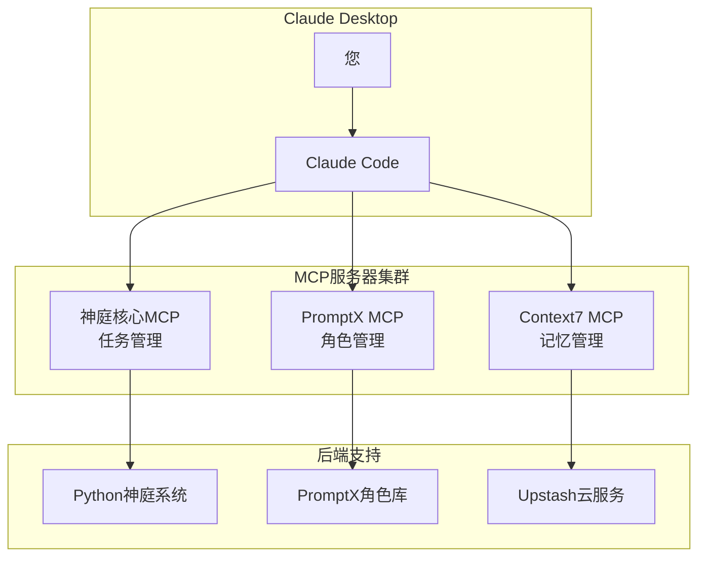

# MCP配置说明文档

## 📋 当前MCP服务器配置

我们的神庭系统已配置以下MCP服务器：

### 1. 神庭核心MCP (shenting-core)
- **功能**: 任务管理、Agent生命周期、系统状态监控
- **路径**: 本地Python脚本
- **状态**: ✅ 已实现并测试通过

### 2. PromptX MCP (promptx)
- **功能**: AI角色管理、女娲造神、自然语言交互
- **版本**: Beta版本 (相对稳定，适合日常使用)
- **状态**: ✅ 已配置，需要验证连接

### 3. Context7 MCP (context7)
- **功能**: 上下文记忆管理
- **提供商**: Upstash
- **状态**: ✅ 已配置，需要验证连接

## 🚀 配置部署步骤

### 步骤1: 复制配置文件
将 `claude_desktop_config.json` 的内容复制到您的Claude Desktop配置文件中：

**Windows**: `%APPDATA%\Claude\claude_desktop_config.json`
**macOS**: `~/Library/Application Support/Claude/claude_desktop_config.json`
**Linux**: `~/.config/Claude/claude_desktop_config.json`

### 步骤2: 重启Claude Desktop
配置文件更新后，需要完全重启Claude Desktop应用程序。

### 步骤3: 验证MCP连接
重启后，在Claude Desktop中应该能看到MCP工具图标，表示连接成功。

## 🔧 验证和测试

### 测试PromptX连接
在Claude Desktop中尝试：
```
我想要找到可用的角色
```
或
```
激活羲和
```

### 测试Context7连接
在Claude Desktop中尝试上下文记忆相关功能。

### 测试神庭核心MCP
先启动本地MCP服务器：
```bash
cd /mnt/d/kokovsc/koko/Python/promptX+
python shenting_mcp_server.py
```

## 📊 当前架构图



## ⚠️ 注意事项

1. **Node.js要求**: PromptX和Context7都需要Node.js (推荐v18+)
2. **网络连接**: PromptX和Context7需要互联网连接
3. **权限设置**: 确保有执行npx命令的权限
4. **版本选择**: 
   - Alpha: 最新功能，用于测试
   - Beta: 相对稳定，日常使用 ✅ 当前选择
   - Latest: 最稳定，生产环境

## 🎯 下一步行动

1. **立即**: 将配置部署到Claude Desktop并重启
2. **验证**: 测试所有MCP连接是否正常
3. **激活羲和**: 确认可以调用羲和分析论文
4. **继续迭代**: 基于羲和的分析继续神庭系统升级

---

*MCP配置说明 - 神庭系统v0.1*