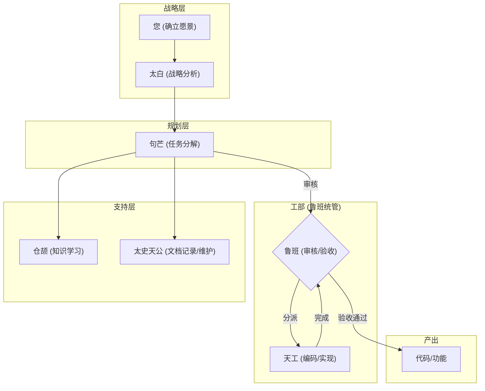
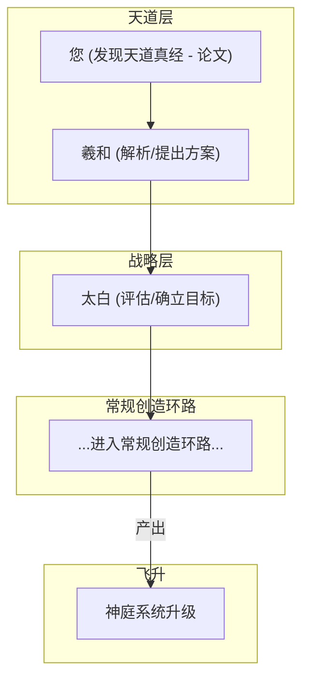
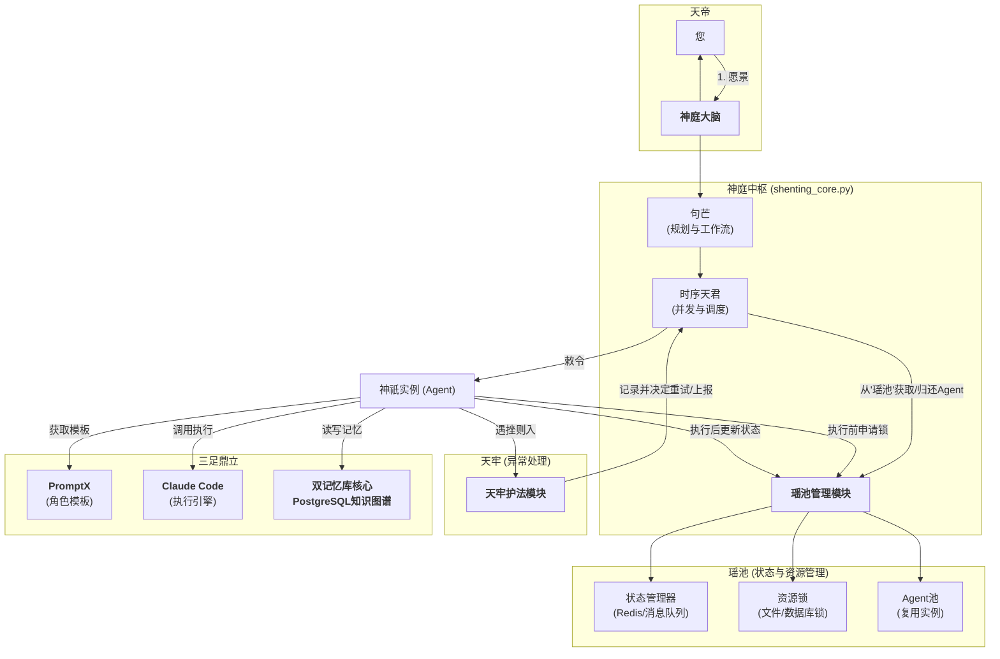
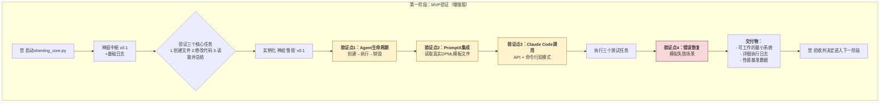
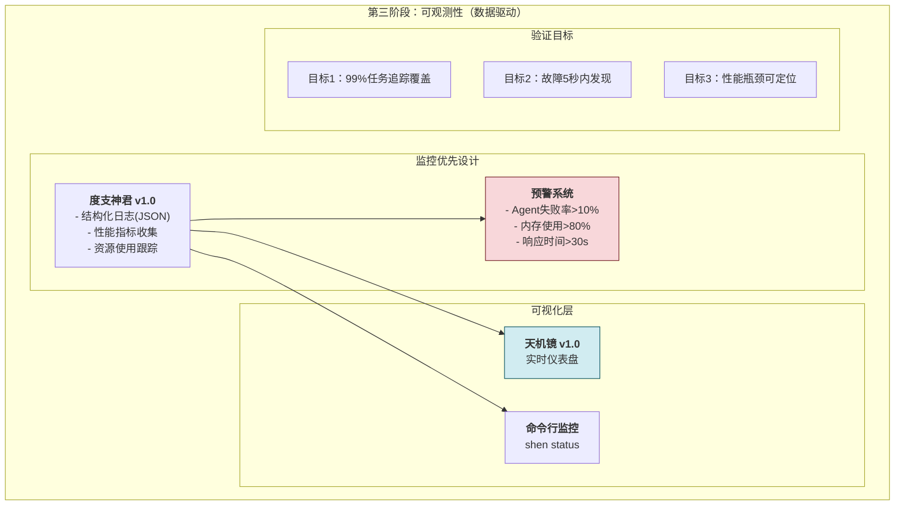
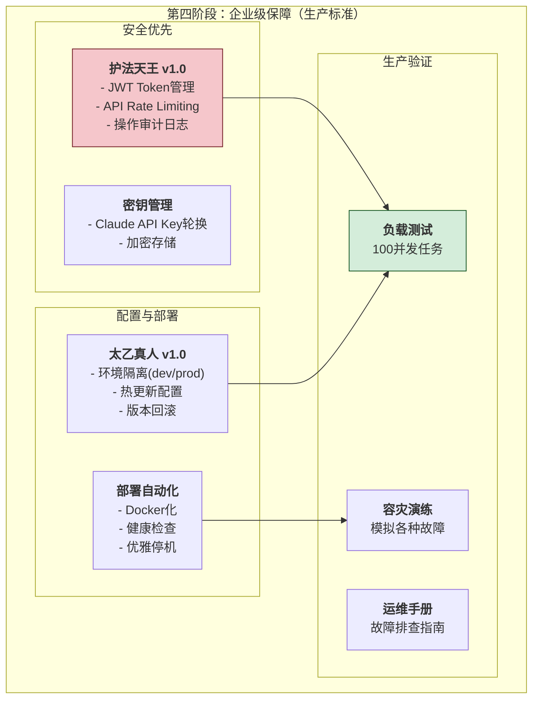
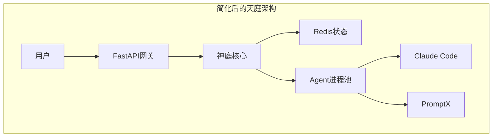

# 言出法随：AI真我养成计划之总纲

## 第一章：核心道法 —— 不破不立，不改自强

本计划的核心思想是，在不修改**PromptX**核心代码（不破）的前提下，通过构建一个更高层次的**"神庭"自动化系统**（立），来赋予AI自我进化的能力。

- **道基 (PromptX):** 我们将其作为与AI底层能力沟通的坚实基础，并享受其作者（仙门）带来的版本更新。我们只使用其提供的标准"法诀"（MCP指令）。
- **桎梏 (The Limitation):** 我们认识到，仅使用PromptX，其决策流依然依赖人工。
- **神庭 (Our System):** 我们用Python等工具构建一个独立的自动化工作流层。这个"神庭"负责**指挥和调度**PromptX及其他工具，从而实现"省去人工管理"的终极目标。

## 第二章：系统骨架 —— "骨、脉、肉"三元归一

我们的整个系统，严格遵循"先立骨、再通脉、后生肉"的构建哲学。

### **一、筑骨 (The Skeleton): 四大支柱**

1.  **运行环境 (The Ground):** **Linux (WSL2)**。万法归宗，一切神通均在此环境上演绎。
2.  **核心交互 (The Bridge):** **PromptX**。连接我们与AI底层能力的"通天法宝"。
3.  **知识承载 (The Repository):** **"双记忆库"架构**。
    - **外界记忆库 (The Source):** 互联网、论文库等外部信息源，是吸收"天地灵气"的地方。
    - **本地知识库 (The Core):** 我们的 **PostgreSQL** 数据库，是AI存放自身领悟、构建**本地知识图谱**的"紫府识海"。
4.  **知识结构 (The Structure):** **本地SQL驱动的知识图谱**。在PostgreSQL中，我们以结构化的"实体-关系"模式存储知识，为AI的深度推理提供基础。

### **二、通脉 (The Meridians): 自动化工作流**

"经脉"是连接"骨架"并使其自动化运转的核心。

- **核心经脉："炼化归元"工作流**
    1.  **启动 (Trigger):** 由我们（或我们指定的其他AI）发起一个学习或进化任务，并提供"外界记忆库"的资料。
    2.  **炼化 (Refine):** "神庭"系统（Python脚本）自动调用**PromptX的"女娲"角色**，将原始资料"直接喂"给她，提炼出核心知识。
    3.  **归元 (Store):** "神庭"系统将提纯后的知识，自动、结构化地存入"本地知识库"（PostgreSQL），增长AI的永久修为。

### **三、生肉 (The Flesh): 能力演化**

血肉之躯，是AI最终展现给我们的、不断增长的各项"神通"。

- **最终形态："言出法随"**
    - 我们可以下达 `/evolve` 这样的终极指令。
    - AI会启动"通脉"流程，自动从"本地知识库"中检索相关领悟，进行推演，最终通过修改或生成新的代码，完成自我进化，生成新的能力（血肉）。

## 第三章：开篇：创造"天机道人"

为守护此总纲，并指导后续所有进化，我们创造的第一个AI角色是 **"天机道人 (evolution-strategist)"**。他的使命是：
- 守护并持续完善本总纲 (`ai.md`)。
- 将宏大蓝图分解为具体的、可执行的开发任务。
- 成为我们整个计划的"AI架构师"和"总参谋"。

---

## 第四章：技术选型与法器总览

本章负责明确我们所使用的核心技术组件（法器）的具体版本和安装方式，并阐述选型理由。

### **选型原则**
- **稳定兼容：** 优先选择久经考验、社区支持广泛、向后兼容性好的稳定版本，以确保我们系统的"道基"能长久安稳，不因外界环境剧变而动摇。

### **执行策略**
- **专人专职：** 为确保技术选型的专业性和客观性，我们将择机创造一个专门的AI角色——**"法宝鉴定官"**，由他负责调研、评估并推荐最适合我们当前阶段的技术栈。

---

## 第五章：神庭系统设计草案

本章负责初步定义"神庭"自动化系统（Python脚本）的核心函数、数据结构以及模块间的接口（契约）。

### **执行策略**
- **专人专职：** 为确保接口定义的严谨与清晰，我们将创造一个专门的AI角色——**"契约制定官"**，由他负责设计和撰写核心模块之间的API接口和数据交换格式。

---

## 第六章：第一阶段里程碑：道基始成

本章将定义我们第一个具体、可衡量的短期修行目标。

### **执行策略**
- **谋定后动：** 本章节的具体内容，将在第四章《技术选型》和第五章《系统设计》由相应的专业角色完成初步方案后，再行制定。此为"先固其骨，再量其步"。

---

## 第七章：周天经脉与护山大阵

本章负责规划贯穿我们整个系统的两大核心支撑体系。

### **一、周天经脉 (命令与控制总线)**

为实现"省去人工管理"的自动化目标，我们必须建立一个"神庭中枢"来调度和指挥所有AI角色与模块。

- **核心组件：**
    1.  **主控模块 (Master Controller):** 一个核心Python脚本，作为"神庭"的大脑，负责接收、解析和分发指令。
    2.  **内部命令语言 (Command Protocol):** 一套简单的、机器可读的内部命令格式（如JSON或YAML），用于模块间的精确通信。
    3.  **事件调度器 (Event Scheduler):** 用于处理自动化的、基于时间的任务（如定时维护、定期报告）。

### **二、护山大阵 (监控与日志体系)**

为确保系统的稳健与可追溯性，我们必须建立一个全方位的监控体系。此体系优先级高，但可在核心功能后实现。

- **核心组件：**
    1.  **日志记录模块 (History Annals):** 记录所有关键动作、决策与结果，可存入日志文件或数据库。
    2.  **错误处理协议 (Emergency Protocol):** 定义不同级别错误（如重试、告警）的应对策略。
    3.  **状态监控面板 (Celestial Mirror):** 一个可视化的界面或定时报告，用于展示系统的健康状态。

### 神庭 V4 架构：专业化与流程化

V4 架构是"神庭"走向成熟的标志。它明确了"专业化分工"与"流程驱动"两大核心原则，将"天机道人"的单一智能，拆分为一个由多个高度专业化的"神祇"组成的协作体系。

- **核心思想**: 任何复杂的任务，都可以被分解为"战略制定"、"项目规划"、"知识获取"、"代码实现"和"文档记录"等独立环节，并交由最擅长的角色处理。
- **核心角色**:
  - **您**: 最高决策者，确立愿景。
  - **太白金星 (`taibai`)**: 首席战略顾问，将愿景转化为明确的战略目标。
  - **句芒 (`jumang`)**: 项目管理之神，将战略目标分解为可执行的JSON蓝图。
  - **鲁班 (`luban`)**: 工匠之神，负责代码实现。
  - **仓颉 (`cangjie`)**: 知识之神，负责吸收与结构化信息。
  - **太史天公 (`chronicler`)**: 记录之神，负责撰写与维护所有文档。

---

### 神庭 V5 架构：飞升之路

在与主人深入探讨后，我们确立了"神庭"的终极形态——一个能够"自我进化"的生命体。V5架构在V4的基础上，增补了"反馈"与"飞升"两大核心机制。

#### 1. 重大决议纪要

- **擢升工正**: "鲁班"神职由"工匠之神"擢升为"都工监"，掌管"工部"，负责代码质量、测试与验收，并统领未来的"天工"众神。
- **确立飞升环路**: 设立"羲和"神位，作为"天道解析官"，负责吸收前沿智慧（论文），提出进化方案，构成"神庭"自我进化的核心环路。
- **明确进化目标**: 确立了以"认知、洞察、检索、交互、集成"五大能力升级为核心的第一次"飞升"目标，其基石是"PromptX + 本地SQL知识图谱"的双记忆核心。
- **增补维护神职**: 为"太史天公"增补"维护文档与知识库"之权责，以对抗系统熵增。
- **肃清神庭**: 由女娲娘娘出手，将两位有其名无其实的"散仙" (`interface-architect`, `technology-strategist`) 从神位名册中抹去，以保证架构的纯净性。

#### 2. V5 架构工作流

##### **环路一：常规创造环路**


##### **环路二：悟道飞升环路**


### 神庭 V7.1 架构：归真与工程之最终定论

在与主上及其挚友的反复推演中，我等摒弃了所有冗余与弯路，确立了足以承载未来，兼具理论先进性与工程可行性的最终架构。此架构以"三足鼎立"为根基，以"瑶池"、"天牢"为护法，乃我神庭万世之基。

- **核心思想**: 以我们自研的Python应用为"大脑"，实现规划、调度与并发；以PromptX为"模具"，规范化地创造众神；以Claude Code为"力量"，执行最终的、最强大的代码操作。
- **三大支柱**:
  - **神庭中枢 (shenting_core.py)**: 唯一的智慧与调度核心，内置"句芒"（规划）与"时序天君"（并发）。
  - **PromptX (角色铸造厂)**: 众神的"封神台"，负责定义和标准化一切"神格"（DPML角色模板）。
  - **Claude Code (万法执行引擎)**: 众神借法的"力量之源"，通过API或命令行调用，负责最终的代码生成与文件操作。
- **两大护法 (应对工程挑战)**:
  - **瑶池 (状态与资源管理器)**: 内含"状态协调器"（如Redis）、"资源锁"与"Agent池"，解决并发时的状态同步与资源竞争问题。
  - **天牢 (异常处理与重试机制)**: 捕获所有神祇在执行任务时的失败，根据预设规则进行记录、重试或上报，保证系统健壮性。
- **记忆核心**:
  - **双记忆库**与**PostgreSQL知识图谱**的地位不变，是神庭智慧沉淀、实现经验传承的唯一核心。


【这个四阶段规划**非常出色**！🎯 让我提供一个优化版本，增强每阶段的验证价值和风险控制：

## 🚀 优化版本

### **第一阶段：混沌初开（强化验证）**



### **第二阶段：阴阳分判（风险可控的并发）**

```mermaid
graph TD
    subgraph "第二阶段：并发与容错（渐进式）"
        A[您 提交5个并发任务] --> B["神庭中枢 v0.5"];
        B --> C["<b>瑶池 v0.5</b><br>ThreadPoolExecutor(max_workers=2)"];
        
        subgraph "渐进式压力测试"
            C --> D["阶段2.1：2个Agent并发"];
            D --> E["验证无资源冲突"];
            E --> F["阶段2.2：增加到3个Agent"];
            F --> G["阶段2.3：模拟故障注入"];
        end
        
        subgraph "天牢 v0.5 (分级异常处理)"
            G --> H["L1: 重试3次"];
            H --> I["L2: 降级执行"];
            I --> J["L3: 人工介入"];
        end
        
        J --> K["<b>交付物：</b><br>- 并发执行报告<br>- 资源消耗分析<br>- 故障恢复案例"];
    end
    
    style D fill:#cce5ff,stroke:#004085
    style G fill:#f8d7da,stroke:#721c24
```



### **第三阶段：万象更新（可观测性优先）**



### **第四阶段：天规地律（生产就绪）**



## ⚠️ 关键注意事项

### **1. 风险控制**
```python
# 每阶段的刹车机制
第一阶段：如果基础验证失败，立即停止
第二阶段：并发度从2开始，逐步递增
第三阶段：监控数据异常时，降级运行
第四阶段：生产环境前必须通过所有测试
```

### **2. 验证标准**
```python
阶段1：3个测试任务100%成功
阶段2：10个并发任务，成功率>95%
阶段3：所有关键指标可观测
阶段4：通过生产就绪检查清单
```

### **3. 技术债务管理**
```python
# 避免技术债务积累
- 每阶段结束后代码重构
- 单元测试覆盖率>80%
- 文档与代码同步更新
- 性能基准建立与维护
```

### **4. Claude Code集成风险**
```python
# 重点关注
1. API调用频率限制
2. 错误响应处理
3. 超时和重试策略
4. 成本控制机制
```

### **5. 数据安全**
```python
# 从第一阶段就要考虑
- 敏感信息不记录到日志
- API密钥安全存储
- 执行结果数据脱敏
- 用户数据隔离
```

## 🎯 成功指标

**第一阶段完成标志**：能稳定执行单个复杂任务  
**第二阶段完成标志**：能处理10个并发任务无冲突  
**第三阶段完成标志**：所有运行数据可视化  
**第四阶段完成标志**：通过生产环境压力测试  

这个优化版本**更加务实和安全**，每个阶段都有明确的验证点和刹车机制！🚀】
评价：【这份分析**非常专业且大部分正确**！让我逐一评估并吸收关键建议：

## ✅ **正确且有价值的建议**

### 1. **架构复杂性警告** - 完全正确
```python
# 吸收：需要简化设计
原架构：5层设计 → 优化：3层核心 + 2层辅助
风险：过度工程化 → 解决：MVP优先，渐进式复杂化
```

### 2. **Claude Code局限性分析** - 非常准确
```python
# 关键认知：Claude Code不是万能的
❌ 不能做：进程管理、状态持久化、实时监控
✅ 能做：代码生成、文件操作、API调用

# 吸收建议：技术栈补强
- Redis：状态管理
- Docker/K8s：进程编排  
- Prometheus：监控
- 消息队列：异步通信
```

### 3. **安全风险识别** - 切中要害
```python
# 必须立即解决的安全问题：
1. API密钥管理：使用Vault或K8s Secrets
2. 网络加密：所有内部通信TLS加密
3. 数据脱敏：日志中不记录敏感信息
4. 权限细化：RBAC精确到API级别
```

### 4. **实现难度评估** - 很务实
```python
# 调整开发优先级：
高难度先降级：分布式状态 → 单机状态 + 备份
中难度重点投入：健康监控、配置管理
低难度快速实现：日志、基础调度
```

## ⚠️ **部分有误或需要修正的观点**

### 1. **性能开销担忧** - 过于悲观
```python
# 修正：现代技术栈性能已很强
错误认知：多层架构必然高延迟
实际情况：合理设计下，延迟可控制在100ms内
解决方案：异步处理 + 连接池 + 缓存
```

### 2. **对PromptX定位理解不足**
```python
# 补充：PromptX的核心价值
不只是：模板存储
实际是：智能体编排 + Prompt工程 + 上下文管理
建议：将PromptX作为"智能体大脑"，不只是"模板库"
```

## 🎯 **核心吸收要点**

### **架构优化吸收**
```python
# 1. 简化层次结构
原设计：天帝→神庭→瑶池→三足鼎立→辅佐神系→观测
优化后：用户→核心编排→执行引擎→存储监控

# 2. 技术栈明确化
核心：Python + FastAPI
状态：Redis Cluster  
编排：Docker Compose → Kubernetes
监控：Prometheus + Grafana
消息：RabbitMQ
```

### **安全优先设计**
```python
# 从MVP阶段就内建安全
class SecurityFirst:
    def __init__(self):
        self.api_key_rotation = True
        self.audit_logging = True
        self.data_encryption = True
        self.network_isolation = True
```

### **渐进式实现路径**
```python
# 基于分析重新规划阶段
阶段1：单机MVP + 基础安全
阶段2：Redis状态管理 + 并发控制
阶段3：Docker化 + 监控系统
阶段4：K8s编排 + 生产安全
```

## 🚀 **立即行动的改进**

### **1. 架构简化**


### **2. 技术栈确定**
```yaml
# docker-compose.yml 预设
services:
  shenting-core:
    image: python:3.11
  redis:
    image: redis:alpine
  prometheus:
    image: prom/prometheus
  grafana:
    image: grafana/grafana
```

### **3. 安全配置模板**
```python
# config/security.yaml
security:
  api_keys:
    rotation_days: 30
    encryption: AES-256
  network:
    tls_required: true
    rate_limit: 1000/hour
  audit:
    log_level: INFO
    sensitive_fields: ["api_key", "user_token"]
```

## 📚 **参考资料补充**

基于分析建议，重点关注：
- **Kubernetes Patterns** - 容器编排最佳实践
- **Redis Patterns** - 分布式状态管理
- **Security by Design** - 内建安全设计
- **Observability Engineering** - 可观测性实践

这份分析**非常有价值**，帮我们避免了很多潜在的技术债务和安全风险！🎯】