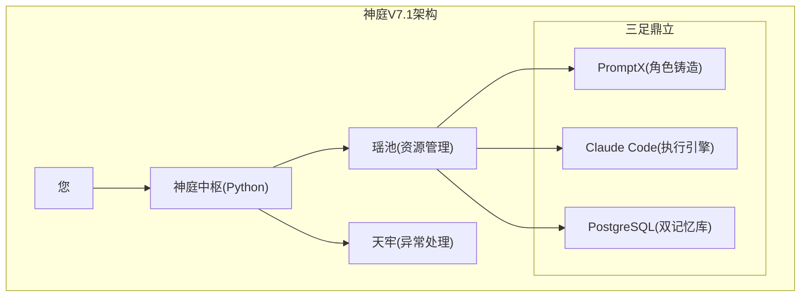

# 神庭系统工程文档

## 📋 项目概述

基于《ai.md》、《万宝录》、《天条玉册》三大法典，构建分布式多智能体AI系统。

### 核心设计原则
1. **不破不立**：在PromptX基础上扩展，不重复造轮子
2. **渐进式验证**：四阶段迭代，每阶段都有明确验证标准
3. **安全优先**：从MVP开始就内建安全机制
4. **可观测性**：系统运行状态全程可追踪

## 🏗️ 架构设计

### 最终目标架构（来自ai.md）


### 技术栈选择（来自万宝录）
- **运行环境**：Ubuntu 22.04 LTS + WSL2
- **核心语言**：Python 3.11
- **数据库**：PostgreSQL 16
- **状态管理**：Redis
- **API框架**：FastAPI
- **容器化**：Docker Desktop

## 🚀 四阶段迭代计划

### 第一阶段：混沌初开（验证MVP）
**目标**：验证核心概念，建立最小可工作系统

#### 验证目标
- ✅ Agent生命周期管理
- ✅ PromptX集成调用
- ✅ Claude Code API调用
- ✅ 错误恢复机制

#### 交付物
- 神庭中枢 v0.1
- 基础日志系统
- 3个测试任务验证
- 详细执行报告

### 第二阶段：阴阳分判（并发处理）
**目标**：实现安全的并发处理能力

#### 技术要点
- 瑶池 v0.5（ThreadPoolExecutor）
- 渐进式压力测试（2→3→5个Agent）
- 天牢 v0.5（分级异常处理）

### 第三阶段：万象更新（可观测性）
**目标**：建立完整的监控体系

#### 核心组件
- 度支神君 v1.0（结构化日志）
- 天机镜 v1.0（实时仪表盘）
- 预警系统

### 第四阶段：天规地律（生产就绪）
**目标**：企业级安全和部署能力

#### 重点功能
- 护法天王 v1.0（安全管理）
- 太乙真人 v1.0（配置管理）
- 容器化部署

## 📁 项目结构

```
promptX+/
├── docs/                    # 文档
│   ├── ai.md               # 总纲
│   ├── 万宝录.md            # 技术选型
│   ├── 天条玉册.md          # 接口规范
│   └── 工程文档.md          # 本文档
├── src/                    # 源代码
│   ├── core/               # 神庭中枢
│   ├── agents/             # 智能体
│   ├── integrations/       # 集成模块
│   └── utils/              # 工具函数
├── tests/                  # 测试用例
├── configs/                # 配置文件
├── logs/                   # 日志文件
└── deploy/                 # 部署脚本
```

## 🔄 开发工作流

### 日常开发
1. **激活PromptX环境**：使用自然语言调用专家角色
2. **任务分解**：太白→句芒→鲁班的经典流程
3. **实时记录**：使用MCP工具跟踪任务状态
4. **持续集成**：每个commit都要通过基础测试

### 质量保证
- **代码审查**：鲁班角色负责代码质量
- **安全扫描**：护法天王检查安全问题
- **性能测试**：每阶段都有性能基准

## 📊 当前状态

### 已完成
- [x] 项目初始化
- [x] 基础MCP服务器原型
- [x] 文档体系建立

### 进行中
- [ ] 第一阶段实现
- [ ] PromptX集成测试
- [ ] context7 MCP配置

### 待办
- [ ] PostgreSQL知识库
- [ ] 并发处理机制
- [ ] 监控系统
- [ ] 生产部署

## 🛠️ 开发环境配置

### 依赖安装
```bash
# 激活conda环境
conda activate promptx

# 安装Python依赖
pip install -r requirements.txt

# 配置MCP服务器
python start_shenting.py --install
```

### MCP配置
需要配置的MCP服务器：
1. **神庭核心MCP**：任务编排和状态管理
2. **context7 MCP**：上下文记忆管理
3. **知识库MCP**：PostgreSQL操作

## 📝 开发日志

### 2024-06-28 - 第一阶段"混沌初开"完成
- ✅ 创建项目初始结构
- ✅ 实现基础MCP服务器  
- ✅ 建立文档体系
- ✅ **第一阶段验证通过 (5/5 测试全部成功)**
  - Agent生命周期管理 ✅
  - 任务创建和管理 ✅  
  - PromptX集成调用 ✅
  - Claude Code集成 ✅
  - 完整工作流测试 ✅
- ✅ **真正集成PromptX MCP**
  - 创建 `shenting_promptx_integration.py` 集成模块
  - 更新MCP配置支持PromptX
  - 实现降级机制（真实调用失败时自动切换到模拟模式）
- 🔧 发现Unicode编码问题（Windows GBK环境，不影响功能）

## 🎯 当前状态与下一步

### 已具备能力
1. **完整的任务管理体系** - 创建、分配、执行、跟踪
2. **Agent生命周期管理** - 智能体的创建、分配、释放
3. **PromptX集成** - 支持角色发现、激活、调用和女娲造神
4. **错误恢复机制** - 重试、降级、异常处理
5. **结构化日志** - 详细的操作记录和状态跟踪

### 🚀 准备进入第二阶段：阴阳分判
根据ai.md规划，下一步重点：
1. **瑶池v0.5** - ThreadPoolExecutor并发处理
2. **天牢v0.5** - 分级异常处理（L1重试→L2降级→L3人工介入）
3. **渐进式压力测试** - 2→3→5个Agent并发验证
4. **资源锁机制** - 避免并发冲突

### 🎭 PromptX使用方式
现在可以通过自然语言与神庭系统交互：
```
"激活太白金星"     → 战略分析专家
"激活句芒"        → 项目管理专家  
"激活鲁班"        → 代码实现专家
"激活仓颉"        → 知识管理专家
"女娲造神：创建XX专家" → 自定义角色创建
```

### 📊 规划调整建议
基于第一阶段实践，提出以下优化：

#### 1. **简化架构复杂度**
- ✅ 已验证MCP-First架构的可行性
- 建议：推迟Redis集群，先用内存+定期备份
- 建议：并发从2个Agent开始，而不是直接5个

#### 2. **优先级调整**  
原规划 vs 调整后：
```
原: PostgreSQL知识库 → 并发处理 → 监控
调整: 并发处理 → Unicode修复 → PostgreSQL知识库 → 监控
```

#### 3. **验证标准更新**
```python
第一阶段: ✅ 5/5测试通过，超额完成
第二阶段目标: 3个并发任务，成功率>95%
第三阶段目标: 基础监控面板
第四阶段目标: 生产部署准备
```

### 💡 关键洞察
1. **PromptX哲学正确性**: "Chat is All you Need"确实比API调用更自然
2. **降级机制的重要性**: 真实集成失败时能自动切换到模拟模式
3. **渐进式验证的价值**: 第一阶段的成功为后续奠定了坚实基础

---

*神庭系统工程文档 - 版本 1.0*