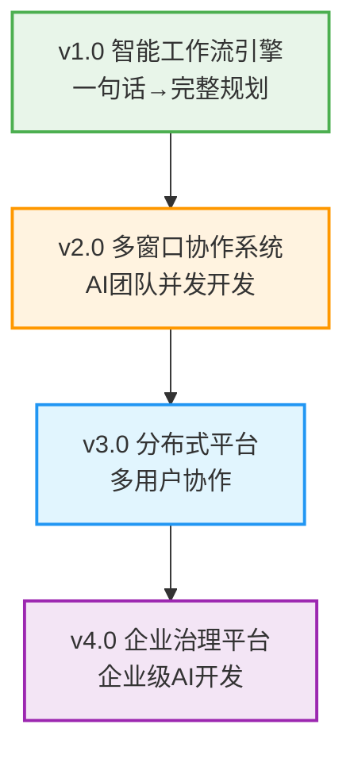

# 天庭 - "言出法随"的AI开发团队

## 🎯 项目愿景

构建一个智能的AI开发团队协作平台，实现"言出法随" - 用户用自然语言描述想法，AI团队自动完成从需求分析到代码实现的全流程开发。

## 🌟 核心价值

- **降低门槛**: 非技术背景用户也能启动专业软件项目
- **提高效率**: 从想法到可执行方案的时间从数周缩短到数小时
- **智能协作**: 多个AI角色并发协作，模拟真实开发团队
- **持续学习**: 基于历史项目不断优化和提升

## 🗺️ 版本演进路线



## 📁 项目结构

```
tianting/
├── project-management/         # 项目级管理文档
│   ├── vision-roadmap.md      # 项目愿景和路线图
│   ├── version-lifecycle.md   # 版本生命周期管理
│   ├── quality-governance.md  # 质量治理体系
│   └── team-collaboration.md  # 团队协作规范
│
├── research-foundation/        # 研究基础
│   ├── requirements-analysis.md
│   ├── user-experience-design.md
│   └── academic-papers/
│
├── v1.0-intelligent-workflow/ # 当前版本: 智能工作流引擎
├── v2.0-multi-window-collab/  # 下一版本: 多窗口协作系统
├── v3.0-distributed-platform/ # 未来版本: 分布式平台
├── v4.0-enterprise-governance/ # 远期版本: 企业治理平台
│
├── shared-infrastructure/      # 共享基础设施
│   ├── templates/             # 文档和代码模板
│   ├── scripts/              # 通用脚本工具
│   └── deployment/           # 部署配置
│
└── archive/                   # 归档区域
    ├── deprecated-designs/
    └── lessons-learned/
```

## 🚀 当前状态

### v1.0 智能工作流引擎 (开发中)
- **状态**: 🚧 OES任务设计完成，环境搭建中
- **目标**: 实现"言出法随"的基础能力
- **核心功能**: 需求解析、项目规划、方案生成
- **预计完成**: 2025年2月15日

### v2.0 多窗口协作系统 (规划中)
- **状态**: 📋 技术方案设计完成
- **目标**: 真正的AI开发团队协作
- **核心功能**: 多窗口管理、任务分解、协作开发
- **预计启动**: v1.0完成后

## 📖 快速开始

### 对于项目决策者
1. 阅读 [`project-management/vision-roadmap.md`](project-management/vision-roadmap.md) 了解项目愿景
2. 查看 [`v1.0-intelligent-workflow/CURRENT-VERSION-STATUS.md`](v1.0-intelligent-workflow/CURRENT-VERSION-STATUS.md) 了解当前进度
3. 参考 [`project-management/version-lifecycle.md`](project-management/version-lifecycle.md) 了解版本管理机制

### 对于开发团队
1. 阅读 [`v1.0-intelligent-workflow/PROJECT-EXECUTION-GUIDE.md`](v1.0-intelligent-workflow/PROJECT-EXECUTION-GUIDE.md) 了解执行流程
2. 查看 [`v1.0-intelligent-workflow/OES-EXECUTION-GUIDE.md`](v1.0-intelligent-workflow/OES-EXECUTION-GUIDE.md) 了解OES任务系统
3. 执行 [`v1.0-intelligent-workflow/packages/setup/tasks/project-initialization-00-setup.task.md`](v1.0-intelligent-workflow/packages/setup/tasks/project-initialization-00-setup.task.md) 搭建环境

### 对于新团队成员
1. 从本README开始了解项目全貌
2. 阅读 [`research-foundation/requirements-analysis.md`](research-foundation/requirements-analysis.md) 了解业务背景
3. 参考 [`project-management/team-collaboration.md`](project-management/team-collaboration.md) 了解协作规范

## 🎯 核心技术

### 当前技术栈 (v1.0)
- **前端**: React 18 + TypeScript + Tailwind CSS
- **后端**: FastAPI + Python 3.11
- **数据库**: PostgreSQL + Redis
- **AI服务**: Claude 3.5 Sonnet
- **部署**: Docker容器化

### 未来技术演进
- **v2.0**: 微服务架构 + 多进程协调
- **v3.0**: 分布式系统 + 云原生部署
- **v4.0**: 企业级架构 + AI治理平台

## 📊 项目指标

### 当前目标 (v1.0)
- 需求解析准确率: ≥85%
- 规划生成时间: <30秒
- 用户满意度: ≥4.0/5.0
- 系统可用性: ≥99.5%

### 远期愿景 (v4.0)
- 支持企业用户: 1000+
- AI开发效率提升: ≥300%
- 系统可用性: ≥99.99%
- 企业客户续费率: ≥80%

## 🔄 贡献指南

### 参与方式
1. **需求反馈**: 通过Issue提出功能需求和改进建议
2. **代码贡献**: 按照OES任务系统参与具体开发
3. **文档完善**: 帮助完善项目文档和使用指南
4. **测试验证**: 参与版本测试和质量验收

### 开发规范
- 严格遵循OES任务执行规范
- 确保代码质量和测试覆盖率
- 遵循版本生命周期管理流程
- 维护文档与代码同步

## 📞 联系我们

- **项目仓库**: [GitHub链接]
- **技术讨论**: [技术社群链接]
- **商务合作**: [联系邮箱]
- **用户反馈**: [反馈渠道]

## 📄 许可证

本项目采用 [MIT License](LICENSE) 开源协议。

---

## 🎉 致谢

感谢所有为天庭项目贡献力量的开发者、设计师、测试者和用户！

**愿景**: 让AI成为每个人的开发团队，让创意真正做到"言出法随"！

---

**💡 提示**: 这是一个活跃开发的项目，建议定期查看版本状态和更新文档。