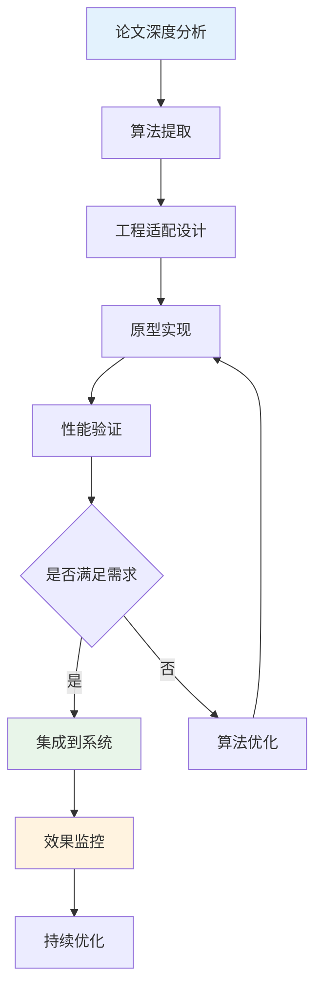

# 📚 天庭系统论文研究指南

## 🎯 研究支持总体策略

### 学术驱动开发模式
天庭系统采用"理论先行，实践验证"的开发模式，通过学术研究指导技术实现：


### 研究协作分工
- **用户职责**: 论文检索、筛选、提供
- **AI职责**: 论文分析、算法提取、工程转化
- **共同目标**: 将最新学术成果转化为实用技术

---

## 🔬 Stage 0: 智能工作流引擎 - 论文需求

### 技术模块1: 自然语言需求理解

#### 核心技术挑战
1. **多意图识别**: 从复杂描述中识别多个项目意图
2. **实体关系抽取**: 理解功能模块间的关联关系
3. **隐含需求推理**: 挖掘用户未明确表达的需求
4. **上下文语义理解**: 理解业务场景和技术约束

#### 目标论文领域

**Intent Recognition (意图识别)**
```yaml
研究方向: 多意图分类、层次化意图识别
关键词组合:
  - "multi-intent detection"
  - "hierarchical intent classification"
  - "software requirement intent recognition"
  - "conversational intent understanding"

推荐顶级会议:
  - ACL: Association for Computational Linguistics
  - EMNLP: Empirical Methods in Natural Language Processing
  - NAACL: North American Chapter of ACL

具体技术点:
  - 基于BERT的多标签分类
  - 层次化标签结构建模
  - 少样本学习在意图识别中的应用
  - 意图边界检测算法
```

**Named Entity Recognition (命名实体识别)**
```yaml
研究方向: 领域特定实体识别、嵌套实体抽取
关键词组合:
  - "domain-specific named entity recognition"
  - "nested entity extraction"
  - "software engineering entity recognition"
  - "technical requirement entity extraction"

重点技术:
  - BiLSTM-CRF模型优化
  - 预训练模型fine-tuning策略
  - 多任务学习框架
  - 弱监督学习方法

期望成果:
  - 识别项目类型、技术栈、功能模块等实体
  - 抽取用户群体、性能要求、约束条件
  - 建立实体间的关系网络
```

**Relation Extraction (关系抽取)**
```yaml
研究方向: 软件需求中的实体关系识别
关键词组合:
  - "relation extraction in software requirements"
  - "dependency relation classification"
  - "semantic relation extraction"
  - "joint entity and relation extraction"

技术重点:
  - 图神经网络在关系抽取中的应用
  - 注意力机制优化
  - 远程监督学习
  - 多模态关系抽取

应用目标:
  - 识别功能依赖关系
  - 抽取用户-功能映射
  - 建立技术约束关系
```

**Requirement Engineering (需求工程)**
```yaml
研究方向: 自动化需求分析、需求一致性检查
关键词组合:
  - "automated requirements analysis"
  - "natural language requirements processing"
  - "requirements consistency checking"
  - "requirements classification and prioritization"

顶级会议:
  - ICSE: International Conference on Software Engineering
  - FSE: Foundations of Software Engineering
  - RE: Requirements Engineering Conference

关键技术:
  - 需求质量自动评估
  - 需求冲突检测算法
  - 需求优先级排序方法
  - 需求可追溯性分析
```

#### 论文筛选标准

**质量标准**:
```yaml
会议等级: A类顶级会议 (CCF-A, CORE-A*)
发表时间: 2020-2024年 (最新4年)
引用次数: >50次 (高影响力)
开源代码: 有开源实现优先
实验完整性: 有完整数据集和基准测试

评估指标:
  - 准确率 >85%
  - 召回率 >80%
  - F1-score >82%
  - 处理速度 <1秒/请求
```

**内容要求**:
```yaml
必须包含:
  - 详细的算法描述
  - 完整的实验设置
  - 性能对比分析
  - 错误案例分析

优先考虑:
  - 有工业应用案例
  - 提供预训练模型
  - 支持中文处理
  - 计算效率优化
```

---

### 技术模块2: 智能项目规划生成

#### 核心技术挑战
1. **架构模式推荐**: 基于需求推荐合适的技术架构
2. **成本时间估算**: 准确预测开发成本和时间
3. **技术选型优化**: 智能推荐最适合的技术栈
4. **规划一致性保证**: 确保规划各部分逻辑一致

#### 目标论文领域

**Software Architecture Recommendation (软件架构推荐)**
```yaml
研究方向: 基于需求的架构自动推荐
关键词组合:
  - "automated software architecture recommendation"
  - "requirement-to-architecture mapping"
  - "microservices architecture selection"
  - "architecture pattern mining"

技术重点:
  - 基于案例的推理 (CBR)
  - 多目标优化算法
  - 机器学习驱动的架构选择
  - 架构质量评估模型

期望成果:
  - 架构模式自动匹配
  - 技术栈适配算法
  - 性能预测模型
  - 扩展性评估方法
```

**Software Effort Estimation (软件工作量估算)**
```yaml
研究方向: 机器学习驱动的项目估算
关键词组合:
  - "machine learning software effort estimation"
  - "deep learning project estimation"
  - "agile estimation methods"
  - "function point analysis automation"

顶级期刊:
  - TSE: IEEE Transactions on Software Engineering
  - TOSEM: ACM Transactions on Software Engineering
  - JSS: Journal of Systems and Software

核心算法:
  - 集成学习方法 (Random Forest, XGBoost)
  - 深度神经网络估算模型
  - 时间序列预测方法
  - 贝叶斯估算方法

质量指标:
  - MMRE (平均相对误差) <25%
  - PRED(25) (25%内预测准确率) >75%
  - 标准差 <20%
```

**Technology Stack Selection (技术栈选择)**
```yaml
研究方向: 智能技术选型决策支持
关键词组合:
  - "technology selection decision support"
  - "software technology recommendation"
  - "multi-criteria technology evaluation"
  - "technology stack optimization"

关键技术:
  - 多属性决策方法 (MADM)
  - 层次分析法 (AHP) 改进
  - 基于知识图谱的推荐
  - 技术生态兼容性分析

评估维度:
  - 性能匹配度
  - 开发效率
  - 维护成本
  - 团队技能适配
  - 生态成熟度
```

**Project Planning Automation (项目规划自动化)**
```yaml
研究方向: AI驱动的项目管理和规划
关键词组合:
  - "automated project planning"
  - "AI project management"
  - "resource allocation optimization"
  - "milestone prediction algorithms"

技术方法:
  - 遗传算法优化
  - 约束满足问题 (CSP)
  - 马尔可夫决策过程
  - 强化学习应用

应用目标:
  - 任务分解算法
  - 里程碑规划
  - 资源分配优化
  - 风险评估模型
```

---

### 技术模块3: 交互式规划调整

#### 核心技术挑战
1. **反馈意图理解**: 准确理解用户调整意图
2. **规划一致性维护**: 调整后保持规划逻辑一致性
3. **智能推荐**: 基于反馈提供优化建议
4. **版本管理**: 高效管理规划版本历史

#### 目标论文领域

**Interactive Machine Learning (交互式机器学习)**
```yaml
研究方向: 人机交互式学习系统
关键词组合:
  - "interactive machine learning"
  - "human-in-the-loop learning"
  - "active learning systems"
  - "user feedback incorporation"

核心技术:
  - 主动学习算法
  - 在线学习方法
  - 用户反馈建模
  - 增量学习框架

应用场景:
  - 规划调整学习
  - 用户偏好建模
  - 个性化推荐优化
  - 系统自适应改进
```

**Consistency Checking (一致性检查)**
```yaml
研究方向: 软件制品一致性验证
关键词组合:
  - "software consistency checking"
  - "model consistency verification"
  - "constraint satisfaction"
  - "automated consistency repair"

技术方法:
  - SAT求解器应用
  - 约束逻辑编程
  - 模型检验技术
  - 启发式修复算法

验证目标:
  - 需求一致性
  - 架构一致性
  - 成本逻辑一致性
  - 时间约束一致性
```

---

## 🚀 Stage 1: 多窗口并发执行 - 论文需求

### 技术模块4: 多智能体协调

#### 核心技术挑战
1. **任务分解算法**: 智能分解复杂开发任务
2. **负载均衡**: 动态平衡多窗口工作负载
3. **一致性协议**: 保证分布式开发的一致性
4. **冲突解决**: 自动检测和解决开发冲突

#### 目标论文领域

**Multi-Agent Coordination (多智能体协调)**
```yaml
研究方向: 分布式智能体协作机制
关键词组合:
  - "multi-agent coordination mechanisms"
  - "distributed software development"
  - "agent-based software engineering"
  - "collaborative AI systems"

顶级会议:
  - AAMAS: Autonomous Agents and Multiagent Systems
  - IJCAI: International Joint Conference on AI
  - AAAI: Association for the Advancement of AI

核心算法:
  - 分布式一致性算法
  - 拍卖机制设计
  - 博弈论应用
  - 协调机制优化

技术指标:
  - 协调效率 >90%
  - 通信开销 <10%
  - 冲突解决率 >85%
  - 系统吞吐量提升 >200%
```

**Task Decomposition (任务分解)**
```yaml
研究方向: 智能任务分解和调度
关键词组合:
  - "automated task decomposition"
  - "hierarchical task networks"
  - "workflow decomposition algorithms"
  - "dependency-aware task scheduling"

技术方法:
  - HTN规划算法
  - 图分解算法
  - 启发式搜索
  - 机器学习优化

分解维度:
  - 功能模块分解
  - 技术栈分离
  - 依赖关系分析
  - 并行度优化
```

**Consensus Algorithms (一致性算法)**
```yaml
研究方向: 分布式系统一致性保证
关键词组合:
  - "distributed consensus algorithms"
  - "byzantine fault tolerance"
  - "eventual consistency"
  - "conflict-free replicated data types"

经典算法:
  - Raft算法优化
  - PBFT算法改进
  - Gossip协议应用
  - Vector Clock机制

应用场景:
  - 代码状态同步
  - 配置一致性
  - 进度协调
  - 冲突检测
```

**Conflict Resolution (冲突解决)**
```yaml
研究方向: 自动化冲突检测和解决
关键词组合:
  - "automated conflict resolution"
  - "merge conflict detection"
  - "semantic conflict analysis"
  - "collaborative editing systems"

技术路线:
  - 语义冲突检测
  - 三路合并算法
  - 机器学习预测
  - 启发式修复

解决策略:
  - 结构化合并
  - 语义感知合并
  - 用户意图推断
  - 最小化修改原则
```

---

### 技术模块5: 状态同步系统

#### 核心技术挑战
1. **实时状态同步**: 毫秒级状态同步机制
2. **网络分区处理**: 处理网络异常情况
3. **版本控制优化**: 高效的分布式版本控制
4. **数据一致性**: 强一致性和最终一致性平衡

#### 目标论文领域

**Real-time Synchronization (实时同步)**
```yaml
研究方向: 分布式实时同步协议
关键词组合:
  - "real-time distributed synchronization"
  - "low-latency state replication"
  - "event-driven synchronization"
  - "optimistic replication protocols"

性能目标:
  - 同步延迟 <100ms
  - 吞吐量 >1000 ops/sec
  - 可用性 >99.9%
  - 一致性保证 >99.99%

技术手段:
  - 操作变换 (OT)
  - 冲突无关复制数据类型 (CRDT)
  - 事件溯源 (Event Sourcing)
  - 状态机复制
```

**Distributed Version Control (分布式版本控制)**
```yaml
研究方向: 高性能分布式版本控制
关键词组合:
  - "distributed version control optimization"
  - "collaborative editing algorithms"
  - "merge-less collaboration"
  - "real-time collaborative development"

关键技术:
  - Merkle DAG优化
  - 增量同步算法
  - 压缩存储方案
  - 智能分支策略

优化指标:
  - 存储效率提升 >50%
  - 同步速度提升 >300%
  - 内存使用降低 >40%
  - 网络带宽节省 >60%
```

---

## 📊 论文评估和筛选流程

### 筛选评估标准

#### 一级筛选 (快速过滤)
```yaml
基础要求:
  - 发表年份: 2019-2024
  - 会议级别: CCF-A/B, CORE-A*/A
  - 引用次数: >20次
  - 语言: 英文
  - 完整性: 有摘要、实验、结论

排除标准:
  - 纯理论无实验验证
  - 无开源代码或数据集
  - 实验结果不理想
  - 与应用场景不符
```

#### 二级筛选 (深度评估)
```yaml
技术评估:
  算法创新性: 是否有技术突破
  实现复杂度: 工程实现难度评估
  性能表现: 关键指标是否满足需求
  可扩展性: 是否支持规模化应用

应用评估:
  场景匹配度: 与天庭系统场景匹配程度
  数据要求: 训练数据获取难度
  计算资源: 计算资源消耗评估
  集成难度: 与现有系统集成难度
```

#### 三级筛选 (最终确定)
```yaml
实用性评估:
  - 算法可理解性和可解释性
  - 参数调优的复杂度
  - 鲁棒性和容错能力
  - 维护和更新难度

ROI评估:
  - 实现投入成本
  - 性能提升收益
  - 风险评估
  - 时间收益分析
```

### 论文分析框架

#### 结构化分析模板
```yaml
论文基本信息:
  标题: [论文标题]
  作者: [作者列表]
  会议/期刊: [发表venue]
  年份: [发表年份]
  引用次数: [引用统计]
  
技术内容分析:
  问题定义: [解决的具体问题]
  核心算法: [主要技术方法]
  创新点: [技术创新之处]
  实验设置: [实验环境和数据集]
  性能结果: [关键性能指标]
  
工程适用性:
  实现复杂度: [1-5级评分]
  数据需求: [数据规模和质量要求]
  计算需求: [硬件和计算资源]
  集成难度: [与现有系统集成难度]
  
应用价值:
  直接适用: [可直接应用的部分]
  需要改进: [需要优化的地方]
  实现计划: [具体实现步骤]
  风险评估: [潜在风险和缓解方案]
```

#### 技术转化流程


---

## 🎯 实施计划和时间安排

### 论文研究时间表

#### Stage 0论文研究 (8周)
```yaml
Week 1-2: 需求理解相关论文
  目标数量: 15-20篇高质量论文
  重点领域: Intent Recognition, NER, Relation Extraction
  交付物: 技术分析报告、实现方案设计

Week 3-4: 项目规划相关论文
  目标数量: 10-15篇论文
  重点领域: Architecture Recommendation, Effort Estimation
  交付物: 规划算法设计、成本模型设计

Week 5-6: 交互调整相关论文
  目标数量: 8-12篇论文
  重点领域: Interactive ML, Consistency Checking
  交付物: 交互算法设计、一致性验证方案

Week 7-8: 算法集成和优化
  目标: 集成所有算法，整体优化
  交付物: 完整技术实现方案、性能基准
```

#### Stage 1论文研究 (6周)
```yaml
Week 1-2: 多智能体协调论文
  目标数量: 12-15篇论文
  重点领域: Multi-Agent Coordination, Task Decomposition
  
Week 3-4: 一致性和同步论文
  目标数量: 10-12篇论文
  重点领域: Consensus Algorithms, Real-time Sync

Week 5-6: 冲突解决和集成
  目标数量: 8-10篇论文
  重点领域: Conflict Resolution, Distributed Systems
```

### 质量保证机制

#### 论文质量控制
```yaml
每周评审:
  - 论文筛选质量检查
  - 技术分析深度评估
  - 实现方案可行性验证
  - 进度和质量调整

月度总结:
  - 技术收获总结
  - 实现难点识别
  - 方案优化建议
  - 下月计划调整
```

#### 技术验证机制
```yaml
原型验证:
  - 关键算法原型实现
  - 性能基准测试
  - 与理论结果对比
  - 实际场景验证

集成测试:
  - 算法间协调测试
  - 端到端流程验证
  - 性能压力测试
  - 用户体验测试
```

---

## 📖 论文管理工具推荐

### 文献管理工具
```yaml
推荐工具:
  Zotero: 免费开源，插件丰富
  Mendeley: 社交功能强，PDF注释好
  EndNote: 功能强大，适合大量文献
  
使用规范:
  - 统一标签体系
  - 结构化笔记模板
  - 定期备份同步
  - 团队共享机制
```

### 搜索策略
```yaml
数据库选择:
  - Google Scholar: 覆盖面广，引用分析
  - DBLP: 计算机科学专业数据库
  - IEEE Xplore: 工程技术论文
  - ACM Digital Library: 计算机学会论文

搜索技巧:
  - 布尔操作符组合
  - 时间范围限制
  - 引用链追踪
  - 作者关系网络
```

---

**📚 通过系统化的论文研究支持，确保天庭系统的技术实现建立在坚实的学术基础之上，实现从理论到实践的完美转化！**