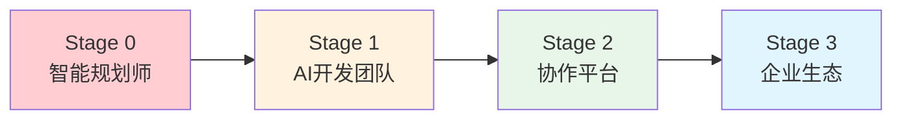

# 📋 天庭系统需求分析

## 🎯 核心问题定义

### 当前痛点分析
**问题陈述**: 软件开发从想法到产品交付的周期过长，技术门槛过高，阻碍了创新想法的快速验证和实现。

#### 痛点1: 项目启动门槛高
- **现状**: 从想法到可运行原型需要2-4周
- **影响**: 错失市场机会，创业成本高
- **证据**: 90%的创业想法在技术实现阶段夭折

#### 痛点2: 开发资源稀缺
- **现状**: 需要多个专业角色协作（前端、后端、设计师、产品经理）
- **影响**: 人力成本高，协作复杂
- **证据**: 中小企业平均需要6个月组建开发团队

#### 痛点3: 技术选型复杂
- **现状**: 技术栈选择需要大量调研和评估
- **影响**: 决策周期长，容易选择错误
- **证据**: 60%的项目因技术选型问题重构

#### 痛点4: 并发开发协调难
- **现状**: 多人协作开发存在大量沟通成本
- **影响**: 开发效率低，容易产生冲突
- **证据**: 平均30%开发时间用于协调沟通

---

## 🌟 解决方案愿景

### "言出法随"核心概念
**愿景**: 让任何人都能通过一句话描述想法，系统自动理解并生成完整的项目规划，最终实现可运行的产品。

### 核心价值主张
```
一句话输入 → 30秒理解 → 2分钟规划 → 2小时交付
```

### 用户受益价值
1. **时间效益**: 项目启动时间从周级缩短到小时级
2. **成本效益**: 减少90%的前期投入成本
3. **技术效益**: 自动化技术选型和架构设计
4. **质量效益**: AI保证代码质量和最佳实践

---

## 👥 目标用户群体

### 主要用户群体

#### 1. 创业者 (Primary)
- **特征**: 有想法但缺乏技术背景
- **需求**: 快速验证想法，获得MVP原型
- **规模**: 每年新增创业项目100万+
- **付费能力**: 月付200-500元

#### 2. 企业内部创新团队 (Primary)
- **特征**: 有预算但缺乏开发资源
- **需求**: 快速内部系统开发，提升效率
- **规模**: 中大型企业内部项目
- **付费能力**: 年付5-20万元

#### 3. 教育培训机构 (Secondary)
- **特征**: 需要实践项目进行教学
- **需求**: 为学生提供真实项目体验
- **规模**: 职业培训、高等教育
- **付费能力**: 年付2-10万元

#### 4. 开发者个人 (Secondary)
- **特征**: 想要提升开发效率
- **需求**: 自动化重复工作，专注核心逻辑
- **规模**: 个人开发者
- **付费能力**: 月付50-200元

---

## 🔍 竞品分析

### 直接竞品

#### GitHub Copilot
- **优势**: 代码生成能力强，VS Code集成好
- **劣势**: 缺乏项目规划能力，需要用户懂技术
- **差异化**: 我们提供端到端解决方案

#### Cursor
- **优势**: AI代码编辑体验好
- **劣势**: 仍需用户进行项目架构设计
- **差异化**: 我们提供自动化项目规划

#### Claude Code
- **优势**: 对话式开发，理解能力强
- **劣势**: 单窗口工作，无法并发开发
- **差异化**: 我们提供多窗口并发协作

### 间接竞品

#### 低代码平台 (OutSystems, Mendix)
- **优势**: 快速开发，可视化
- **劣势**: 平台锁定，扩展性差
- **差异化**: 我们生成标准代码，无平台锁定

#### 代码生成工具 (Copilot, TabNine)
- **优势**: 代码生成准确
- **劣势**: 需要开发者手动设计架构
- **差异化**: 我们提供完整的项目规划

---

## 📊 市场机会分析

### 市场规模 (TAM/SAM/SOM)

#### TAM (Total Addressable Market)
- **全球软件开发市场**: $650B (2024)
- **增长率**: 8.6% CAGR
- **驱动因素**: 数字化转型、AI普及

#### SAM (Serviceable Addressable Market)
- **AI辅助开发工具市场**: $15B (2024)
- **目标地区**: 中美欧发达市场
- **增长率**: 25% CAGR

#### SOM (Serviceable Obtainable Market)
- **5年目标市场份额**: 0.1% = $150M
- **用户规模**: 10万企业用户 + 100万个人用户
- **ARPU**: 企业$2000/年，个人$200/年

### 市场趋势分析

#### 技术趋势
- **AI代码生成普及**: 2024年50%开发者使用AI工具
- **低代码/无代码兴起**: 市场规模$46B到2026年
- **云原生开发**: 80%新应用采用云原生架构

#### 用户行为趋势
- **开发效率要求提升**: 平均项目周期要求缩短50%
- **技术门槛降低需求**: 非技术背景用户参与开发
- **快速原型验证**: 创业公司更注重快速试错

---

## 🎨 产品定位策略

### 产品定位
**"AI驱动的端到端项目开发平台，让任何想法都能在小时内变成现实"**

### 差异化策略

#### 核心差异化
1. **端到端解决方案**: 从想法到部署的完整流程
2. **自然语言交互**: 零技术门槛的交互方式
3. **多窗口并发开发**: 真正的AI团队协作
4. **学术研究驱动**: 持续的技术创新能力

#### 竞争壁垒
1. **技术壁垒**: 多智能体协调算法
2. **数据壁垒**: 项目模式和用户偏好数据
3. **生态壁垒**: 与主流开发工具深度集成
4. **人才壁垒**: AI+软件工程复合人才

### 产品路线图定位


---

## 📈 商业模式设计

### 收入模式

#### 阶段性收入策略

**Stage 0: 免费获客**
- 免费提供基础项目规划功能
- 建立用户基础和口碑
- 目标: 10万注册用户

**Stage 1: 增值付费**
- 多窗口并发开发: $50/月
- 高级项目模板: $20/月
- 目标: 20%付费转化率

**Stage 2: SaaS订阅**
- 团队协作版: $200/用户/月
- 企业版: $500/用户/月
- 目标: 企业客户为主

**Stage 3: 平台生态**
- 插件市场分成: 30%
- 咨询服务: $500/天
- 企业定制: $50万起

### 成本结构

#### 主要成本组成
1. **AI API成本**: 40% (Claude、OpenAI等)
2. **云服务成本**: 20% (AWS、阿里云等)
3. **人力成本**: 30% (研发、运营、销售)
4. **其他成本**: 10% (办公、营销等)

#### 成本优化策略
1. **智能调度**: 减少不必要的AI调用
2. **模型优化**: 自训练模型降低API依赖
3. **弹性扩容**: 按需使用云资源
4. **自动化运营**: 减少人工成本

---

## 🎯 核心功能需求

### 功能优先级矩阵

#### 高优先级 (Must Have)
| 功能 | 用户价值 | 技术复杂度 | 商业价值 |
|------|---------|------------|----------|
| 需求理解引擎 | 极高 | 高 | 极高 |
| 项目规划生成 | 极高 | 中 | 极高 |
| 技术架构推荐 | 高 | 中 | 高 |
| 基础代码生成 | 高 | 高 | 高 |

#### 中优先级 (Should Have)
| 功能 | 用户价值 | 技术复杂度 | 商业价值 |
|------|---------|------------|----------|
| 多窗口协调 | 极高 | 极高 | 极高 |
| 实时状态同步 | 高 | 高 | 中 |
| 冲突自动解决 | 高 | 极高 | 中 |
| 质量自动检查 | 中 | 中 | 中 |

#### 低优先级 (Could Have)
| 功能 | 用户价值 | 技术复杂度 | 商业价值 |
|------|---------|------------|----------|
| 团队协作 | 中 | 中 | 高 |
| 云端部署 | 中 | 低 | 高 |
| 插件生态 | 低 | 高 | 极高 |
| 企业集成 | 低 | 中 | 极高 |

### 功能详细描述

#### 核心功能1: 需求理解引擎
**目标**: 准确理解用户的自然语言描述，提取项目关键信息

**输入**: 用户自然语言描述
**输出**: 结构化项目需求

**核心能力**:
- 意图识别: 判断项目类型（Web应用、移动应用、API等）
- 实体抽取: 识别功能模块、技术约束、用户群体
- 上下文理解: 理解隐含需求和业务逻辑

**成功标准**: 90%的输入能正确理解并生成合理的需求结构

#### 核心功能2: 项目规划生成器
**目标**: 基于理解的需求，自动生成完整的项目规划

**输入**: 结构化项目需求
**输出**: 完整项目规划文档

**核心能力**:
- 用户旅程设计: 自动生成用户使用流程
- 功能模块拆分: 识别核心功能和辅助功能
- 技术架构设计: 推荐合适的技术栈
- 开发计划制定: 估算工期和任务优先级

**成功标准**: 生成的规划文档专业度评分≥4.0/5.0

#### 核心功能3: 多窗口协调器
**目标**: 管理多个Claude Code窗口并发开发，确保协调一致

**输入**: 项目规划和任务分配
**输出**: 协调后的开发成果

**核心能力**:
- 任务智能分配: 根据模块依赖分配任务
- 状态实时同步: 确保所有窗口看到一致状态
- 冲突自动解决: 检测并解决代码冲突
- 进度智能监控: 跟踪开发进度和质量

**成功标准**: 支持4个窗口稳定协作，冲突解决成功率≥80%

---

## ⚠️ 风险评估

### 技术风险

#### 高风险
| 风险 | 影响 | 概率 | 缓解策略 |
|------|------|------|----------|
| AI理解准确率不足 | 产品核心价值受损 | 中 | 大量训练数据，持续优化 |
| 多窗口同步复杂度 | 功能无法实现 | 高 | 分阶段实现，降低复杂度 |
| 代码生成质量不稳定 | 用户体验差 | 中 | 质量检查机制，人工审核 |

#### 中风险
| 风险 | 影响 | 概率 | 缓解策略 |
|------|------|------|----------|
| Claude API限制 | 服务不稳定 | 中 | 多API供应商，本地备份 |
| 性能瓶颈 | 用户体验下降 | 中 | 性能监控，优化算法 |

### 商业风险

#### 市场风险
- **竞品快速跟进**: 大厂推出类似产品
- **缓解**: 建立技术壁垒，快速占领市场

#### 用户风险
- **期望过高**: 用户对AI能力期望超出实际
- **缓解**: 明确产品边界，管理用户期望

#### 合规风险
- **AI生成代码版权**: 代码版权归属不明确
- **缓解**: 法律咨询，使用条款明确

---

## 📊 成功指标体系

### 产品指标

#### 核心指标 (North Star Metrics)
- **项目成功率**: 用户完成完整项目的比例 ≥70%
- **时间节省比例**: 相比传统开发节省时间 ≥80%
- **用户满意度**: NPS ≥50

#### 功能指标
- **需求理解准确率**: ≥90%
- **规划文档质量评分**: ≥4.0/5.0
- **代码生成可运行率**: ≥85%
- **多窗口协作成功率**: ≥80%

### 业务指标

#### 增长指标
- **月活用户增长率**: ≥20%
- **付费转化率**: ≥15%
- **用户留存率**: 7日≥60%, 30日≥40%

#### 收入指标
- **ARPU**: 个人$200/年, 企业$2000/年
- **LTV/CAC**: ≥3:1
- **月收入增长率**: ≥30%

### 技术指标

#### 性能指标
- **响应时间**: 需求理解<10s, 规划生成<60s
- **系统可用性**: ≥99.5%
- **并发支持**: 单用户4窗口, 系统100+用户

#### 质量指标
- **代码质量**: 生成代码通过率≥90%
- **测试覆盖率**: ≥80%
- **Bug率**: <1 bug/1000行代码

---

## 🎯 下一步行动计划

### 即将启动的工作

#### 1. 用户旅程设计 (Week 1)
- 基于需求分析设计详细用户旅程
- 定义各个阶段的用户体验
- 识别关键决策点和痛点

#### 2. 用户故事拆分 (Week 1-2)
- 将需求转化为详细的User Stories
- 定义验收标准和测试用例
- 确定开发优先级

#### 3. 技术架构设计 (Week 2)
- 基于功能需求设计技术架构
- 选择合适的技术栈
- 制定技术实现方案

#### 4. 论文研究支持 (Week 2-3)
- 识别需要论文支持的技术难点
- 制定论文收集和应用策略
- 建立学术研究转化流程

#### 5. OES设计 (Week 3-4)
- 设计完整的OES任务分解方法
- 定义多窗口协调机制
- 制定实现优先级

### 成功验证标准
1. 需求分析获得10+潜在用户验证
2. 用户旅程获得85%+用户认可
3. 技术方案可行性验证通过
4. 核心算法原型验证成功

---

**🎯 从痛点到解决方案，从想法到产品，天庭让"言出法随"成为现实！**