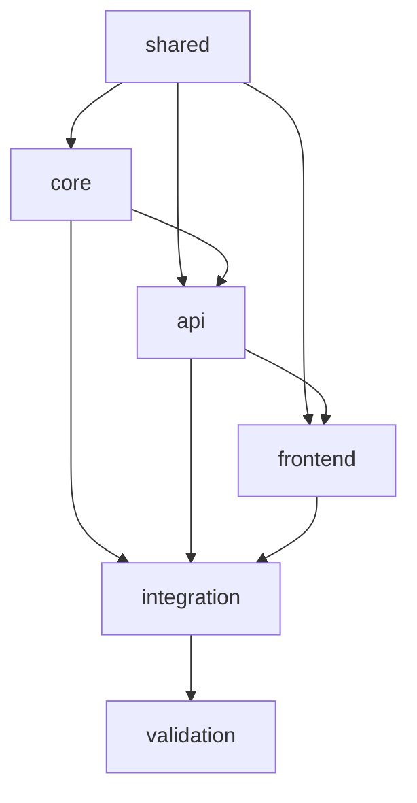

# 天庭系统OES任务执行指南

## 🎯 总览

本文档是天庭AI项目规划系统的完整开发指南，基于OES (Object-Entity-System) 方法论设计，支持真正的并发开发。

### 🏗️ 系统架构

```
天庭MVP系统
├── packages/shared/          # 共享类型定义 (所有包的基础)
├── packages/core/            # 业务逻辑层 (AI服务、需求解析、项目规划)
├── packages/api/             # HTTP API层 (FastAPI服务)
├── packages/frontend/        # 用户界面层 (React应用)
├── packages/integration/     # 跨包集成测试
└── packages/validation/      # 最终系统验证
```

### 🚀 并发开发能力

✅ **真正的并发开发**: 每个包可以在独立的Claude Code窗口中并发开发  
✅ **环境隔离**: 每个包有独立的数据库、端口、Docker环境  
✅ **接口契约**: 基于shared包的类型定义，包间通过接口协作  
✅ **Mock服务**: 前端可以基于Mock API完全独立开发  

## 📋 开发阶段和任务分布

### Stage 0: 基础设施 (Foundation)
**可并发执行的包**: shared, core, api, frontend

| 包名 | 任务文件 | 负责内容 | 端口 | 数据库 |
|------|----------|----------|------|--------|
| shared | `packages/shared/tasks/type-definitions-01-base.task.md` | TypeScript类型定义 | N/A | N/A |
| core | `packages/core/tasks/requirement-parsing-01-base.task.md` | 需求解析器 | 8001 | tianting_core_dev |
| core | `packages/core/tasks/project-planning-01-base.task.md` | 项目规划器 | 8001 | tianting_core_dev |
| api | `packages/api/tasks/server-framework-01-base.task.md` | FastAPI框架 | 8002 | tianting_api_dev |
| api | `packages/api/tasks/requirement-endpoints-01-base.task.md` | 需求管理API | 8002 | tianting_api_dev |
| frontend | `packages/frontend/tasks/ui-components-01-base.task.md` | 基础UI组件 | 3001 | N/A |
| frontend | `packages/frontend/tasks/page-components-01-base.task.md` | 页面组件和路由 | 3001 | N/A |

### Stage 1: 集成验证 (Integration)
**依赖**: Stage 0 所有基础任务完成

| 包名 | 任务文件 | 负责内容 |
|------|----------|----------|
| core | `packages/core/tasks/core-integration-01-integration.task.md` | Core包内部集成 |
| integration | `packages/integration/tasks/end-to-end-workflow-01-integration.task.md` | 跨包集成测试 |

### Stage 2: 最终验证 (Validation)
**依赖**: Stage 1 集成任务完成

| 包名 | 任务文件 | 负责内容 |
|------|----------|----------|
| validation | `packages/validation/tasks/system-validation-01-final.task.md` | 系统最终验证和发布准备 |

## 🔧 快速开始

### 1. 环境准备

```bash
# 克隆项目
git clone <repository-url>
cd tianting-mvp

# 启动基础服务 (Docker)
docker-compose -f packages/common/environments/docker-compose.dev.yml up -d

# 验证服务状态
curl http://localhost:5432  # PostgreSQL
curl http://localhost:6379  # Redis
```

### 2. 选择开发包

根据团队分工，选择一个包进行开发：

```bash
# 示例：开发core包
cd packages/core
```

### 3. 执行任务

在新的Claude Code窗口中执行以下步骤：

1. **阅读任务文件**: 完整阅读对应的`.task.md`文件
2. **宣誓执行**: 按任务要求宣誓接受AI执行誓词
3. **环境分析**: 详细分析任务环境和依赖
4. **目标分析**: 理解任务目标和边界
5. **实施开发**: 按照实现指导进行开发
6. **验证测试**: 运行测试确保任务完成

### 4. 典型执行示例

```
Claude开发者: 我已阅读并接受AI执行誓词，现在开始按规范执行任务

环境分析完成：
- 参考了packages/shared/src/types/domain.ts中的RequirementModel定义
- 确认core包服务端口为8001
- 了解了依赖shared包的类型定义
- 明确了不包含API路由层的任务边界

目标分析完成：
- 目标是实现RequirementParser类
- 需要使用本地AI能力进行需求解析
- 输出格式必须符合RequirementModel
- 性能要求是30秒内完成解析

现在制定实现计划...
```

## 🔄 并发开发协调

### 包间依赖关系



### 开发顺序建议

1. **优先级1**: `shared` - 所有包的基础
2. **优先级2**: `core`, `api`, `frontend` - 可并发开发
3. **优先级3**: `integration` - 需要基础包完成
4. **优先级4**: `validation` - 最终验证

### 协调机制

- **接口契约**: 基于`packages/common/contracts/api-contracts.md`
- **类型安全**: 基于shared包的TypeScript定义
- **Mock服务**: 前端使用Mock API独立开发
- **环境隔离**: 每个包独立的数据库和端口

## 📊 质量保证

### 测试覆盖率要求
- **单元测试**: ≥80%
- **集成测试**: ≥90% 
- **端到端测试**: 覆盖主要用户流程

### 性能指标
- **需求解析**: <30秒
- **API响应**: <100ms
- **页面加载**: <2秒
- **系统可用性**: ≥99.9%

### 代码质量
- **TypeScript**: 严格类型检查
- **ESLint**: 无错误级别问题
- **Prettier**: 统一代码格式
- **测试**: 所有测试通过

## 🛠️ 开发工具

### 必需工具
- **Node.js**: 18+
- **Python**: 3.11+
- **Docker**: 24+
- **Git**: 2.40+

### 推荐IDE
- **VS Code**: 统一开发环境
- **Extensions**: TypeScript, Python, Docker, Prettier

### 调试工具
- **React DevTools**: 前端调试
- **Postman**: API测试
- **pgAdmin**: 数据库管理
- **Redis Commander**: Redis管理

## 📁 文件结构说明

```
packages/
├── shared/                    # 共享类型和工具
│   ├── src/types/            # TypeScript类型定义
│   ├── tests/                # 类型测试
│   └── tasks/                # shared包任务
├── core/                     # 业务逻辑核心
│   ├── src/                  # Python业务逻辑
│   ├── tests/                # 单元测试
│   └── tasks/                # core包任务
├── api/                      # FastAPI服务
│   ├── src/                  # API实现
│   ├── tests/                # API测试
│   └── tasks/                # api包任务
├── frontend/                 # React前端
│   ├── src/                  # 前端代码
│   ├── tests/                # 前端测试
│   └── tasks/                # frontend包任务
├── integration/              # 集成测试
│   ├── tests/                # 跨包测试
│   └── tasks/                # 集成任务
├── validation/               # 最终验证
│   ├── tests/                # 验收测试
│   └── tasks/                # 验证任务
└── common/                   # 公共配置
    ├── contracts/            # 接口契约
    ├── environments/         # 环境配置
    └── guides/               # 开发指南
```

## 🚨 重要注意事项

### 1. 任务执行规范
- **必须宣誓**: 每个任务开始前必须宣誓接受AI执行誓词
- **顺序执行**: 严格按照"环境分析 → 目标分析 → 实施"的顺序
- **测试优先**: 实现功能的同时确保测试通过
- **文档同步**: 代码实现的同时更新相关文档

### 2. 并发开发冲突避免
- **文件边界**: 严格按照包边界分工，避免修改其他包文件
- **接口稳定**: shared包的类型定义确定后避免频繁修改
- **数据库隔离**: 每个包使用独立的数据库
- **端口分配**: 严格按照分配的端口运行服务

### 3. 代码质量标准
- **类型安全**: 所有代码必须通过TypeScript类型检查
- **测试覆盖**: 新增代码必须有对应测试
- **代码审查**: 提交前进行自我代码审查
- **文档更新**: 重要功能必须有文档说明

## 🔍 故障排查

### 常见问题

1. **端口冲突**: 检查端口分配，确保按包使用指定端口
2. **数据库连接**: 确认Docker服务正常运行
3. **类型错误**: 检查shared包类型定义是否最新
4. **测试失败**: 查看详细错误日志，确认测试环境配置

### 调试指南

```bash
# 检查服务状态
docker-compose ps

# 查看服务日志
docker-compose logs [service-name]

# 重启服务
docker-compose restart [service-name]

# 检查网络连接
curl http://localhost:[port]/health
```

## 📞 支持

- **技术问题**: 查看各包的tasks/目录下的任务文件
- **架构问题**: 参考`packages/common/guides/`目录
- **环境问题**: 参考`packages/common/environments/`目录

---

**重要提醒**: 这是一个支持真正并发开发的OES任务系统。请确保每个开发者在独立的Claude Code窗口中执行对应的任务，遵循任务文件中的指导，确保系统的整体质量和一致性。