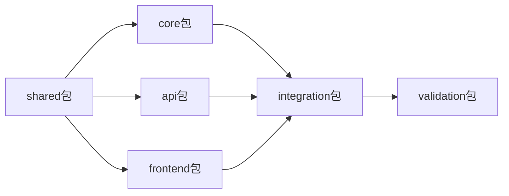

# 天庭 v1.0 - 智能工作流引擎

## 🎯 版本概述

**版本目标**: 实现"言出法随"的基础能力 - 用户用一句话描述需求，系统自动生成完整的项目规划和实现方案。

**核心价值**: 降低软件开发门槛，让非技术用户也能启动专业级软件项目。

## 🚀 版本状态

**当前阶段**: 🚧 开发中 (Development Phase)  
**开始时间**: 2025年1月15日  
**预计完成**: 2025年2月15日  
**完成进度**: 25% (OES任务设计完成，环境搭建中)

## 🎪 核心功能

### 1. 智能需求解析 🧠
- 自然语言需求理解
- 自动识别项目类型和复杂度
- 生成结构化需求文档

### 2. 自动项目规划 📋
- 基于需求自动生成开发计划
- 技术栈选择和架构建议
- 时间和资源预估

### 3. 方案生成引擎 ⚡
- 生成完整的技术实现方案
- 包含代码结构、API设计、数据库设计
- 输出可执行的开发指导

## 🏗️ 技术架构

### 技术栈
- **前端**: React 18 + TypeScript + Tailwind CSS
- **后端**: FastAPI + Python 3.11
- **数据库**: PostgreSQL + Redis
- **AI服务**: Claude 3.5 Sonnet
- **部署**: Docker 容器化

### 系统组件
```
v1.0-intelligent-workflow/
├── packages/shared/        # 共享类型和工具
├── packages/core/          # 核心业务逻辑
├── packages/api/           # API服务层
├── packages/frontend/      # 用户界面
├── packages/integration/   # 集成测试
└── packages/validation/    # 最终验证
```

## 📚 快速开始

### 🚀 新用户开始这里
1. **一键安装**: `./install.sh` 自动安装所有依赖
2. **快速启动**: `./quick-start.sh` 启动所有服务
3. **访问应用**: http://localhost:3001
4. **详细指南**: 查看 [`QUICK-START-GUIDE.md`](QUICK-START-GUIDE.md) 📖

### 对于开发者
1. **环境搭建**: 执行 [`packages/setup/tasks/project-initialization-00-setup.task.md`](packages/setup/tasks/project-initialization-00-setup.task.md)
2. **了解流程**: 阅读 [`PROJECT-EXECUTION-GUIDE.md`](PROJECT-EXECUTION-GUIDE.md)
3. **开始开发**: 查看 [`OES-EXECUTION-GUIDE.md`](OES-EXECUTION-GUIDE.md) 了解并发开发机制

### 对于项目管理者
1. **查看进度**: 阅读 [`CURRENT-VERSION-STATUS.md`](CURRENT-VERSION-STATUS.md)
2. **了解计划**: 查看 [`MVP-SCOPE-AND-ROADMAP.md`](MVP-SCOPE-AND-ROADMAP.md)
3. **验收标准**: 参考 [`VERSION-COMPLETION-CHECKLIST.md`](VERSION-COMPLETION-CHECKLIST.md)

### 对于新团队成员
1. **项目全貌**: 从 [`../README.md`](../README.md) 开始了解整体项目
2. **需求背景**: 阅读 [`docs/requirements-analysis.md`](docs/requirements-analysis.md)
3. **协作指南**: 参考 [`../project-management/team-collaboration.md`](../project-management/team-collaboration.md)

## 🎯 成功标准

### 功能标准
- [x] 需求解析准确率 ≥85%
- [ ] 规划生成时间 <30秒
- [ ] 支持5种以上项目类型
- [ ] 生成方案的可执行性 ≥80%

### 技术标准
- [ ] 代码测试覆盖率 ≥80%
- [ ] API响应时间 <2秒
- [ ] 系统可用性 ≥99.5%
- [ ] 安全扫描无高危漏洞

### 用户标准
- [ ] 用户满意度 ≥4.0/5.0
- [ ] 新用户上手时间 <10分钟
- [ ] 用户推荐度 ≥60%

## 📊 开发任务概览

### 并发开发包结构


### 当前任务状态
- **setup包**: ✅ 环境搭建任务完成
- **shared包**: 🚧 类型定义开发中
- **core包**: ⏳ 等待shared包完成
- **api包**: ⏳ 等待shared包完成
- **frontend包**: 🚧 UI组件开发中 (可并行)
- **integration包**: ⏳ 等待核心包完成
- **validation包**: ⏳ 最后执行

## 🔄 向 v2.0 过渡

### v2.0 多窗口协作系统
**目标**: 实现真正的AI开发团队，多个AI角色并发协作开发

**主要改进**:
- 多窗口任务分解和并发执行
- AI角色专业化 (前端专家、后端专家、测试专家等)
- 智能任务调度和依赖管理
- 跨窗口状态同步和冲突解决

**过渡条件**:
- v1.0 功能验证通过
- 用户满意度达标
- 技术债务清理完成
- v2.0 环境准备就绪

详见: [`MVP-0-TO-MVP-1-TRANSITION.md`](MVP-0-TO-MVP-1-TRANSITION.md)

## 🐛 已知问题和限制

### 当前限制
- 仅支持Web应用项目类型
- 需求解析依赖单一AI模型
- 暂不支持复杂的企业级需求
- 生成的方案需要人工验证

### 计划改进
- 扩展更多项目类型支持
- 引入多模型协作机制
- 增强方案自动验证能力
- 优化用户交互体验

## 📞 支持和反馈

### 开发支持
- **技术问题**: 查看各包的 `docs/` 目录
- **开发指南**: [`PROJECT-EXECUTION-GUIDE.md`](PROJECT-EXECUTION-GUIDE.md)
- **API文档**: [`packages/common/contracts/api-contracts.md`](packages/common/contracts/api-contracts.md)

### 问题反馈
- **功能缺陷**: 在对应包的issues中记录
- **改进建议**: 提交到 `feedback/` 目录
- **紧急问题**: 直接联系技术负责人

## 📄 重要文档索引

### 执行指南
- [`PROJECT-EXECUTION-GUIDE.md`](PROJECT-EXECUTION-GUIDE.md) - 项目执行流程
- [`OES-EXECUTION-GUIDE.md`](OES-EXECUTION-GUIDE.md) - OES任务系统使用
- [`../project-management/team-collaboration.md`](../project-management/team-collaboration.md) - 团队协作指南

### 状态跟踪
- [`CURRENT-VERSION-STATUS.md`](CURRENT-VERSION-STATUS.md) - 实时状态面板
- [`VERSION-COMPLETION-CHECKLIST.md`](VERSION-COMPLETION-CHECKLIST.md) - 完成验证清单

### 技术文档
- [`development/architecture/technical-architecture.md`](development/architecture/technical-architecture.md) - 技术架构
- [`packages/common/guides/concurrent-development-framework.md`](packages/common/guides/concurrent-development-framework.md) - 并发开发框架

---

## 🎉 里程碑

### 已完成
- ✅ **2025-01-15**: 项目启动，OES任务设计完成
- ✅ **2025-01-20**: 包结构设计和环境配置完成

### 进行中
- 🚧 **2025-01-25**: shared包类型定义开发
- 🚧 **2025-01-30**: core包核心逻辑开发
- 🚧 **2025-01-30**: frontend包UI组件开发

### 计划中
- 📅 **2025-02-05**: API服务集成完成
- 📅 **2025-02-10**: 集成测试和缺陷修复
- 📅 **2025-02-15**: 最终验证和版本发布

---

**💡 提示**: 这是一个活跃开发的版本，建议开发者每日查看 `CURRENT-VERSION-STATUS.md` 了解最新进展。