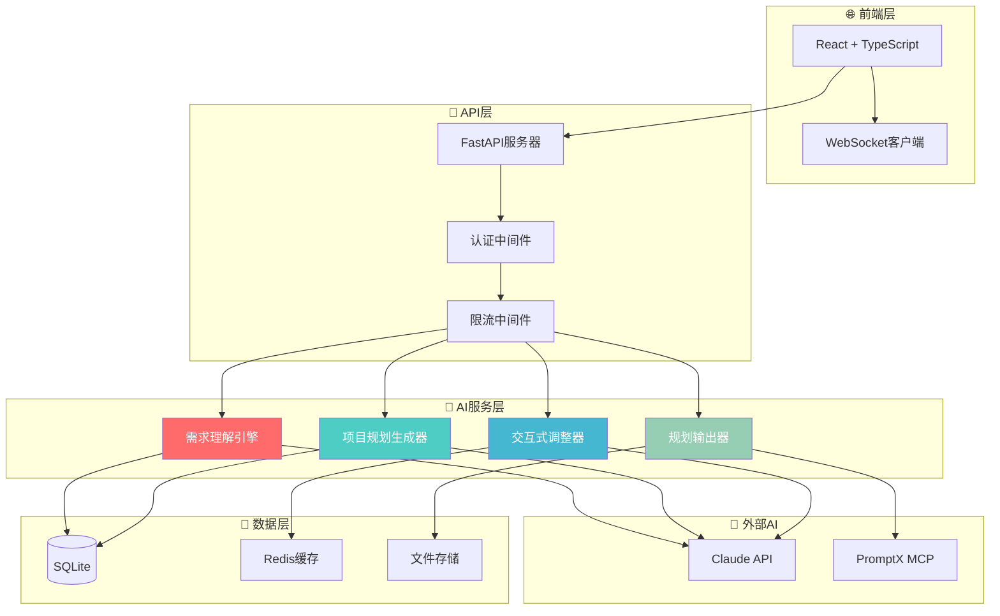
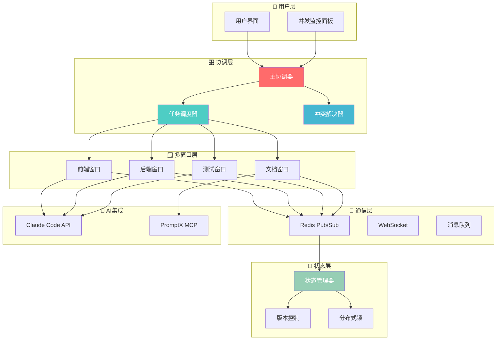

# 🏗️ 天庭系统技术架构设计

## 🎯 架构设计原则

### 核心设计理念
基于"言出法随"的产品愿景，技术架构遵循以下原则：

1. **渐进式演进**: 支持从简单到复杂的平滑升级
2. **模块化设计**: 高内聚低耦合，便于独立开发和测试
3. **AI优先**: 所有组件都为AI集成和协作优化
4. **性能导向**: 优化响应时间，确保用户体验
5. **可扩展性**: 支持从单用户到企业级的规模扩展

### 技术选型策略
- **成熟优先**: 选择经过验证的技术栈
- **AI友好**: 优先选择AI生态支持良好的技术
- **开发效率**: 平衡开发速度和系统性能
- **成本控制**: 考虑部署和运维成本

---

## 🚀 Stage 0: 智能工作流引擎架构

### 系统架构概览



### 核心组件设计

#### 1. 需求理解引擎 (NLU Engine)

**职责**: 解析用户自然语言输入，提取结构化需求信息

**技术栈**:
```yaml
语言: Python 3.11+
框架: FastAPI + Pydantic
AI集成: Claude API (Sonnet-3.5)
NLP处理: spaCy + transformers
数据验证: Pydantic models
```

**核心算法**:
```python
class RequirementParser:
    def __init__(self):
        self.claude_client = ClaudeClient()
        self.nlp_processor = spacy.load("zh_core_web_sm")
        
    async def parse_requirement(self, user_input: str) -> RequirementModel:
        # 1. 预处理文本
        processed_text = self.preprocess_text(user_input)
        
        # 2. 实体识别
        entities = self.extract_entities(processed_text)
        
        # 3. 意图分类
        intent = await self.classify_intent(processed_text)
        
        # 4. 结构化提取
        structured_req = await self.extract_structure(
            processed_text, entities, intent
        )
        
        return RequirementModel(**structured_req)
```

**数据模型**:
```python
class RequirementModel(BaseModel):
    project_type: ProjectType
    target_users: List[UserGroup]
    core_features: List[Feature]
    technical_constraints: List[Constraint]
    business_model: BusinessModel
    priority_level: PriorityLevel
    estimated_complexity: ComplexityLevel
```

#### 2. 项目规划生成器 (Project Planner)

**职责**: 基于理解的需求生成完整项目规划

**技术栈**:
```yaml
语言: Python 3.11+
模板引擎: Jinja2
图表生成: matplotlib + plotly
文档生成: reportlab + markdown
知识库: 项目模板数据库
```

**核心架构**:
```python
class ProjectPlanner:
    def __init__(self):
        self.template_db = TemplateDatabase()
        self.cost_calculator = CostCalculator()
        self.timeline_estimator = TimelineEstimator()
        
    async def generate_plan(self, requirement: RequirementModel) -> ProjectPlan:
        # 1. 选择项目模板
        template = self.select_template(requirement.project_type)
        
        # 2. 生成用户旅程
        user_journey = await self.generate_user_journey(requirement)
        
        # 3. 设计技术架构
        tech_architecture = await self.design_architecture(requirement)
        
        # 4. 分解功能模块
        modules = await self.decompose_modules(requirement)
        
        # 5. 制定开发计划
        timeline = self.estimate_timeline(modules)
        
        # 6. 计算成本预算
        budget = self.calculate_budget(modules, timeline)
        
        return ProjectPlan(
            user_journey=user_journey,
            architecture=tech_architecture,
            modules=modules,
            timeline=timeline,
            budget=budget
        )
```

#### 3. 交互式调整器 (Interactive Adjuster)

**职责**: 处理用户反馈，智能调整项目规划

**技术栈**:
```yaml
语言: Python 3.11+
实时通信: WebSocket + Redis
状态管理: Redis + JSON
版本控制: Git-like diff算法
```

**调整策略**:
```python
class InteractiveAdjuster:
    def __init__(self):
        self.feedback_analyzer = FeedbackAnalyzer()
        self.plan_modifier = PlanModifier()
        self.version_manager = VersionManager()
        
    async def process_feedback(
        self, 
        plan: ProjectPlan, 
        feedback: UserFeedback
    ) -> AdjustedPlan:
        # 1. 分析反馈意图
        intent = await self.feedback_analyzer.analyze(feedback)
        
        # 2. 生成调整方案
        adjustments = await self.plan_modifier.generate_adjustments(
            plan, intent
        )
        
        # 3. 验证调整一致性
        validated_plan = self.validate_consistency(plan, adjustments)
        
        # 4. 保存版本历史
        self.version_manager.save_version(plan, validated_plan)
        
        return validated_plan
```

#### 4. 规划输出器 (Plan Exporter)

**职责**: 将最终规划输出为各种格式的文档

**技术栈**:
```yaml
语言: Python 3.11+
PDF生成: reportlab + weasyprint
文档模板: Jinja2 + Markdown
图表生成: matplotlib + mermaid
云存储: 本地文件系统 (Stage 0)
```

### 数据库设计

#### SQLite Schema设计
```sql
-- 用户表
CREATE TABLE users (
    id INTEGER PRIMARY KEY AUTOINCREMENT,
    username VARCHAR(50) UNIQUE NOT NULL,
    email VARCHAR(100) UNIQUE NOT NULL,
    created_at TIMESTAMP DEFAULT CURRENT_TIMESTAMP
);

-- 项目表
CREATE TABLE projects (
    id INTEGER PRIMARY KEY AUTOINCREMENT,
    user_id INTEGER NOT NULL,
    name VARCHAR(200) NOT NULL,
    description TEXT,
    project_type VARCHAR(50) NOT NULL,
    status VARCHAR(20) DEFAULT 'planning',
    created_at TIMESTAMP DEFAULT CURRENT_TIMESTAMP,
    updated_at TIMESTAMP DEFAULT CURRENT_TIMESTAMP,
    FOREIGN KEY (user_id) REFERENCES users(id)
);

-- 需求表
CREATE TABLE requirements (
    id INTEGER PRIMARY KEY AUTOINCREMENT,
    project_id INTEGER NOT NULL,
    raw_input TEXT NOT NULL,
    parsed_data JSON NOT NULL,
    confidence_score REAL NOT NULL,
    created_at TIMESTAMP DEFAULT CURRENT_TIMESTAMP,
    FOREIGN KEY (project_id) REFERENCES projects(id)
);

-- 规划表
CREATE TABLE plans (
    id INTEGER PRIMARY KEY AUTOINCREMENT,
    project_id INTEGER NOT NULL,
    version INTEGER NOT NULL DEFAULT 1,
    plan_data JSON NOT NULL,
    is_current BOOLEAN DEFAULT TRUE,
    created_at TIMESTAMP DEFAULT CURRENT_TIMESTAMP,
    FOREIGN KEY (project_id) REFERENCES projects(id)
);

-- 反馈表
CREATE TABLE feedbacks (
    id INTEGER PRIMARY KEY AUTOINCREMENT,
    plan_id INTEGER NOT NULL,
    feedback_text TEXT NOT NULL,
    feedback_type VARCHAR(20) NOT NULL,
    processed BOOLEAN DEFAULT FALSE,
    created_at TIMESTAMP DEFAULT CURRENT_TIMESTAMP,
    FOREIGN KEY (plan_id) REFERENCES plans(id)
);
```

### API设计

#### RESTful API端点
```yaml
基础路径: /api/v1

认证端点:
  POST /auth/login     # 用户登录
  POST /auth/register  # 用户注册
  POST /auth/logout    # 用户登出

项目管理:
  GET  /projects       # 获取项目列表
  POST /projects       # 创建新项目
  GET  /projects/{id}  # 获取项目详情
  PUT  /projects/{id}  # 更新项目信息
  DELETE /projects/{id} # 删除项目

需求处理:
  POST /projects/{id}/requirements  # 提交需求
  GET  /projects/{id}/requirements  # 获取需求历史

规划生成:
  POST /projects/{id}/plan          # 生成规划
  GET  /projects/{id}/plan          # 获取当前规划
  GET  /projects/{id}/plan/versions # 获取历史版本

交互调整:
  POST /projects/{id}/feedback      # 提交反馈
  POST /projects/{id}/adjust        # 执行调整

文档导出:
  GET  /projects/{id}/export/pdf    # 导出PDF
  GET  /projects/{id}/export/docx   # 导出Word
  GET  /projects/{id}/export/md     # 导出Markdown
```

#### WebSocket事件
```yaml
连接: /ws/projects/{project_id}

客户端事件:
  requirement_submit   # 提交需求
  feedback_submit      # 提交反馈
  plan_adjust_request  # 请求调整

服务端事件:
  requirement_processing  # 需求处理中
  requirement_completed   # 需求处理完成
  plan_generating        # 规划生成中
  plan_completed         # 规划生成完成
  adjustment_processing  # 调整处理中
  adjustment_completed   # 调整完成
  error_occurred         # 错误发生
```

---

## 🔄 Stage 1: 多窗口并发执行架构

### 架构升级概览



### 新增核心组件

#### 1. 主协调器 (Main Orchestrator)

**职责**: 统一管理和协调所有并发开发窗口

**技术栈**:
```yaml
语言: Python 3.11+ (异步编程)
进程管理: asyncio + multiprocessing
窗口管理: Claude Code API客户端
监控: prometheus_client
```

**核心实现**:
```python
class MainOrchestrator:
    def __init__(self):
        self.window_manager = WindowManager()
        self.task_scheduler = TaskScheduler()
        self.conflict_resolver = ConflictResolver()
        self.state_manager = StateManager()
        
    async def start_concurrent_development(self, project_plan: ProjectPlan):
        # 1. 分析项目计划，分解任务
        tasks = await self.decompose_tasks(project_plan)
        
        # 2. 启动多个开发窗口
        windows = await self.window_manager.create_windows(4)
        
        # 3. 分配任务到窗口
        task_assignments = await self.task_scheduler.assign_tasks(
            tasks, windows
        )
        
        # 4. 启动并发执行
        results = await asyncio.gather(*[
            self.execute_window_tasks(window, assignments)
            for window, assignments in task_assignments.items()
        ])
        
        # 5. 集成所有结果
        integrated_project = await self.integrate_results(results)
        
        return integrated_project
```

#### 2. 任务调度器 (Task Scheduler)

**职责**: 智能分配任务给不同窗口，管理依赖关系

**调度算法**:
```python
class TaskScheduler:
    def __init__(self):
        self.dependency_analyzer = DependencyAnalyzer()
        self.load_balancer = LoadBalancer()
        
    async def assign_tasks(self, tasks: List[Task], windows: List[Window]):
        # 1. 分析任务依赖关系
        dependency_graph = self.dependency_analyzer.build_graph(tasks)
        
        # 2. 拓扑排序确定执行顺序
        execution_order = self.topological_sort(dependency_graph)
        
        # 3. 按窗口专业领域分组
        task_groups = {
            'frontend': [],
            'backend': [],
            'testing': [],
            'documentation': []
        }
        
        for task in execution_order:
            group = self.classify_task(task)
            task_groups[group].append(task)
        
        # 4. 负载均衡分配
        assignments = self.load_balancer.assign(task_groups, windows)
        
        return assignments
```

#### 3. 冲突解决器 (Conflict Resolver)

**职责**: 检测和自动解决多窗口开发中的冲突

**冲突检测算法**:
```python
class ConflictResolver:
    def __init__(self):
        self.file_monitor = FileMonitor()
        self.api_monitor = APIMonitor()
        self.db_monitor = DatabaseMonitor()
        
    async def detect_conflicts(self, changes: List[Change]) -> List[Conflict]:
        conflicts = []
        
        # 1. 文件级冲突检测
        file_conflicts = await self.detect_file_conflicts(changes)
        conflicts.extend(file_conflicts)
        
        # 2. API接口冲突检测
        api_conflicts = await self.detect_api_conflicts(changes)
        conflicts.extend(api_conflicts)
        
        # 3. 数据库schema冲突检测
        db_conflicts = await self.detect_db_conflicts(changes)
        conflicts.extend(db_conflicts)
        
        return conflicts
    
    async def resolve_conflicts(self, conflicts: List[Conflict]) -> Resolution:
        resolutions = []
        
        for conflict in conflicts:
            if conflict.type == ConflictType.FILE_MERGE:
                resolution = await self.auto_merge_files(conflict)
            elif conflict.type == ConflictType.API_INTERFACE:
                resolution = await self.harmonize_api(conflict)
            elif conflict.type == ConflictType.DATABASE_SCHEMA:
                resolution = await self.merge_schema(conflict)
            else:
                resolution = await self.request_manual_resolution(conflict)
            
            resolutions.append(resolution)
        
        return Resolution(resolutions)
```

#### 4. 状态管理器 (State Manager)

**职责**: 维护所有窗口的一致状态，支持实时同步

**状态同步机制**:
```python
class StateManager:
    def __init__(self):
        self.redis_client = redis.Redis()
        self.websocket_manager = WebSocketManager()
        self.version_control = VersionControl()
        
    async def sync_state(self, window_id: str, state_change: StateChange):
        # 1. 更新Redis中的状态
        await self.redis_client.hset(
            f"project:{state_change.project_id}:state",
            window_id,
            json.dumps(state_change.data)
        )
        
        # 2. 广播状态变更到其他窗口
        await self.websocket_manager.broadcast(
            f"project:{state_change.project_id}",
            {
                "type": "state_update",
                "window_id": window_id,
                "change": state_change.data
            }
        )
        
        # 3. 记录版本历史
        await self.version_control.record_change(state_change)
        
    async def get_consistent_state(self, project_id: str) -> ProjectState:
        # 从Redis获取所有窗口的最新状态
        state_data = await self.redis_client.hgetall(
            f"project:{project_id}:state"
        )
        
        # 合并为一致的项目状态
        consistent_state = self.merge_window_states(state_data)
        
        return consistent_state
```

### 性能优化策略

#### 1. 异步编程模式
```python
# 使用asyncio实现高并发
async def process_multiple_windows():
    tasks = [
        process_window(window_id) 
        for window_id in active_windows
    ]
    results = await asyncio.gather(*tasks, return_exceptions=True)
    return results
```

#### 2. 连接池管理
```python
# Redis连接池
redis_pool = redis.ConnectionPool(
    host='localhost',
    port=6379,
    max_connections=20
)

# Claude API连接池
claude_session = aiohttp.ClientSession(
    connector=aiohttp.TCPConnector(limit=10)
)
```

#### 3. 智能缓存策略
```python
class SmartCache:
    def __init__(self):
        self.redis = redis.Redis()
        self.local_cache = {}
        
    async def get_cached_result(self, key: str, generator_func):
        # 1. 检查本地缓存
        if key in self.local_cache:
            return self.local_cache[key]
            
        # 2. 检查Redis缓存
        cached = await self.redis.get(key)
        if cached:
            result = json.loads(cached)
            self.local_cache[key] = result
            return result
            
        # 3. 生成新结果并缓存
        result = await generator_func()
        await self.redis.setex(key, 3600, json.dumps(result))
        self.local_cache[key] = result
        return result
```

---

## 📊 技术选型详细说明

### 后端技术栈

#### FastAPI框架选择理由
```yaml
优势:
  - 原生异步支持，适合AI API集成
  - 自动API文档生成
  - 类型安全和数据验证
  - 高性能，接近Flask的2-3倍
  - 现代Python特性支持

与替代方案对比:
  vs Django: 更轻量，异步支持更好
  vs Flask: 更现代，类型安全，性能更高
  vs Express.js: Python生态，AI集成更友好
```

#### SQLite vs PostgreSQL
```yaml
Stage 0 - SQLite:
  优势: 零配置，文件数据库，简化部署
  劣势: 并发支持有限，功能相对简单
  
Stage 1+ - PostgreSQL:
  优势: 强大并发支持，丰富功能，JSON支持
  升级路径: 数据迁移脚本，ORM兼容
```

### 前端技术栈

#### React + TypeScript
```yaml
选择理由:
  - 组件化开发，便于AI代码生成
  - TypeScript提供类型安全
  - 丰富的UI组件库生态
  - 优秀的开发者工具

技术细节:
  状态管理: Redux Toolkit + RTK Query
  UI组件库: Ant Design / Material-UI
  图表可视化: D3.js + React-vis
  实时通信: Socket.io-client
```

### AI集成技术

#### 本地AI能力集成
```python
class LocalAIIntegration:
    def __init__(self):
        self.client = LocalAIClient()
        self.rate_limiter = AsyncLimiter(max_rate=10, time_period=60)
        
    async def understand_requirement(self, text: str) -> dict:
        async with self.rate_limiter:
            response = await self.client.process_text(
                text=text,
                max_tokens=4000,
                temperature=0.1,
                system_prompt=REQUIREMENT_ANALYSIS_PROMPT
            )
            return json.loads(response.content)
```

#### PromptX MCP集成
```python
class PromptXIntegration:
    def __init__(self):
        self.mcp_client = MCPClient()
        
    async def activate_role(self, role_name: str):
        return await self.mcp_client.call_tool(
            "promptx_action",
            {"role": role_name}
        )
        
    async def remember_experience(self, content: str, tags: str):
        return await self.mcp_client.call_tool(
            "promptx_remember",
            {"content": content, "tags": tags}
        )
```

---

## 🔐 安全架构设计

### 认证和授权

#### JWT令牌认证
```python
class AuthenticationService:
    def __init__(self):
        self.secret_key = settings.JWT_SECRET_KEY
        self.algorithm = "HS256"
        
    def create_access_token(self, user_id: int) -> str:
        payload = {
            "user_id": user_id,
            "exp": datetime.utcnow() + timedelta(hours=24),
            "iat": datetime.utcnow(),
            "type": "access"
        }
        return jwt.encode(payload, self.secret_key, algorithm=self.algorithm)
        
    def verify_token(self, token: str) -> dict:
        try:
            payload = jwt.decode(
                token, self.secret_key, algorithms=[self.algorithm]
            )
            return payload
        except jwt.ExpiredSignatureError:
            raise AuthenticationError("Token expired")
        except jwt.InvalidTokenError:
            raise AuthenticationError("Invalid token")
```

#### API密钥管理
```python
class AIConfigManager:
    def __init__(self):
        self.config_client = ConfigClient()
        
    async def get_ai_endpoint(self) -> str:
        # 从配置管理获取AI服务端点
        endpoint = await self.config_client.get_config("local-ai-endpoint")
        return endpoint.value
        
    async def update_ai_config(self):
        # 更新AI服务配置
        new_config = await self.generate_new_config()
        await self.config_client.store_config("local-ai-endpoint", new_config)
```

### 数据安全

#### 敏感数据加密
```python
class DataEncryption:
    def __init__(self):
        self.fernet = Fernet(settings.ENCRYPTION_KEY)
        
    def encrypt_user_data(self, data: str) -> str:
        return self.fernet.encrypt(data.encode()).decode()
        
    def decrypt_user_data(self, encrypted_data: str) -> str:
        return self.fernet.decrypt(encrypted_data.encode()).decode()
```

#### API限流保护
```python
class RateLimiter:
    def __init__(self):
        self.redis = redis.Redis()
        
    async def check_rate_limit(self, user_id: int, endpoint: str) -> bool:
        key = f"rate_limit:{user_id}:{endpoint}"
        current = await self.redis.get(key)
        
        if current is None:
            await self.redis.setex(key, 3600, 1)
            return True
            
        if int(current) >= settings.RATE_LIMIT_PER_HOUR:
            return False
            
        await self.redis.incr(key)
        return True
```

---

## 📈 监控和可观测性

### 性能监控

#### Prometheus指标收集
```python
from prometheus_client import Counter, Histogram, Gauge, generate_latest

# 业务指标
requirement_processing_time = Histogram(
    'requirement_processing_duration_seconds',
    'Time spent processing requirements'
)

plan_generation_counter = Counter(
    'plan_generation_total',
    'Total number of plans generated'
)

active_windows_gauge = Gauge(
    'active_windows_current',
    'Current number of active development windows'
)

@requirement_processing_time.time()
async def process_requirement(text: str):
    # 处理需求的代码
    pass
```

#### 应用监控
```python
class ApplicationMonitor:
    def __init__(self):
        self.metrics = MetricsCollector()
        
    async def track_user_action(self, user_id: int, action: str):
        await self.metrics.increment_counter(
            "user_actions_total",
            {"user_id": user_id, "action": action}
        )
        
    async def track_ai_api_call(self, api_name: str, duration: float):
        await self.metrics.record_histogram(
            "ai_api_call_duration",
            duration,
            {"api": api_name}
        )
```

### 日志管理

#### 结构化日志
```python
import structlog

logger = structlog.get_logger()

class LoggingMiddleware:
    async def __call__(self, request: Request, call_next):
        start_time = time.time()
        
        logger.info(
            "request_started",
            method=request.method,
            url=str(request.url),
            user_id=getattr(request.state, "user_id", None)
        )
        
        response = await call_next(request)
        
        logger.info(
            "request_completed",
            method=request.method,
            url=str(request.url),
            status_code=response.status_code,
            duration=time.time() - start_time
        )
        
        return response
```

---

## 🚀 部署架构

### Stage 0部署方案

#### Docker容器化
```dockerfile
# Dockerfile
FROM python:3.11-slim

WORKDIR /app

COPY requirements.txt .
RUN pip install --no-cache-dir -r requirements.txt

COPY . .

EXPOSE 8000

CMD ["uvicorn", "main:app", "--host", "0.0.0.0", "--port", "8000"]
```

#### Docker Compose配置
```yaml
version: '3.8'

services:
  api:
    build: .
    ports:
      - "8000:8000"
    environment:
      - DATABASE_URL=sqlite:///./tianting.db
      - REDIS_URL=redis://redis:6379
      - LOCAL_AI_ENDPOINT=${LOCAL_AI_ENDPOINT}
    depends_on:
      - redis
    volumes:
      - ./data:/app/data
      
  redis:
    image: redis:7-alpine
    ports:
      - "6379:6379"
    volumes:
      - redis_data:/data
      
  frontend:
    build: ./frontend
    ports:
      - "3000:3000"
    depends_on:
      - api

volumes:
  redis_data:
```

### Stage 1+部署方案

#### Kubernetes部署
```yaml
apiVersion: apps/v1
kind: Deployment
metadata:
  name: tianting-api
spec:
  replicas: 3
  selector:
    matchLabels:
      app: tianting-api
  template:
    metadata:
      labels:
        app: tianting-api
    spec:
      containers:
      - name: api
        image: tianting/api:latest
        ports:
        - containerPort: 8000
        env:
        - name: DATABASE_URL
          valueFrom:
            secretKeyRef:
              name: tianting-secrets
              key: database-url
        - name: REDIS_URL
          value: "redis://redis-service:6379"
```

---

## 🎯 技术债务管理

### 代码质量保证

#### 自动化检查
```yaml
pre-commit配置:
  - repo: local
    hooks:
      - id: pytest
        name: pytest
        entry: pytest
        language: system
        pass_filenames: false
        
      - id: black
        name: black
        entry: black
        language: system
        types: [python]
        
      - id: isort
        name: isort
        entry: isort
        language: system
        types: [python]
        
      - id: mypy
        name: mypy
        entry: mypy
        language: system
        types: [python]
```

#### 测试策略
```python
# 单元测试示例
class TestRequirementParser:
    @pytest.fixture
    def parser(self):
        return RequirementParser()
        
    async def test_parse_web_app_requirement(self, parser):
        input_text = "我想做一个在线音乐播放器"
        result = await parser.parse_requirement(input_text)
        
        assert result.project_type == ProjectType.WEB_APP
        assert "音乐" in [f.name for f in result.core_features]
        assert result.estimated_complexity == ComplexityLevel.MEDIUM

# 集成测试示例  
class TestProjectPlanningFlow:
    async def test_complete_planning_flow(self):
        # 测试从需求到规划的完整流程
        requirement = await submit_requirement("电商网站")
        plan = await generate_plan(requirement.id)
        adjusted_plan = await adjust_plan(plan.id, "预算控制在10万")
        
        assert plan.budget.total > adjusted_plan.budget.total
```

### 性能基准测试

#### 负载测试
```python
import locust

class TiantingUser(HttpUser):
    wait_time = between(1, 3)
    
    @task(3)
    def submit_requirement(self):
        self.client.post("/api/v1/requirements", json={
            "text": "我想做一个社交应用",
            "project_type": "mobile_app"
        })
    
    @task(1) 
    def generate_plan(self):
        self.client.post("/api/v1/plans/generate", json={
            "requirement_id": 1
        })
```

---

**🏗️ 通过系统化的技术架构设计，确保天庭系统能够高效、稳定、安全地为用户提供"言出法随"的开发体验！**