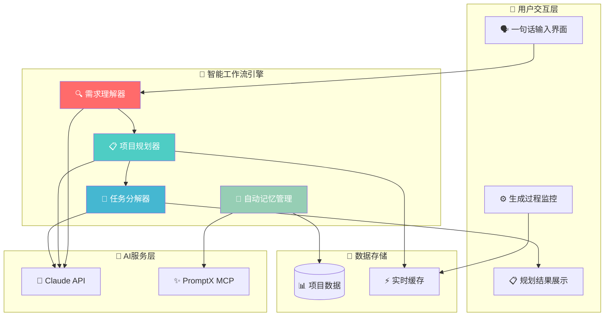
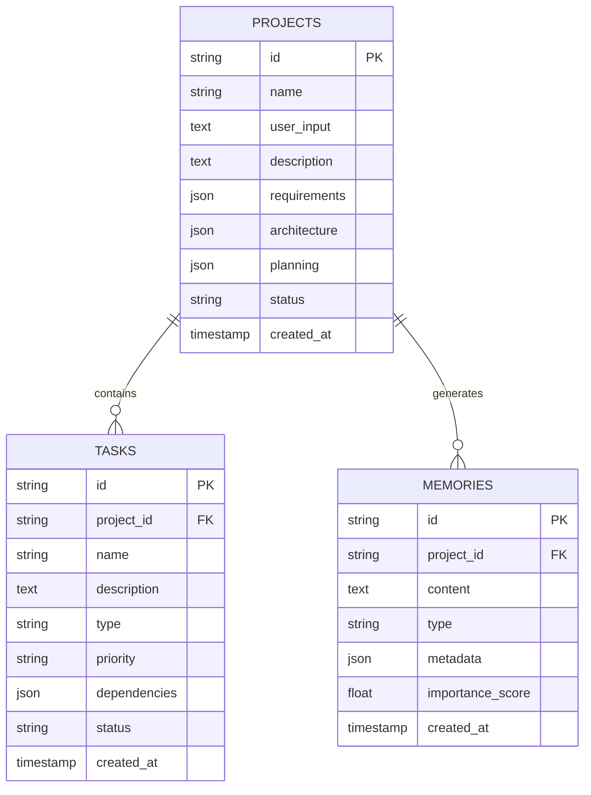
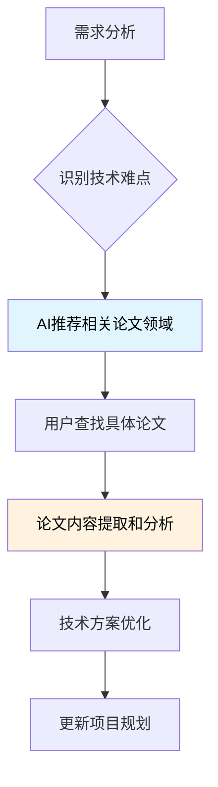

# 🏗️ 天庭系统架构 & 界面设计详解

## 🎯 技术架构全景

### 智能工作流架构（简化版）


---

## 🗄️ 数据架构设计

### 简化数据模型关系图


**核心实体说明**：
- **PROJECTS**: 存储用户的项目规划，包含原始输入和生成的规划文档
- **TASKS**: 项目分解的具体任务，支持依赖关系和状态跟踪
- **MEMORIES**: 自动记忆的用户偏好和项目决策历史

---

## 🎨 用户界面设计

### "言出法随"主界面设计
```
┌─────────────────────────────────────────────────────────┐
│                    🏛️ 天庭 - 言出法随                      │
├─────────────────────────────────────────────────────────┤
│                                                         │
│  💭 描述你的想法，让AI为你完成所有规划...                    │
│  ┌─────────────────────────────────────────────────────┐ │
│  │ 我想做一个音乐推荐APP                                  │ │  
│  └─────────────────────────────────────────────────────┘ │
│                                          [🚀 开始规划]   │
│                                                         │
│  💡 示例想法:                                            │
│  • "我想做一个电商网站"                                   │
│  • "开发一个任务管理工具"                                 │  
│  • "创建一个在线教育平台"                                 │
│                                                         │
└─────────────────────────────────────────────────────────┘
```

### 规划生成过程界面
```
┌─────────────────────────────────────────────────────────┐
│  🧠 AI正在为您规划项目...                                  │
├─────────────────────────────────────────────────────────┤
│                                                         │
│  📝 需求分析 ████████████████████████████ 100% ✅        │
│  🏗️ 架构设计 ████████████████████████████ 100% ✅        │  
│  📋 任务分解 ██████████████░░░░░░░░░░░░░░░ 60%  🔄        │
│  📚 文档生成 ░░░░░░░░░░░░░░░░░░░░░░░░░░░░░░ 0%   ⏳        │
│                                                         │
│  💡 当前步骤: 正在分析功能依赖关系...                      │
│                                                         │
└─────────────────────────────────────────────────────────┘
```

### 规划结果展示界面
```
┌─────────────────────────────────────────────────────────┐
│  🎉 项目规划完成！                                        │
├─────────────────────────────────────────────────────────┤
│                                                         │
│  📋 项目概述                                             │
│  ┌─────────────────────────────────────────────────────┐ │
│  │ 项目名称：智能音乐推荐APP "MelodyAI"                  │ │
│  │ 项目类型：React Native移动应用                        │ │
│  │ 核心功能：个性化推荐、播放、社交分享                   │ │
│  │ 开发周期：4-6周 | 团队规模：3-4人                     │ │
│  └─────────────────────────────────────────────────────┘ │
│                                                         │
│  🏗️ 技术架构                                            │
│  • 前端：React Native + TypeScript                      │
│  • 后端：Node.js + Express + MongoDB                    │
│  • AI服务：推荐算法 + 音乐特征分析                       │
│  • 第三方：Spotify API + Apple Music API               │
│                                                         │
│  ✅ 开发任务 (共15个)                                    │
│  🎨 UI/UX设计 → 📱 前端开发 → ⚙️ 后端API → 🧠 推荐算法   │
│                                                         │
│                    [📥 下载完整规划] [🚀 启动并发开发]    │
└─────────────────────────────────────────────────────────┘
```

---

## 🔬 论文研究工作流集成

### 学术研究支持流程


### 需要论文支持的关键技术领域

#### 🧠 自然语言理解 (NLU)
- **意图识别**: 从一句话中准确提取项目需求
- **实体抽取**: 识别功能模块、技术约束、用户群体
- **上下文理解**: 理解隐含需求和业务逻辑

#### 🤖 智能代码生成
- **代码合成**: 从自然语言生成可执行代码
- **多模态生成**: 同时生成前端、后端、测试代码
- **质量保证**: 生成代码的正确性和可维护性

#### ⚙️ 多智能体协调
- **任务分解**: OES方法的数学基础和优化
- **依赖分析**: 任务间依赖关系的图论算法
- **冲突解决**: 多窗口开发的一致性保证

#### 📊 项目规划自动化
- **需求工程**: 自动化需求分析和建模
- **架构推荐**: 基于需求的技术选型算法
- **工期估算**: 机器学习驱动的项目时间预测

### 研究论文检索策略
```yaml
关键词组合:
  NLU: ["intent recognition", "named entity recognition", "requirement engineering"]
  代码生成: ["code synthesis", "program synthesis", "neural code generation"]
  多智能体: ["multi-agent coordination", "distributed AI", "consensus algorithms"]
  项目管理: ["automated project planning", "software estimation", "agile AI"]

顶级会议:
  - ACL/EMNLP (NLP)
  - ICSE/FSE (软件工程)
  - AAAI/IJCAI (AI)
  - AAMAS (多智能体)
```

---

## 🛠️ 技术选型更新

### 简化技术栈 (对应新架构)
```yaml
核心技术栈:
  后端框架: FastAPI (轻量、高性能、异步支持)
  数据库: SQLite + Redis (简单部署、高性能缓存)
  前端框架: React + TypeScript (成熟生态、类型安全)
  AI集成: Claude API + PromptX MCP (现有生态)
  
并发管理:
  进程管理: Python multiprocessing
  状态同步: Redis Pub/Sub
  WebSocket: FastAPI WebSocket原生支持
  任务队列: Celery + Redis
  
部署运维:
  容器化: Docker Compose (简化部署)
  监控: FastAPI自带metrics + Prometheus
  日志: Python logging + ELK Stack
  API网关: Nginx (反向代理、负载均衡)
```

### 技术选择理由
1. **FastAPI vs Django**: 更适合AI服务集成，异步性能更好
2. **SQLite vs PostgreSQL**: MVP阶段简化部署，后期可升级
3. **Redis**: 既做缓存又做消息队列，减少组件复杂度
4. **Docker Compose**: 本地开发和小规模部署的最佳选择

---

**🎯 从理论到实践，让AI开发真正"言出法随"！**