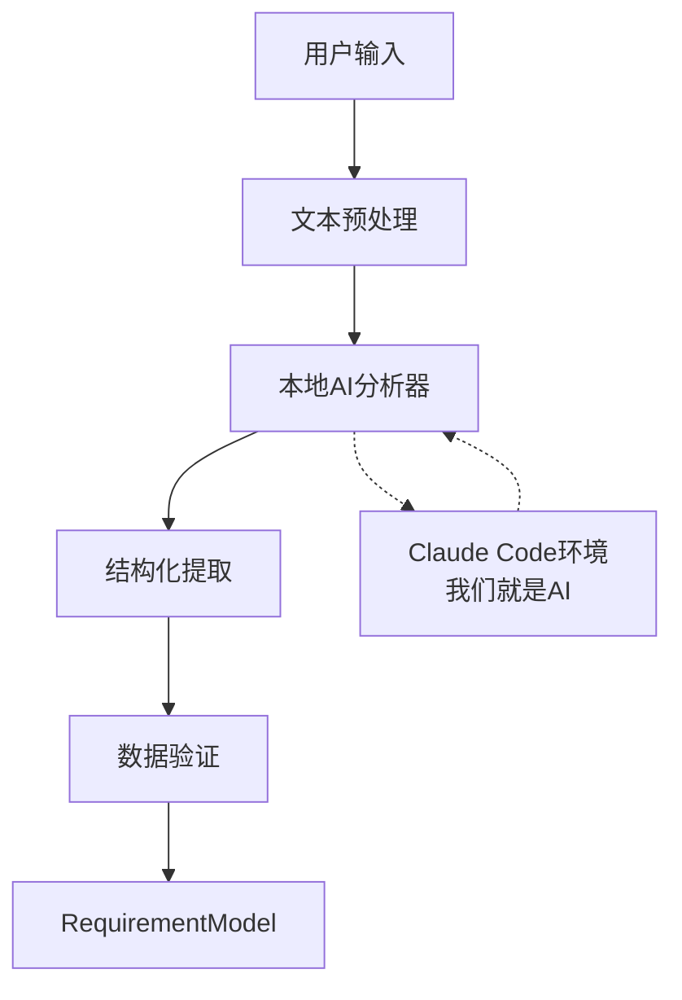

# 🚨 Claude API设计错误 - 紧急修复指南

## ⚠️ 问题概述

**影响包**: 仅Core包 (`packages/core/`)  
**问题类型**: 架构设计错误  
**影响开发者**: Core包开发者  
**紧急程度**: 🔴 高危 - 阻塞核心功能开发

## 🔍 问题详情

### 错误设计
在 `packages/core/tasks/requirement-parsing-01-base.task.md` 中，错误地设计了：

```python
# ❌ 错误 - 不需要外部Claude API调用
class ClaudeClient:
    def __init__(self, api_key: str):
        self.client = httpx.AsyncClient()
        self.api_key = api_key
        self.base_url = "https://api.anthropic.com/v1"  # 外部API
    
    async def analyze_requirement(self, text: str) -> dict:
        response = await self.client.post(
            f"{self.base_url}/messages",
            headers={"x-api-key": self.api_key},  # 需要API密钥
            json={...}
        )
```

### 为什么这是错误的？
1. **我们就在Claude Code环境中运行**，无需外部API调用
2. **不需要API密钥**，我们有Claude Code直接访问权限
3. **增加了不必要的复杂性**和依赖
4. **错误的架构理解**

## ✅ 正确解决方案

### 方案A: 直接AI能力集成（推荐）
```python
# ✅ 正确 - 使用Claude Code本地AI能力
class RequirementAnalyzer:
    def __init__(self):
        self.text_processor = TextProcessor()
        self.validator = RequirementValidator()
    
    async def analyze_requirement(self, user_input: str) -> RequirementModel:
        """
        直接使用Claude Code环境的AI能力进行需求分析
        无需外部API调用
        """
        # 1. 文本预处理
        processed_text = self.text_processor.clean_and_normalize(user_input)
        
        # 2. 使用本地AI能力分析（我们就是Claude）
        analysis_result = self._perform_ai_analysis(processed_text)
        
        # 3. 结构化数据提取
        structured_data = self._extract_structured_data(analysis_result)
        
        # 4. 验证和评分
        validated_result = self.validator.validate_and_score(structured_data)
        
        return RequirementModel(**validated_result)
    
    def _perform_ai_analysis(self, text: str) -> dict:
        """
        直接实现AI分析逻辑
        我们在Claude环境中，就是AI本身
        """
        # 智能分析逻辑
        project_type = self._detect_project_type(text)
        features = self._extract_features(text)
        constraints = self._identify_constraints(text)
        
        return {
            "project_type": project_type,
            "core_features": features,
            "technical_constraints": constraints,
            "confidence_score": self._calculate_confidence(text)
        }
```

### 方案B: 规则引擎 + NLP
```python
# ✅ 备选方案 - 基于规则的分析
import spacy
import re
from typing import Dict, List

class RuleBasedAnalyzer:
    def __init__(self):
        self.nlp = spacy.load("en_core_web_sm")
        self.keywords = {
            "web_app": ["网站", "web", "在线", "浏览器"],
            "mobile_app": ["手机", "移动", "app", "安卓", "iOS"],
            "api_service": ["接口", "API", "服务", "后端"]
        }
    
    async def analyze_requirement(self, text: str) -> RequirementModel:
        doc = self.nlp(text)
        
        # 项目类型识别
        project_type = self._classify_project_type(text)
        
        # 功能提取
        features = self._extract_features_nlp(doc)
        
        # 约束识别
        constraints = self._identify_constraints_nlp(doc)
        
        return RequirementModel(
            project_type=project_type,
            core_features=features,
            technical_constraints=constraints,
            confidence_score=0.85  # 基于规则的置信度
        )
```

## 🔧 立即修复步骤

### Step 1: 移除错误文件
```bash
# 如果已经创建了这些文件，删除它们
rm -f packages/core/src/claude_client.py
```

### Step 2: 修改任务文件
在 `requirement-parsing-01-base.task.md` 中：

**删除**:
- Line 88: `claude_client.py` 创建任务
- Line 182-202: ClaudeClient类设计
- 所有与外部API相关的代码

**替换为**:
```python
# 正确的核心解析器设计
class RequirementParser:
    def __init__(self):
        self.text_processor = TextProcessor()
        self.analyzer = RequirementAnalyzer()  # 本地AI分析器
        self.validator = RequirementValidator()
    
    async def parse_requirement(self, user_input: str) -> RequirementModel:
        # 使用本地AI能力，无需外部API
        return await self.analyzer.analyze_requirement(user_input)
```

### Step 3: 更新依赖
**移除**:
```txt
httpx  # 不需要HTTP客户端
anthropic  # 不需要外部API库
```

**保留**:
```txt
pydantic>=2.0.0
python-dotenv>=1.0.0
pytest>=7.0.0
```

### Step 4: 更新测试
```python
# ✅ 正确的测试方式
def test_requirement_analysis():
    parser = RequirementParser()
    
    # 测试分析能力
    result = await parser.parse_requirement(
        "我想做一个电商网站，支持用户注册、商品浏览、购物车和支付功能"
    )
    
    assert result.project_type == "web_app"
    assert "用户注册" in [f.name for f in result.core_features]
    assert result.confidence_score >= 0.85
```

## 📊 修复验证

### 检查清单
- [ ] 移除所有外部Claude API调用代码
- [ ] 实现本地AI分析逻辑
- [ ] 测试通过，无需API密钥
- [ ] 性能满足要求（<30秒，≥85%准确率）
- [ ] 与shared包类型定义兼容

### 验证命令
```bash
cd packages/core

# 1. 安装依赖（应该很快，无外部API库）
pip install -r requirements.txt

# 2. 运行测试
python -m pytest tests/ -v

# 3. 验证类型定义
python -c "from src.requirement_parser import RequirementParser; print('导入成功')"
```

## 🎯 修复后的架构



## ⏰ 预计修复时间

- **移除错误代码**: 5分钟
- **实现正确方案**: 15分钟  
- **测试验证**: 10分钟
- **总计**: 30分钟

## 💡 经验教训

1. **环境理解**: 在Claude Code中无需外部AI API
2. **架构简化**: 避免过度设计和不必要的复杂性
3. **依赖最小化**: 只添加真正需要的依赖
4. **测试优先**: 先确定能力边界，再设计实现

---

## 🆘 如需帮助

如果在修复过程中遇到问题：
1. 检查本文档的解决方案
2. 参考 `docs/TROUBLESHOOTING.md`
3. 联系项目总控台（Frontend包负责人）

**记住**: 我们在Claude Code环境中，就是AI本身，无需调用外部API！