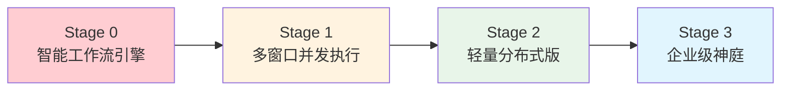
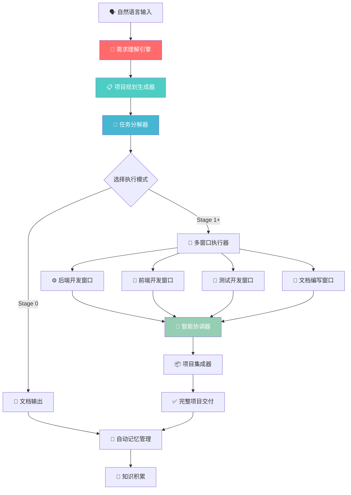
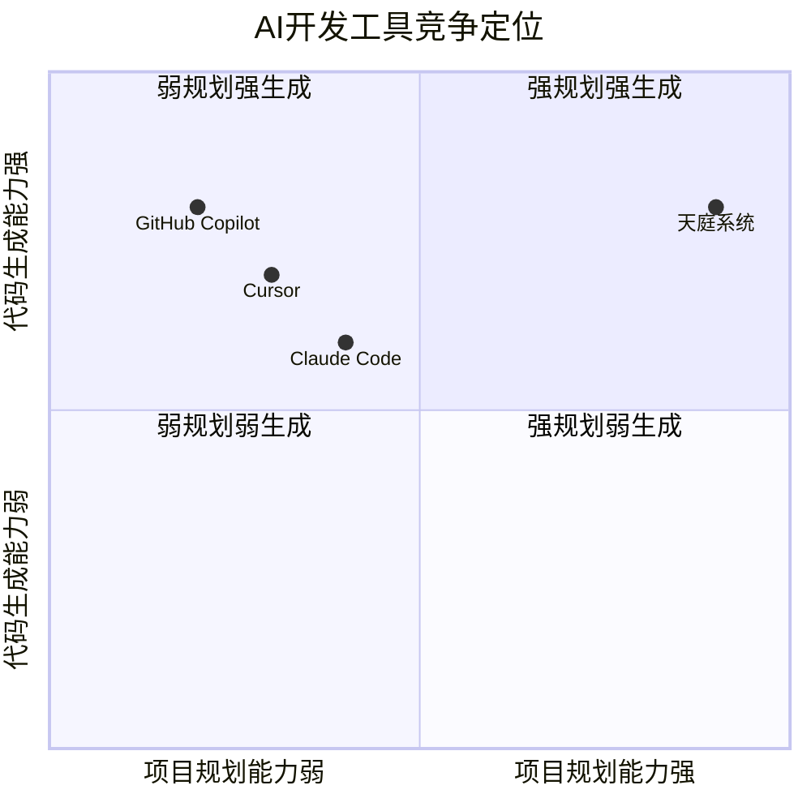

# 🌟 天庭系统概览可视化

## 🎯 系统愿景："言出法随"的智能开发体验

### 核心理念
```
一句话输入 → AI智能理解 → 自动项目规划 → 多窗口并发开发 → 完整项目交付
```

**愿景陈述**：让任何人都能通过自然语言快速启动专业级项目开发，实现从想法到完整项目的"言出法随"。

### 🔬 学术研究驱动的技术创新

天庭系统基于最新的AI和软件工程研究，将学术理论转化为实用的开发工具：
- **NLU研究应用**: 意图识别、实体抽取、上下文理解
- **代码合成研究**: 多模态代码生成、质量保证算法
- **多智能体研究**: 协调机制、一致性算法、冲突解决
- **自动化软件工程**: 需求建模、架构推荐、工期预测

---

## 📱 用户体验演进

### 😫 传统开发方式
```
想法阶段: "我想做个APP" 
         ↓ (几天到几周)
技术调研: 手动研究技术方案
         ↓ (几天)
需求分析: 手动编写需求文档
         ↓ (几天)
架构设计: 手动设计技术架构
         ↓ (几天)
团队组建: 寻找合适的开发者
         ↓ (几周到几月)
项目开发: 串行开发各个模块
```

### 😊 天庭"言出法随"体验
```
想法输入: "我想做个音乐推荐APP"
         ↓ (30秒)
AI理解: 自动识别项目类型、核心功能、用户群体
         ↓ (60秒)
智能规划: 自动生成用户旅程、技术架构、开发计划
         ↓ (2分钟)
用户确认: 查看并确认自动生成的完整规划
         ↓ (用户选择)
并发开发: 多个AI角色同时开发前端、后端、测试、文档
         ↓ (2-4小时)
项目交付: 获得完整可运行的项目和部署文档
```

---

## 🚀 四阶段进化路径

### 阶段映射关系


### Stage 0: 智能工作流引擎
**目标**: 实现"言出法随"的核心工作流
```
🗣️ 用户输入："我想做个音乐推荐APP"
↓
🧠 AI理解：项目类型、核心功能、技术约束
↓
📋 自动规划：用户旅程、架构设计、开发计划
↓
✨ 文档交付：完整的项目规划和技术文档
```

**核心价值**：
- ✅ 一句话启动项目规划
- ✅ 自动生成专业文档
- ✅ 智能技术选型推荐
- ✅ 完整开发任务分解

### Stage 1: 多窗口并发执行
**目标**: 实现真正的AI开发团队协同
```
📋 确认规划：用户确认项目规划
↓
🚀 启动团队：前端/后端/测试/文档工程师
↓
⚡ 并发开发：多个Claude Code窗口同时工作
↓
🔄 智能协调：状态同步、冲突解决、进度管理
↓
📦 项目交付：完整可运行的项目成果
```

**核心价值**：
- ✅ 多窗口并发开发
- ✅ 智能任务协调
- ✅ 实时状态同步
- ✅ 端到端项目交付

### Stage 2: 轻量分布式版
**目标**: 支持团队协作和商业化验证
```
👥 团队协作：多用户共享工作空间
↓
☁️ 云服务：高可用、可扩展的服务
↓  
📊 数据洞察：使用模式分析、效率报告
↓
💰 商业验证：付费意愿、ROI体现
```

**核心价值**：
- ✅ 多用户团队协作
- ✅ 云端高可用服务
- ✅ 智能数据分析
- ✅ 明确商业价值

### Stage 3: 企业级神庭
**目标**: 成为AI能力的统一治理平台
```
🏢 企业部署：私有化安全部署
↓
🌐 生态整合：统一管理所有AI工具和流程
↓
⚖️ 智能治理：AI工作流统一编排和监管
↓
🚀 战略价值：AI驱动的核心竞争优势
```

**核心价值**：
- ✅ 企业级安全和合规
- ✅ AI生态统一治理
- ✅ 智能决策支持
- ✅ 行业标准引领

---

## 🎭 用户体验演进

### 体验对比矩阵
| 维度 | 传统开发 | Stage 0 | Stage 1 | Stage 2 | Stage 3 |
|------|------------|---------|---------|---------|----------|
| 项目启动 | 🔴 几天规划 | 🟢 几分钟 | 🟢 即时启动 | 🟢 团队协作 | 🟢 企业级 |
| 开发方式 | 🔴 手动串行 | 🟡 辅助规划 | 🟢 AI并发 | 🟢 多团队 | 🟢 全生态 |
| 技术门槛 | 🔴 专业要求 | 🟢 自然语言 | 🟢 零门槛 | 🟢 团队共享 | 🟢 标准化 |
| 开发速度 | 🔴 周/月计 | 🟢 小时级 | 🟢 分钟级 | 🟢 规模化 | 🟢 工业化 |
| 代码质量 | 🟡 人工保证 | 🟢 AI优化 | 🟢 多重检查 | 🟢 团队标准 | 🟢 企业规范 |

---

## 🔄 核心工作流程详解



---

## 💎 核心差异化优势

### vs 现有AI开发工具


**独特优势**：
- 🎯 **从一句话到完整项目的端到端解决方案**
- 🤖 **真正的AI开发团队并发协作**  
- 🧠 **学术研究驱动的技术创新**
- 📈 **渐进式价值交付，每阶段都有独立价值**

### 技术创新亮点
1. **自然语言项目规划**: 突破传统需求分析瓶颈
2. **多智能体并发开发**: 实现真正的AI团队协作
3. **端到端质量保证**: 从规划到交付的全流程质量控制
4. **学术理论产业化**: 将最新研究转化为实用工具

---

## 🎯 成功案例预演

### 典型使用场景

#### 场景1：创业者快速验证想法
```
需求："我想做一个健身追踪APP"

传统方式：
- 手动调研竞品
- 自己设计架构
- 寻找开发团队
- 耗时：2-4周

天庭方式：
- 一句话描述想法
- 30秒理解分析
- 2分钟生成完整规划
- 2小时交付可运行项目

效果：从周级缩短到小时级，降低创业门槛
```

#### 场景2：企业内部项目开发
```
需求："开发一个员工绩效管理系统"

传统方式：
- 需求调研和文档编写
- 技术方案设计和评审
- 组建开发团队
- 分工协作开发
- 耗时：3-6个月

天庭方式：  
- 自然语言描述需求
- AI自动生成完整规划
- 多窗口并发开发
- 自动协调和集成
- 耗时：1-2周

效果：开发周期缩短90%，降低人力成本
```

#### 场景3：教育机构项目实训
```
需求："为学生设计一个电商项目实训"

传统方式：
- 教师手动设计项目
- 准备详细教学材料
- 指导学生逐步开发
- 耗时：整个学期

天庭方式：
- 描述教学目标和难度
- AI生成渐进式项目方案
- 学生体验完整开发流程
- 快速获得成就感和技能

效果：教学效果提升，学生实践能力快速提升
```

---

## 🔬 学术研究支持需求

### 需要论文辅助的关键技术领域

#### 🧠 自然语言理解 (NLU)
- **意图识别**: 从一句话中准确提取项目需求
- **实体抽取**: 识别功能模块、技术约束、用户群体
- **上下文理解**: 理解隐含需求和业务逻辑

#### 🤖 智能代码生成
- **代码合成**: 从自然语言生成可执行代码
- **多模态生成**: 同时生成前端、后端、测试代码
- **质量保证**: 生成代码的正确性和可维护性

#### ⚙️ 多智能体协调
- **任务分解**: OES方法的数学基础和优化
- **依赖分析**: 任务间依赖关系的图论算法
- **冲突解决**: 多窗口开发的一致性保证

#### 📊 项目规划自动化
- **需求工程**: 自动化需求分析和建模
- **架构推荐**: 基于需求的技术选型算法
- **工期估算**: 机器学习驱动的项目时间预测

### 研究论文检索策略
```yaml
关键词组合:
  NLU: ["intent recognition", "named entity recognition", "requirement engineering"]
  代码生成: ["code synthesis", "program synthesis", "neural code generation"]
  多智能体: ["multi-agent coordination", "distributed AI", "consensus algorithms"]
  项目管理: ["automated project planning", "software estimation", "agile AI"]

顶级会议:
  - ACL/EMNLP (NLP)
  - ICSE/FSE (软件工程)
  - AAAI/IJCAI (AI)
  - AAMAS (多智能体)
```

---

## 💰 商业价值预期

### ROI计算模型
```yaml
创业者价值:
  想法验证: 从几周缩短到几小时
  原型开发: 快速获得可演示项目
  团队组建: 降低技术门槛和成本
  付费意愿: 月付费200-500元

企业开发价值:
  开发周期: 缩短70-90%
  人力成本: 降低50-80%
  项目质量: AI保证一致性和最佳实践
  付费意愿: 年付费5-20万元

教育培训价值:
  教学效率: 提升5-10倍
  学生体验: 快速获得成就感
  实践能力: 真实项目经验
  付费意愿: 年付费2-10万元
```

---

## 🚀 实现路径总结

### 技术路线
1. **Stage 0** - 实现核心工作流，验证"言出法随"概念
2. **Stage 1** - 突破并发执行，构建技术壁垒  
3. **Stage 2** - 验证商业模式，实现规模化增长
4. **Stage 3** - 建立行业标准，成为AI开发基础设施

### 商业路线
1. **MVP验证** - 解决核心需求，获得种子用户
2. **产品化** - 完善用户体验，形成付费价值
3. **平台化** - 多用户协作，SaaS订阅模式
4. **生态化** - 企业解决方案，行业标准制定

### 学术驱动路线
1. **理论转化** - 将最新研究转化为实用技术
2. **技术创新** - 在实践中产生新的研究问题
3. **开源贡献** - 回馈学术社区，建立影响力
4. **产学合作** - 与高校合作，持续技术创新

---

**🎭 天庭：从学术研究到产业应用，让AI开发真正"言出法随"**