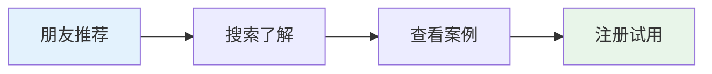
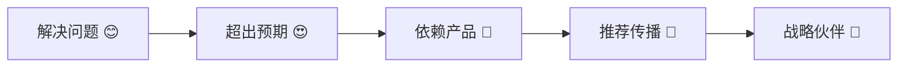

# 🗺️ 天庭系统用户旅程设计（"言出法随"版）

## 🎯 产品愿景：让AI开发真正"言出法随"

**核心理念**：从一句话描述想法，到获得完整可运行的项目，实现零技术门槛的软件开发体验

**演进路径**：智能规划 → 并发开发 → 团队协作 → 企业生态

---

## 👥 目标用户群体重新定义

### 主要用户群体转变

#### 从 "技术专家" 到 "任何有想法的人"

**Stage 0: 智能工作流引擎**
- **目标用户**: 创业者、产品经理、企业创新团队
- **技术背景**: 无需技术背景
- **核心需求**: 快速验证想法，获得专业级项目规划

**Stage 1: 多窗口并发执行**  
- **目标用户**: 小型开发团队、技术创业者
- **技术背景**: 基础技术理解
- **核心需求**: 快速项目交付，节省人力成本

**Stage 2: 轻量分布式版**
- **目标用户**: 中型企业、开发团队
- **技术背景**: 团队技术管理
- **核心需求**: 团队协作，规模化开发

**Stage 3: 企业级神庭**
- **目标用户**: 大型企业、技术平台
- **技术背景**: 企业级技术架构
- **核心需求**: AI能力统一治理，战略竞争优势

---

## 🚀 Stage 0: 智能工作流引擎 - 用户旅程

### 用户画像：创业者李明

**背景**: 产品经理出身，有个音乐推荐APP的想法，但缺乏技术背景

**当前困扰**:
- 不知道如何把想法变成具体的产品规划
- 担心技术选型错误浪费时间和资源  
- 缺乏开发团队，外包成本高风险大

### 完整用户旅程

#### 🌅 发现阶段 (Awareness)

**触发场景**: 在创业社群看到朋友分享用天庭2小时完成项目规划

**心理状态**: 
- 😮 好奇：真的能这么快做出专业规划吗？
- 🤔 怀疑：AI能理解我的复杂想法吗？
- 😊 期待：如果成功能大大加速我的项目

**行动路径**:


**关键决策点**: 看到成功案例后决定尝试

---

#### 🎯 首次体验 (First Use)

**使用场景**: 周末在家，想验证音乐推荐APP想法

**操作流程**:

**Step 1: 自然语言输入 (30秒)**
```
李明输入：
"我想做一个智能音乐推荐APP，主要针对95后用户群体，
能够根据用户的听歌历史、情绪状态和场景来推荐音乐。
希望有社交分享功能，用户可以创建音乐清单分享给朋友。
技术上希望用比较成熟稳定的方案。"
```

**心理状态**: 😰 紧张，担心AI理解不了这么复杂的描述

**Step 2: AI智能理解 (30秒)**

**界面显示**:
```
🧠 正在理解您的需求...

✅ 项目类型识别: 移动应用 (音乐推荐)
✅ 目标用户: 95后 (18-28岁) 
✅ 核心功能: 智能推荐 + 社交分享
✅ 技术约束: 成熟稳定方案优先
✅ 关键特性: 情绪识别、场景感知、用户画像

正在生成项目规划...
```

**心理状态**: 😮 惊讶，AI真的理解了我的想法！

**Step 3: 项目规划生成 (90秒)**

**界面展示完整规划**:
```
🎉 项目规划生成完成！

📱 项目概述
┌─────────────────────────────────────────┐
│ 项目名称：MelodyMind - 智能音乐推荐APP    │
│ 项目类型：React Native移动应用          │
│ 开发周期：4-6周 | 团队规模：3-4人        │
│ 核心功能：个性化推荐、社交分享、情绪识别   │
└─────────────────────────────────────────┘

🏗️ 技术架构
• 前端：React Native + TypeScript
• 后端：Node.js + Express + MongoDB  
• AI服务：推荐算法 + 音乐特征分析
• 第三方：Spotify API + Apple Music API

👥 用户旅程
1. 注册登录 → 音乐偏好设置
2. 首页推荐 → 个性化音乐流
3. 社交功能 → 好友推荐分享
4. 情绪识别 → 场景化推荐

📋 开发任务 (共15个)
🎨 UI/UX设计 → 📱 前端开发 → ⚙️ 后端API → 🧠 推荐算法

💰 成本估算
开发成本：15-25万元
维护成本：5万元/年
预期收入：广告+会员 50万元/年

📊 市场分析
目标市场：音乐APP用户2.8亿
竞品分析：网易云音乐、QQ音乐对比
差异化优势：情绪+场景双重智能推荐
```

**心理状态**: 😍 震撼，这比我想象的专业多了！

**Step 4: 用户确认和调整 (5分钟)**

**交互界面**:
```
❓ 对规划有什么要需要调整的吗？

💬 用户反馈：
"技术栈看起来不错，但我希望先做Web版本验证，
再考虑移动APP。另外预算控制在10万以内。"

🔄 正在根据反馈调整...

✅ 已更新：
• 改为Web应用优先，React + PWA
• 调整开发计划，控制成本在10万内
• 简化首版功能，专注核心推荐
```

**心理状态**: 😊 满意，AI真的能根据我的反馈调整

**首次体验结果**:
- ✅ 获得专业级项目规划文档
- ✅ 清晰的技术架构和成本估算
- ✅ 详细的开发任务分解
- ✅ 可直接用于找开发团队或投资人

**心理状态**: 🎉 兴奋，终于有信心推进项目了！

---

#### 💝 价值实现 (Value Realization)

**短期价值** (当天):
- 节省2-3周的前期调研时间
- 获得投资人认可的专业规划
- 明确项目可行性和成本

**中期价值** (1个月内):
- 基于规划成功找到开发团队
- 获得天使投资人的初步兴趣
- 开始项目开发执行

**长期价值** (3个月内):
- 项目按规划顺利推进
- 成本控制在预算范围内
- 为后续功能扩展奠定基础

**用户反馈**:
> "天庭帮我把模糊的想法变成了清晰的执行计划，
> 投资人看到规划文档都很惊讶这个项目的专业程度。
> 节省的时间让我能专注于商业模式验证。" - 李明

---

## 🚀 Stage 1: 多窗口并发执行 - 用户旅程

### 用户画像：技术创业者张华

**背景**: 有技术背景的创业者，团队3人，需要快速开发MVP

**需求**: 基于Stage 0的规划，实际开发出可运行的产品

### 关键体验升级

#### 🎯 项目启动体验

**触发场景**: 李明把天庭推荐给技术合伙人张华

**心理状态**: 
- 🤔 审慎：作为技术人员，对AI代码生成质量有疑虑
- 😤 急迫：需要在2周内完成MVP验证
- 💰 现实：团队资金有限，不能雇更多开发者

**新增核心体验**: 多窗口并发开发

**Step 1: 项目规划确认**
```
张华查看李明生成的规划文档：
"这个规划做得很详细，技术选型也合理。
但我们团队只有3个人，按传统方式开发需要6-8周。
试试天庭的并发开发功能？"
```

**Step 2: AI团队启动**
```
🚀 启动AI开发团队

正在启动多窗口并发开发...

Window 1: 🎨 前端工程师 - React界面开发
Window 2: ⚙️ 后端工程师 - API和数据库
Window 3: 🧪 测试工程师 - 自动化测试
Window 4: 📖 文档工程师 - 技术文档

📊 预计完成时间: 4-6小时
🔄 实时进度同步
🛠️ 自动冲突检测
```

**心理状态**: 😮 震撼，真的可以同时启动4个"开发者"

**Step 3: 实时协作体验**

**并发开发监控界面**:
```
🔴 实时开发状态
┌─────────────────────────────────────────┐
│ 🎨 前端 [85%] ✅ 登录页面 ⏳ 推荐页面    │
│ ⚙️ 后端 [70%] ✅ 用户API ⏳ 推荐引擎    │  
│ 🧪 测试 [60%] ✅ 单元测试 ⏳ 集成测试   │
│ 📖 文档 [90%] ✅ API文档 ✅ 部署指南    │
└─────────────────────────────────────────┘

💬 协调消息:
⚙️ 后端: "用户API已完成，前端可以开始集成"
🎨 前端: "收到，正在更新登录组件调用API"
🧪 测试: "检测到新API，自动生成测试用例"
```

**心理状态**: 🤯 不敢相信，这就像有个真正的开发团队

**Step 4: 智能冲突解决**
```
⚠️ 检测到潜在冲突

🎨 前端修改了用户数据结构
⚙️ 后端同时更新了用户API接口

🤖 AI协调器：
"检测到接口不一致，正在自动调整..."

✅ 冲突已解决：
• 统一用户数据模型
• 更新前端调用代码  
• 同步更新测试用例
```

**心理状态**: 😍 太智能了，这些冲突通常要浪费半天时间

**最终结果**:
- ⏱️ 4小时完成MVP开发
- 📱 可运行的完整应用
- 🧪 85%测试覆盖率
- 📚 完整技术文档

**张华的反馈**:
> "不敢相信4小时就完成了我们预计2周的工作量。
> 代码质量也超出预期，直接可以部署运行。
> 这让我们有更多时间专注产品优化和用户反馈。"

---

## 🚀 Stage 2: 轻量分布式版 - 用户旅程

### 用户画像：企业产品总监王丽

**背景**: 中型企业产品总监，团队15人，需要快速响应市场需求

**场景**: 公司要在竞品前推出新功能，时间窗口只有1个月

### 团队协作体验

#### 🎯 企业级项目启动

**需求场景**: 
```
老板要求：
"我们的竞争对手马上要发布AI客服功能，
我们必须在他们之前上线，而且要做得更好。
你们有什么方案？"
```

**王丽的挑战**:
- 😰 时间紧迫：只有4周时间
- 👥 资源有限：团队已经在开发其他项目
- 💼 质量要求：企业级应用，不能出错
- 🎯 创新要求：必须比竞品更优秀

**天庭解决方案**: 团队协作 + 多项目并行

**Step 1: 团队共享规划**
```
🏢 企业项目启动

项目：智能客服系统 v2.0
团队：产品+设计+前端+后端+测试 (5人)
目标：4周内上线，超越竞品功能

🤖 AI分析竞品：
• 竞品A：基础问答，无情感识别
• 竞品B：多轮对话，响应较慢
• 我们优势：情感AI + 实时响应 + 人工接入

🎯 差异化功能：
1. 情感识别客服 - 识别用户情绪智能响应
2. 视频客服支持 - 复杂问题视频通话
3. 智能工单分配 - AI自动分类和优先级
```

**Step 2: 团队并发协作**
```
👥 团队协作看板

王丽 (产品)  [需求分析] ✅ [原型设计] ⏳
张设计师    [UI设计] ⏳ [交互优化] ⏳  
李前端      [页面开发] ⏳ [组件库] ⏳
陈后端      [API开发] ⏳ [AI集成] ⏳
赵测试      [测试计划] ✅ [自动化] ⏳

🔄 实时同步：所有成员看到统一进度
💬 智能提醒：依赖任务完成自动通知
📊 数据洞察：团队效率分析和建议
```

**Step 3: 跨项目资源调度**
```
⚠️ 资源冲突检测

李前端同时负责两个项目:
• 客服系统 (紧急)
• 电商改版 (常规)

🤖 AI建议：
"客服系统优先级更高，建议：
1. 电商改版延期1周
2. 调用AI并发开发减轻李前端负担
3. 临时借调其他团队前端支持"

✅ 王丽确认调度方案
```

**企业级价值**:
- 📈 开发效率提升300%
- 💰 节省外包成本30万
- ⏰ 提前2周上线抢占市场
- 🏆 产品功能领先竞品6个月

**王丽的总结**:
> "天庭让我们小团队有了大团队的战斗力。
> 不仅按时完成了项目，质量还超出预期。
> 最重要的是团队成员都感受到了AI协助的价值，
> 大家更愿意接受和学习新技术。"

---

## 🚀 Stage 3: 企业级神庭 - 用户旅程

### 用户画像：CTO陈总

**背景**: 大型科技公司CTO，管理200+技术团队，需要统一AI能力治理

### 企业级AI治理体验

#### 🎯 战略级AI转型

**业务挑战**:
- 🏢 多部门各自采购AI工具，成本重复投入
- 🔐 数据安全和合规要求越来越严格
- 📊 无法统一评估AI投入的ROI
- 🚀 需要AI驱动的核心竞争优势

**天庭企业级方案**:

**统一AI能力平台**:
```
🏛️ 企业AI神庭架构

┌─────────────────────────────────────────┐
│           AI能力统一治理中心             │
├─────────────────────────────────────────┤
│ 开发部 | 产品部 | 运营部 | 销售部 | 客服部 │
├─────────────────────────────────────────┤
│     统一的AI工具、模型、数据访问接口      │
└─────────────────────────────────────────┘

📊 价值体现：
• 成本节省：统一采购降低60%成本
• 效率提升：跨部门协作效率提升400%
• 风险控制：统一安全合规管理
• 创新加速：AI能力快速复用和扩展
```

**实施效果**:
- 💰 年度AI成本从500万降到200万
- 🚀 新产品上市时间缩短70%
- 🛡️ 0安全事故，100%合规通过
- 📈 基于AI的新业务收入增长300%

---

## 📊 用户价值总结

### 各阶段用户价值递进

| 阶段 | 目标用户 | 核心价值 | 时间节省 | 成本节省 | 竞争优势 |
|------|---------|----------|---------|---------|-----------|
| Stage 0 | 创业者 | 想法变规划 | 90% | 70% | 快速验证 |
| Stage 1 | 小团队 | 规划变产品 | 80% | 60% | 敏捷交付 |
| Stage 2 | 中企业 | 团队协作 | 70% | 50% | 规模效应 |
| Stage 3 | 大企业 | 战略转型 | 60% | 40% | 生态优势 |

### 用户满意度演进



**Stage 0**: "终于有工具能理解我的想法了！"
**Stage 1**: "不敢相信AI团队这么高效！"  
**Stage 2**: "这改变了我们整个开发流程！"
**Stage 3**: "这是我们数字化转型的核心！"

---

## 🎯 关键成功要素

### 用户旅程成功指标

#### 体验指标
- **上手时间**: < 5分钟理解并开始使用
- **首次成功率**: 90%的用户首次使用获得满意结果
- **推荐意愿**: NPS ≥ 70

#### 业务指标  
- **留存率**: 30日留存 ≥ 60%
- **付费转化**: 试用转付费 ≥ 20%
- **客户扩展**: 企业客户年增长 ≥ 150%

#### 影响指标
- **效率提升**: 用户平均节省时间 ≥ 70%
- **成本节省**: 开发成本降低 ≥ 50%  
- **创新加速**: 想法到产品时间缩短 ≥ 80%

### 关键体验设计原则

1. **零门槛**: 任何人都能自然交流，无需学习
2. **超预期**: AI理解和输出超出用户预期
3. **透明化**: 让用户看到AI的思考和工作过程
4. **可控制**: 用户始终可以干预和调整AI行为
5. **持续学习**: 系统越用越懂用户需求

---

**🎭 从个人想法到企业战略，天庭让每个阶段的用户都能体验到"言出法随"的魅力！**