# 🚀 天庭系统并发开发框架

## 🎯 设计理念：真正的并发执行

基于OES方法论重新设计，确保多个Claude Code窗口可以真正并发、独立、无冲突地执行任务。

### 核心设计原则

#### 1. **垂直模块化切分**
```
tianting-mvp/
├── packages/
│   ├── core/           # 核心业务逻辑包
│   ├── api/            # API服务包  
│   ├── frontend/       # 前端界面包
│   ├── shared/         # 共享类型和工具包
│   └── common/         # 并发开发支持
```

#### 2. **接口优先设计**
- 所有包间交互通过明确定义的接口
- Mock数据和服务桩支持独立开发
- 接口版本控制和兼容性保证

#### 3. **环境完全隔离**
- 每个包有独立的开发环境
- 数据库schema按包隔离
- 测试环境完全独立

#### 4. **文件所有权明确**
- 每个任务只能创建/修改指定文件
- 共享文件有明确的修改协议
- Git分支策略支持并发开发

## 📦 包级别任务分解

### Package: core (核心业务逻辑)
**负责**: 需求理解、项目规划、数据模型
**并发能力**: 高度独立，可完全并发开发

```bash
packages/core/tasks/
├── requirement-parsing-01-base.task.md      # 需求解析器基础
├── requirement-parsing-02-integration.task.md # 需求解析集成
├── project-planning-01-base.task.md         # 项目规划器基础  
├── project-planning-02-integration.task.md  # 项目规划集成
├── data-models-01-base.task.md              # 数据模型定义
└── core-final.task.md                       # 核心包终结任务
```

### Package: api (API服务层)
**负责**: RESTful API、认证、中间件
**并发能力**: 基于接口契约，可与core包并发

```bash
packages/api/tasks/
├── server-framework-01-base.task.md         # API服务器框架
├── authentication-01-base.task.md           # 认证中间件
├── route-handlers-01-base.task.md           # 路由处理器
├── api-integration-01-integration.task.md   # API集成测试
└── api-final.task.md                        # API包终结任务
```

### Package: frontend (前端界面)
**负责**: React组件、用户交互、状态管理
**并发能力**: 基于Mock API，完全独立开发

```bash
packages/frontend/tasks/
├── ui-components-01-base.task.md            # 基础UI组件
├── state-management-01-base.task.md         # 状态管理
├── api-integration-01-base.task.md          # API客户端
├── user-workflow-01-integration.task.md     # 用户工作流
└── frontend-final.task.md                   # 前端包终结任务
```

### Package: shared (共享资源)
**负责**: 类型定义、工具函数、常量
**并发能力**: 接口优先，支持并发开发

```bash
packages/shared/tasks/
├── type-definitions-01-base.task.md         # TypeScript类型定义
├── utils-01-base.task.md                    # 工具函数
└── shared-final.task.md                     # 共享包终结任务
```

## 🔄 并发执行流程

### Phase 1: 接口设计阶段 (Day 1-2)
**串行执行** - 建立所有包的接口契约

1. `shared/type-definitions-01-base` - 定义所有接口类型
2. `common/contracts/api-contracts` - 定义API接口规范
3. `common/environments/dev-setup` - 配置开发环境

### Phase 2: 并发开发阶段 (Day 3-10)  
**真正的并发** - 4个包可以完全并发开发

```mermaid
gantt
    title 天庭系统并发开发时间线
    dateFormat  X
    axisFormat %d
    
    section Package: core
    requirement-parsing-01-base    :1, 3d
    project-planning-01-base       :2, 4d
    data-models-01-base           :3, 2d
    
    section Package: api
    server-framework-01-base      :1, 3d
    authentication-01-base        :2, 2d
    route-handlers-01-base        :4, 3d
    
    section Package: frontend  
    ui-components-01-base         :1, 4d
    state-management-01-base      :3, 3d
    api-integration-01-base       :5, 2d
    
    section Package: shared
    utils-01-base                 :1, 2d
```



### Phase 3: 集成验证阶段 (Day 11-14)
**协调集成** - 各包集成和端到端测试

## 🎛️ 并发开发技术支持

### 1. Docker环境隔离
```yaml
# docker-compose.concurrent.yml
version: '3.8'
services:
  core-dev:
    build: ./packages/core
    environment:
      - PACKAGE=core
      - DB_NAME=tianting_core_dev
    ports: ["8001:8000"]
    
  api-dev:  
    build: ./packages/api
    environment:
      - PACKAGE=api
      - DB_NAME=tianting_api_dev
    ports: ["8002:8000"]
    
  frontend-dev:
    build: ./packages/frontend
    ports: ["3001:3000"]
    
  mock-services:
    image: mockserver/mockserver
    ports: ["1080:1080"]
```

### 2. 数据库隔离策略
```sql
-- 每个包有独立的数据库
CREATE DATABASE tianting_core_dev;
CREATE DATABASE tianting_api_dev;  
CREATE DATABASE tianting_frontend_dev;
CREATE DATABASE tianting_shared_dev;

-- 共享测试数据通过脚本同步
```

### 3. Mock服务支持
```javascript
// packages/common/mock-server/core-api.js
const mockData = {
  '/api/requirements/parse': {
    method: 'POST',
    response: {
      project_type: 'web_app',
      confidence: 0.92,
      features: ['user_auth', 'data_management']
    }
  }
};
```

### 4. Git工作流策略
```bash
# 每个包独立的特性分支
git checkout -b feature/core-requirement-parsing
git checkout -b feature/api-authentication  
git checkout -b feature/frontend-components
git checkout -b feature/shared-types

# 避免主干冲突的合并策略
git flow feature start core-requirement-parsing
```

## 📋 文件所有权矩阵

| 文件/目录 | core包 | api包 | frontend包 | shared包 | 协调要求 |
|-----------|--------|-------|------------|----------|----------|
| `packages/core/src/` | ✅ 完全所有 | ❌ | ❌ | ❌ | 无 |
| `packages/api/src/` | ❌ | ✅ 完全所有 | ❌ | ❌ | 无 |
| `packages/frontend/src/` | ❌ | ❌ | ✅ 完全所有 | ❌ | 无 |
| `packages/shared/src/` | ❌ | ❌ | ❌ | ✅ 完全所有 | 其他包只读 |
| `package.json` (根目录) | 🔄 协调修改 | 🔄 协调修改 | 🔄 协调修改 | 🔄 协调修改 | 需要协调 |
| `.env.example` | ❌ | ✅ API配置 | ❌ | ❌ | 通知其他包 |
| `docker-compose.yml` | 🔄 协调修改 | 🔄 协调修改 | 🔄 协调修改 | ❌ | 需要协调 |

## 🚀 启动并发开发

### 开发者分配建议
- **窗口1**: 执行 `packages/core/tasks/` 中的任务
- **窗口2**: 执行 `packages/api/tasks/` 中的任务  
- **窗口3**: 执行 `packages/frontend/tasks/` 中的任务
- **窗口4**: 执行 `packages/shared/tasks/` 中的任务

### 并发启动命令
```bash
# 窗口1 - Core包开发
cd packages/core && npm run dev

# 窗口2 - API包开发  
cd packages/api && npm run dev

# 窗口3 - Frontend包开发
cd packages/frontend && npm run dev

# 窗口4 - 启动Mock服务
npm run mock-server
```

### 同步检查点
每完成一个base任务后，运行:
```bash
npm run integration-check
```

## 🎯 成功标准

### 并发开发验证
- [ ] 4个窗口可以同时开发，无文件冲突
- [ ] 每个包的测试可以独立运行
- [ ] Mock服务支持前端独立开发  
- [ ] 集成测试可以验证包间协作
- [ ] Git分支可以无冲突合并

### 开发效率提升
- [ ] 并发开发效率比串行提升3倍以上
- [ ] 单包测试执行时间<30秒
- [ ] 集成测试执行时间<2分钟
- [ ] 开发环境启动时间<1分钟

---

**🎯 通过真正的并发开发框架，实现天庭系统的高效并行构建！**