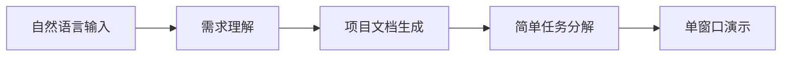
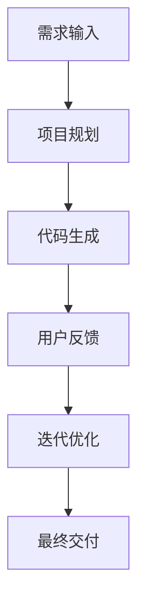
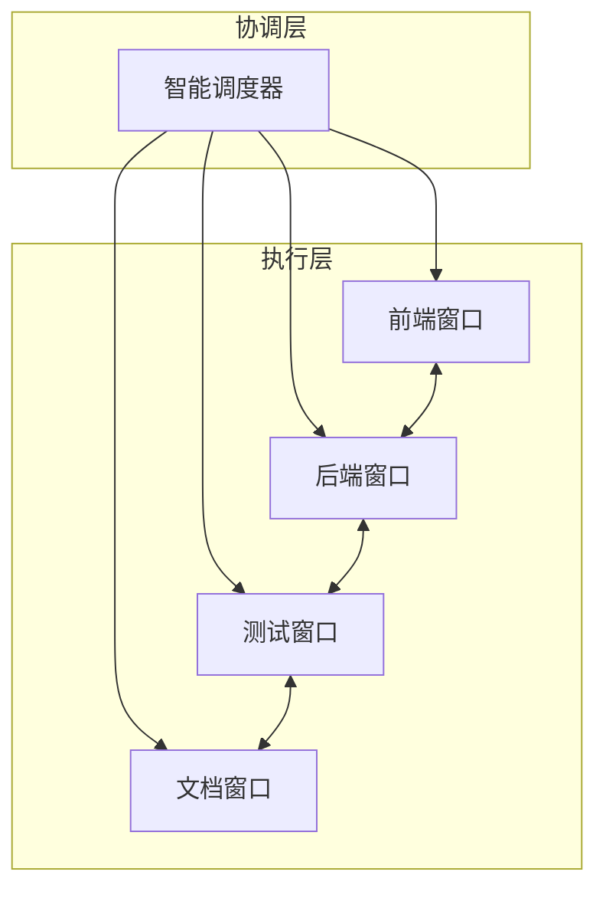
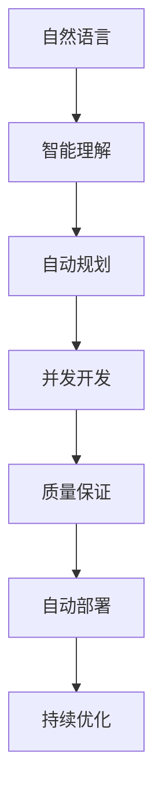
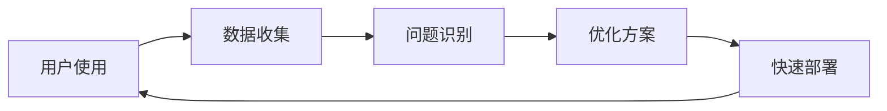

# 🗺️ 天庭系统实现路线图

## 🎯 矛盾驱动的演进策略

### 核心矛盾识别
- **主要矛盾**: 复杂系统设计 vs 快速价值交付
- **次要矛盾**: 功能完整性 vs 系统稳定性  
- **主导方面**: 用户价值优先，技术复杂度服务于用户价值

### 载体转化路径
**手动串行开发** → **半自动协助** → **智能并发执行** → **完全自主开发**

---

## 🚀 四阶段演进计划

### Stage 0: 原型验证 (MVP-0) - 2周
**目标**: 验证核心概念可行性，快速获得用户反馈

#### 🎯 核心价值验证
- ✅ 用户能否通过自然语言描述需求？
- ✅ 系统能否生成有价值的项目文档？
- ✅ 基础的任务分解是否合理？

#### 📋 功能范围


#### 💻 技术实现
- **前端**: 简单HTML+JS，一个输入框
- **后端**: FastAPI + SQLite，单进程
- **AI**: 集成Claude API，基础prompt engineering
- **输出**: 静态文档生成，无实际代码生成

#### 📊 成功指标
- ✅ 80%的测试用例能生成合理的项目文档
- ✅ 用户反馈平均满意度 ≥ 7/10
- ✅ 完整流程响应时间 < 60秒

#### ⚠️ 技术债务约束
- 硬编码配置可接受
- 无需考虑并发性能
- 错误处理可以简化

---

### Stage 1: 智能协助 (MVP-1) - 4周
**目标**: 实现单窗口智能开发助手，证明AI能真正协助开发

#### 🎯 价值提升
- ✅ 生成可运行的代码骨架
- ✅ 提供实用的开发建议
- ✅ 支持用户互动和调整

#### 📋 功能扩展


#### 💻 技术升级
- **前端**: React基础界面，支持实时交互
- **后端**: 增加WebSocket，支持流式响应
- **AI增强**: 
  - 专业角色系统集成
  - 代码生成能力
  - 迭代优化机制
- **输出**: 生成可运行的项目骨架

#### 📊 成功指标
- ✅ 生成的代码90%能正常编译运行
- ✅ 用户完成项目的成功率 ≥ 70%
- ✅ 平均项目启动时间 < 5分钟

#### 🔧 技术债务管理
- 重构核心架构，为并发做准备
- 建立代码质量标准
- 完善错误处理和日志系统

---

### Stage 2: 多窗口协作 (MVP-2) - 6周  
**目标**: 实现真正的并发开发，多个AI角色协同工作

#### 🎯 核心突破
- ✅ 多个Claude Code窗口同时工作
- ✅ 实时状态同步和冲突解决
- ✅ 智能任务分配和进度协调

#### 📋 系统架构


#### 💻 技术实现
- **窗口管理**: Claude Code API集成，进程池管理
- **状态同步**: Redis + WebSocket，实时数据同步
- **冲突解决**: 智能合并算法，自动冲突检测
- **任务分解**: OES方法实现，依赖关系分析

#### 📊 成功指标
- ✅ 支持最多4个并发窗口
- ✅ 窗口间同步延迟 < 2秒
- ✅ 自动冲突解决成功率 ≥ 80%
- ✅ 整体项目完成时间比Stage 1减少50%

#### 🔧 关键技术挑战
1. **窗口生命周期管理**: 如何稳定管理多个Claude Code实例
2. **状态一致性**: 确保所有窗口看到一致的项目状态
3. **智能调度**: 根据任务依赖优化执行顺序

---

### Stage 3: 完全自主 (Production) - 8周
**目标**: 实现"言出法随"的完整体验，用户几乎无需干预

#### 🎯 最终目标
- ✅ 端到端自动化项目开发
- ✅ 生产级别的代码质量
- ✅ 智能学习和优化能力

#### 📋 完整能力


#### 💻 企业级实现
- **高可用架构**: 微服务化，容器编排
- **智能学习**: 用户偏好学习，项目模板优化
- **质量保证**: 自动测试生成，代码审查
- **运维支持**: 监控告警，自动扩缩容

#### 📊 生产指标
- ✅ 支持最多8个并发窗口
- ✅ 系统可用性 ≥ 99.5%
- ✅ 端到端项目完成时间 < 2小时
- ✅ 生成代码的生产就绪率 ≥ 90%

---

## 📅 详细时间规划

### Phase 0: 原型验证 (Week 1-2)
```
Week 1: 核心组件开发
├─ Day 1-2: 基础API架构
├─ Day 3-4: 自然语言理解模块  
├─ Day 5-6: 文档生成引擎
└─ Day 7: 集成测试

Week 2: 验证与优化
├─ Day 1-3: 用户测试与反馈收集
├─ Day 4-5: 核心问题修复
├─ Day 6-7: MVP-0发布准备
```

### Phase 1: 智能协助 (Week 3-6)
```
Week 3: 架构重构
├─ 重构为可扩展架构
├─ 集成PromptX角色系统
└─ 建立代码生成基础

Week 4: 核心功能开发
├─ 实现代码生成引擎
├─ 开发交互式界面
└─ 集成用户反馈机制

Week 5: 质量提升
├─ 完善错误处理
├─ 优化生成质量
└─ 性能调优

Week 6: 测试与发布
├─ 完整功能测试
├─ 用户验收测试  
└─ MVP-1发布
```

### Phase 2: 多窗口协作 (Week 7-12)
```
Week 7-8: 窗口管理系统
├─ Claude Code API集成
├─ 窗口生命周期管理
└─ 基础任务分发

Week 9-10: 状态同步系统
├─ 实时状态同步
├─ 冲突检测与解决
└─ 进度协调机制

Week 11-12: 系统集成优化
├─ 端到端测试
├─ 性能优化
└─ MVP-2发布
```

### Phase 3: 完全自主 (Week 13-20)
```
Week 13-14: 智能优化
├─ 机器学习集成
├─ 用户偏好学习
└─ 自适应调优

Week 15-16: 企业级改造
├─ 微服务架构
├─ 高可用设计
└─ 监控体系

Week 17-18: 质量保证
├─ 自动测试生成
├─ 代码质量检查
└─ 安全审计

Week 19-20: 生产就绪
├─ 性能压测
├─ 文档完善
└─ 正式发布
```

---

## ⚠️ 风险评估与缓解

### 技术风险
| 风险类型 | 可能性 | 影响 | 缓解策略 |
|---------|-------|------|---------|
| Claude Code API稳定性 | 中 | 高 | 开发备用方案，API调用重试机制 |
| 多窗口状态同步复杂度 | 高 | 高 | 分阶段实现，从简单同步开始 |
| 代码生成质量不稳定 | 中 | 中 | 建立质量评估体系，人工审核机制 |
| 系统性能瓶颈 | 中 | 中 | 性能监控，弹性扩缩容 |

### 产品风险
| 风险类型 | 可能性 | 影响 | 缓解策略 |
|---------|-------|------|---------|
| 用户期望过高 | 高 | 中 | 明确功能边界，管理用户期望 |
| 竞品快速跟进 | 中 | 中 | 建立技术壁垒，快速迭代 |
| 商业模式不清晰 | 低 | 高 | 早期验证商业价值 |

### 团队风险
| 风险类型 | 可能性 | 影响 | 缓解策略 |
|---------|-------|------|---------|
| 关键人员流失 | 低 | 高 | 知识文档化，技能互备 |
| 技术债务积累 | 中 | 中 | 定期重构，代码审查 |
| 开发进度延期 | 中 | 中 | 敏捷开发，频繁交付 |

---

## 📊 成功指标体系

### 技术指标
- **响应性能**: 需求理解 < 10s，文档生成 < 60s
- **系统稳定性**: 可用性 ≥ 99%，窗口存活率 ≥ 95%
- **代码质量**: 生成代码编译率 ≥ 90%，测试覆盖率 ≥ 80%

### 用户指标  
- **易用性**: 新用户上手时间 < 5分钟
- **满意度**: NPS ≥ 50，用户满意度 ≥ 8/10
- **效率提升**: 项目启动时间比传统方式快 80%

### 商业指标
- **用户增长**: 月活用户增长率 ≥ 20%
- **用户留存**: 7日留存率 ≥ 60%，30日留存率 ≥ 40%  
- **价值验证**: 用户愿付费率 ≥ 10%

---

## 🛠️ 技术栈演进策略

### 分阶段技术栈演进

#### Stage 0: 智能工作流引擎
```yaml
核心技术栈:
  后端框架: FastAPI (异步支持、AI服务集成友好)
  数据库: SQLite (快速启动、零配置)
  前端框架: React + TypeScript (快速开发、类型安全)
  AI集成: Claude API + PromptX MCP (现有生态)
  
开发工具:
  代码质量: Ruff (Python), ESLint (JS/TS)
  测试框架: Pytest, Jest
  文档工具: MkDocs, Storybook
```

#### Stage 1: 多窗口并发执行
```yaml
并发管理:
  进程管理: Python multiprocessing + asyncio
  状态同步: Redis Pub/Sub + WebSocket
  任务队列: Celery + Redis
  窗口管理: Claude Code API + 进程池
  
数据存储:
  主数据库: SQLite → PostgreSQL (并发支持)
  缓存层: Redis (状态同步、任务队列)
  文件存储: 本地文件系统
```

#### Stage 2: 轻量分布式版
```yaml
微服务架构:
  容器化: Docker + Docker Compose
  服务发现: Consul 或 etcd
  负载均衡: Nginx + HAProxy
  API网关: Kong 或 Traefik
  
云端部署:
  云平台: AWS/阿里云/腾讯云
  容器编排: Kubernetes (生产环境)
  监控体系: Prometheus + Grafana
  日志管理: ELK Stack
```

#### Stage 3: 企业级神庭
```yaml
企业级架构:
  微服务框架: FastAPI + gRPC
  服务网格: Istio (流量管理、安全)
  数据库集群: PostgreSQL HA + 读写分离
  分布式存储: MinIO 或 云存储
  
治理和合规:
  权限管理: RBAC + OAuth 2.0
  审计日志: 完整操作轨迹记录
  数据加密: 端到端加密传输
  备份恢复: 自动化备份策略
```

### 技术选择理由
1. **FastAPI**: 现代Python异步框架，AI服务集成友好，文档自动生成
2. **渐进式数据库**: SQLite→PostgreSQL，避免过早优化
3. **Redis多用途**: 缓存、消息队列、状态同步一体化解决方案
4. **云原生路径**: 从Docker Compose到Kubernetes的平滑演进

---

## 🔬 论文研究支持计划

### 研究论文收集和应用流程

#### 第一阶段论文需求 (Stage 0)
```yaml
自然语言理解:
  - Intent Recognition in Software Requirements
  - Named Entity Recognition for Technical Specifications
  - Context-Aware Requirement Analysis
  
项目规划自动化:
  - Automated Software Architecture Generation
  - Machine Learning for Effort Estimation
  - Requirements-to-Design Transformation
  
代码生成质量:
  - Neural Code Synthesis Evaluation
  - Code Quality Metrics for Generated Code
  - Automated Testing for Generated Software
```

#### 第二阶段论文需求 (Stage 1)
```yaml
多智能体协调:
  - Multi-Agent Coordination in Software Development
  - Consensus Algorithms for Distributed Systems
  - Conflict Resolution in Collaborative Coding
  
并发开发管理:
  - Parallel Software Development Workflows
  - State Synchronization in Distributed Development
  - Automated Merge Conflict Resolution
```

#### 论文应用实施计划

**Week 1-2: 论文调研阶段**
- 用户负责查找和提供相关领域论文
- AI负责分析论文核心算法和方法
- 识别可直接应用的技术方案

**Week 3-4: 技术转化阶段**
- 将论文算法转化为工程实现
- 设计适合天庭系统的技术方案
- 制定原型验证计划

**Week 5-6: 原型验证阶段**
- 实现论文算法的原型版本
- 在天庭系统中进行集成测试
- 评估效果和性能表现

**Week 7-8: 优化迭代阶段**
- 基于验证结果优化算法
- 解决实际应用中的技术问题
- 形成最终的技术实现方案

### 论文收集策略

#### 优先级排序
1. **高优先级**: 直接解决核心技术难点的论文
2. **中优先级**: 提供性能优化方案的论文
3. **低优先级**: 提供理论基础和参考的论文

#### 质量要求
- 顶级会议论文 (ACL, ICSE, AAAI等)
- 近3年发表的最新研究
- 有完整实验验证的论文
- 提供开源代码的论文优先

#### 应用原则
- 理论与实践相结合
- 渐进式技术集成
- 持续效果评估
- 开源社区回馈

---

## 🔄 持续优化机制

### 用户反馈循环


### 技术演进路径
1. **学术驱动**: 基于最新研究优化算法
2. **数据驱动**: 基于真实使用数据优化性能
3. **生态集成**: 与更多开发工具和平台集成
4. **智能化**: 向完全自主的AI开发团队演进

**🎯 从学术理论驱动到产业应用领先，从"做得到"到"做得好"到"做得快"到"做得智能"**