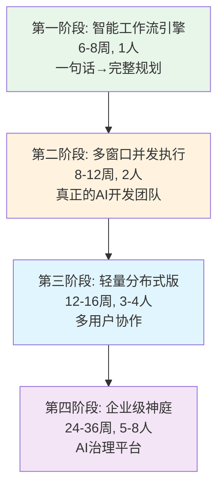
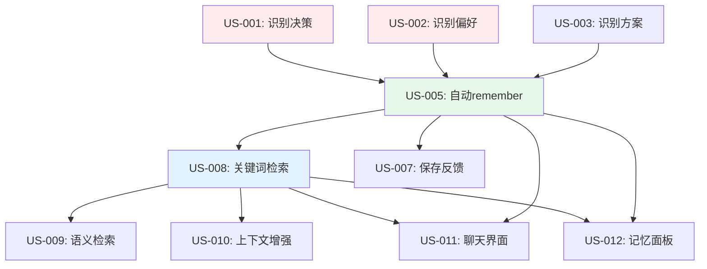
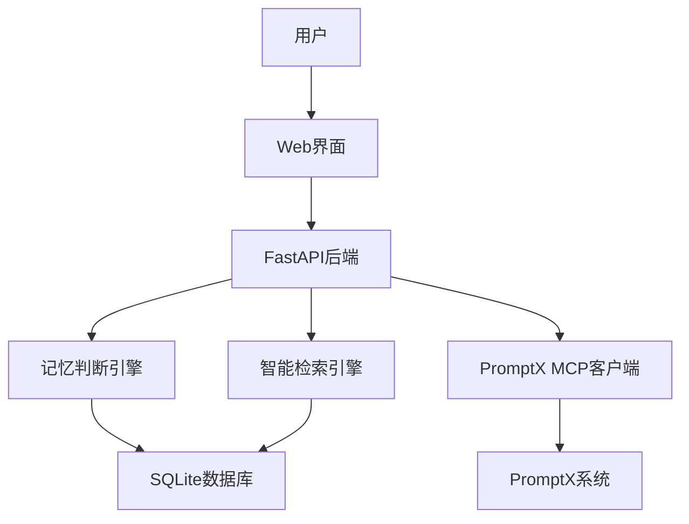

# 天庭系统需求拆分与开发计划（最终版）

## 🎯 项目概览

**项目名称**：天庭 - "言出法随"的AI开发团队  
**第一阶段目标**：智能工作流引擎（MVP-0）  
**开发周期**：6-8周  
**团队规模**：Sean（1人）  
**核心价值**：一句话启动，AI自动完成项目规划到开发的全流程

---

## 🗺️ 总体迭代路径



---

## 🚀 第一阶段：智能工作流引擎（MVP-0）

### 阶段目标与价值主张

**核心价值**：实现"言出法随" - 用户一句话描述想法，AI自动生成完整的项目规划、技术文档、任务分解

**目标用户**：
- 有想法但懒得规划的开发者
- 需要快速启动项目的团队  
- 想要AI协助的产品经理

**成功标准**：
- 从想法到完整规划时间 <5分钟
- 生成文档的专业度评分 >4.0/5.0
- 用户愿意基于此规划启动实际开发 >70%
- 10个种子用户持续使用 >2周

---

## 📖 User Story 体系

### 史诗级用户故事 (Epic)

#### Epic 1: 智能需求理解引擎
**作为** 有想法但懒得详细规划的用户  
**我希望** 能用一句话描述我的想法，系统就自动理解我的完整需求  
**这样** 我不需要花时间写详细的需求文档，专注于核心创意

**价值陈述**: 从粗糙想法到精确需求的智能转换，大幅降低项目启动门槛

#### Epic 2: 自动项目规划生成  
**作为** 需要快速启动项目的团队负责人  
**我希望** 系统能基于需求自动生成完整的项目规划文档  
**这样** 我能立即获得专业级的项目规划，节省大量前期工作

**价值陈述**: 将专业项目规划能力民主化，让任何人都能获得专家级规划

#### Epic 3: 自动记忆管理系统
**作为** 经常使用AI工具的用户  
**我希望** 系统能自动记住我的偏好和重要决策  
**这样** 我不需要重复输入相同信息，AI能越来越懂我

**价值陈述**: 无感化记忆管理，让AI具备个性化学习能力

### Feature级用户故事

#### Feature 1.1: 自然语言需求解析
**Feature描述**: 系统能准确理解用户的一句话描述，提取完整项目需求

**用户故事列表**:
- US-001: 项目类型自动识别（Web/App/API等）
- US-002: 核心功能需求提取
- US-003: 技术约束条件识别  
- US-004: 用户群体和使用场景推导

#### Feature 1.2: 智能项目规划生成
**Feature描述**: 基于解析的需求，自动生成完整的项目规划文档

**用户故事列表**:
- US-005: 用户旅程自动生成
- US-006: 技术架构方案推荐
- US-007: 开发迭代计划制定
- US-008: 技术选型智能推荐

#### Feature 1.3: 任务智能分解
**Feature描述**: 将复杂项目分解为具体可执行的开发任务

**用户故事列表**:
- US-009: 功能模块自动拆分
- US-010: 开发任务优先级排序
- US-011: 任务依赖关系分析
- US-012: 工作量评估和时间规划

#### Feature 1.4: 用户交互界面
**Feature描述**: 提供直观的Web界面，让用户体验"言出法随"

**用户故事列表**:
- US-013: 一句话输入界面
- US-014: 实时规划生成过程展示
- US-015: 生成结果的交互式查看
- US-016: 规划结果的编辑和调整

#### Feature 1.5: 自动记忆管理
**Feature描述**: 在工作流程中自动管理用户偏好和项目历史

**用户故事列表**:
- US-017: 用户技术偏好自动学习
- US-018: 项目决策历史自动保存
- US-019: 智能上下文增强
- US-020: 个性化推荐优化

---

## 📝 详细用户故事

### US-001: 自动识别用户决策

**用户故事**:  
**作为** PromptX用户  
**当我** 在对话中表达了某个决策或选择时  
**我希望** 系统能自动识别这是一个重要的决策信息  
**这样** 这个决策能被自动保存，未来遇到类似情况时能被引用

**验收标准**:
```gherkin
Scenario: 识别技术选型决策
  Given 我是天庭系统的用户
  When 我说"我决定在新项目中使用React而不是Vue，因为团队更熟悉React"
  Then 系统应该识别这是一个"decision"类型的重要信息
  And 重要性评分应该 >= 0.8
  And 记忆类型应该标记为"技术选型"

Scenario: 识别业务决策
  Given 我是天庭系统的用户  
  When 我说"经过考虑，我们选择先做B端产品，C端市场太卷了"
  Then 系统应该识别这是一个"decision"类型的重要信息
  And 重要性评分应该 >= 0.8
  And 记忆类型应该标记为"业务策略"

Scenario: 忽略日常对话
  Given 我是天庭系统的用户
  When 我说"今天天气不错，心情很好"
  Then 系统应该识别这不是重要的决策信息
  And 重要性评分应该 < 0.5
  And 不应该触发自动记忆
```

**优先级**: 高  
**预估工作量**: 3 Story Points  
**开发阶段**: 第3周

### US-002: 自动识别用户偏好

**用户故事**:  
**作为** PromptX用户  
**当我** 在对话中表达了个人偏好或习惯时  
**我希望** 系统能自动识别并记录这些偏好信息  
**这样** AI在未来对话中能更好地理解我的个人特点

**验收标准**:
```gherkin
Scenario: 识别工作习惯偏好
  Given 我是天庭系统的用户
  When 我说"我习惯用VS Code开发，不太喜欢其他编辑器"
  Then 系统应该识别这是一个"preference"类型的信息
  And 偏好类型应该标记为"开发工具"
  And 偏好内容应该包含"VS Code"和"不喜欢其他编辑器"

Scenario: 识别沟通风格偏好  
  Given 我是天庭系统的用户
  When 我说"我比较直接，不喜欢绕弯子，有什么问题直说"
  Then 系统应该识别这是一个"preference"类型的信息
  And 偏好类型应该标记为"沟通风格"
  And 偏好内容应该包含"直接"和"不喜欢绕弯子"
```

**优先级**: 高  
**预估工作量**: 3 Story Points  
**开发阶段**: 第3周

### US-003: 自动识别解决方案

**用户故事**:  
**作为** PromptX用户  
**当我** 讨论了某个问题的具体解决方案时  
**我希望** 系统能自动识别并保存这个解决方案  
**这样** 遇到类似问题时能快速找到已验证的解决方案

**验收标准**:
```gherkin
Scenario: 识别技术解决方案
  Given 我是天庭系统的用户
  When 我说"MySQL慢查询问题我是这样解决的：加了复合索引，然后优化了查询语句"
  Then 系统应该识别这是一个"solution"类型的信息
  And 问题类型应该标记为"数据库性能"
  And 解决方案应该包含"复合索引"和"优化查询语句"

Scenario: 识别流程解决方案
  Given 我是天庭系统的用户
  When 我说"团队协作问题我们用了这个方法：每周一次同步会，用飞书文档共享进度"
  Then 系统应该识别这是一个"solution"类型的信息
  And 问题类型应该标记为"团队管理"
  And 解决方案应该包含"同步会"和"飞书文档"
```

**优先级**: 中  
**预估工作量**: 2 Story Points  
**开发阶段**: 第3周

### US-005: 自动执行remember命令

**用户故事**:  
**作为** PromptX用户  
**当** 系统识别出重要信息需要记忆时  
**我希望** 系统能自动调用PromptX的remember功能保存信息  
**这样** 我不需要手动执行remember命令

**验收标准**:
```gherkin
Scenario: 自动保存决策信息
  Given 系统识别出一条重要的决策信息
  And 重要性评分 >= 0.8
  When 对话结束后的自动处理阶段
  Then 系统应该自动调用PromptX的remember命令
  And remember命令应该包含完整的决策内容
  And remember命令应该包含合适的标签
  And 用户应该看到"已自动保存决策信息"的提示

Scenario: 保存失败的处理
  Given 系统尝试自动保存记忆信息
  When PromptX的remember命令调用失败
  Then 系统应该记录错误日志
  And 用户应该看到"自动保存失败，请手动保存"的提示
  And 失败的内容应该显示在界面上供用户手动处理
```

**优先级**: 高  
**预估工作量**: 5 Story Points  
**开发阶段**: 第5周

### US-008: 关键词匹配检索

**用户故事**:  
**作为** PromptX用户  
**当我** 提出一个问题或话题时  
**我希望** 系统能自动检索相关的历史记忆  
**这样** 对话能基于我的历史经验和偏好进行

**验收标准**:
```gherkin
Scenario: 检索相关决策记忆
  Given 我之前保存过"使用React而不是Vue"的决策
  When 我问"新项目应该用什么前端框架"
  Then 系统应该检索到相关的React决策记忆
  And 检索结果应该按相关性排序
  And 结果应该在5秒内返回

Scenario: 检索相关偏好信息
  Given 我之前保存过"喜欢VS Code开发"的偏好
  When 我讨论"开发环境配置"相关话题
  Then 系统应该检索到VS Code偏好信息
  And 偏好信息应该用于增强对话上下文
```

**优先级**: 高  
**预估工作量**: 4 Story Points  
**开发阶段**: 第3-4周

### US-011: 聊天界面对话

**用户故事**:  
**作为** PromptX用户  
**我希望** 有一个简洁友好的Web界面与天庭系统对话  
**这样** 我能方便地使用自动记忆管理功能

**验收标准**:
```gherkin
Scenario: 基础对话功能
  Given 我打开天庭Web界面
  When 我在输入框中输入问题并发送
  Then 系统应该显示我的消息
  And 系统应该显示AI的回复
  And 界面应该自动滚动到最新消息

Scenario: 自动化状态显示
  Given 我发送了一条包含重要信息的消息
  When 系统处理这条消息时
  Then 界面应该显示"正在检索相关记忆..."
  And 界面应该显示"正在自动保存重要信息..."
  And 处理完成后应该显示"已自动保存X条记忆"

Scenario: 连接状态指示
  Given 我打开天庭Web界面
  Then 界面应该显示与PromptX的连接状态
  And 连接正常时显示绿色指示器
  And 连接异常时显示红色指示器和错误信息
```

**优先级**: 中  
**预估工作量**: 4 Story Points  
**开发阶段**: 第7周

### US-012: 记忆管理面板

**用户故事**:  
**作为** PromptX用户  
**我希望** 能查看和管理系统自动保存的记忆内容  
**这样** 我能了解系统的工作情况并进行必要的调整

**验收标准**:
```gherkin
Scenario: 查看记忆列表
  Given 我打开记忆管理面板
  Then 我应该看到按时间排序的记忆列表
  And 每条记忆应该显示类型、重要性评分、创建时间
  And 我应该能按记忆类型筛选
  And 我应该能按关键词搜索

Scenario: 记忆反馈功能
  Given 我在记忆管理面板中
  When 我看到一条自动保存的记忆
  Then 我应该能标记这条记忆为"有用"或"无用"
  And 我的反馈应该用于改善记忆判断算法
  And 被标记为"无用"的记忆应该降低显示优先级

Scenario: 记忆统计信息
  Given 我打开记忆管理面板
  Then 我应该看到总记忆数量
  And 我应该看到近期新增记忆数量
  And 我应该看到自动化操作的成功率
  And 我应该看到各类型记忆的分布情况
```

**优先级**: 低  
**预估工作量**: 3 Story Points  
**开发阶段**: 第7周

---

## 🎯 User Story 优先级矩阵

### 高优先级 (Must Have)
- US-001: 自动识别用户决策
- US-002: 自动识别用户偏好  
- US-005: 自动执行remember命令
- US-008: 关键词匹配检索

### 中优先级 (Should Have)
- US-003: 自动识别解决方案
- US-009: 语义相似度检索
- US-010: 上下文增强展示
- US-011: 聊天界面对话

### 低优先级 (Could Have)
- US-004: 记忆重要性打分优化
- US-006: 记忆内容分类标记
- US-007: 保存状态实时反馈
- US-012: 记忆管理面板

### 未来版本 (Won't Have)
- 复杂的自然语言处理
- 多语言支持
- 高级数据可视化
- 第三方集成

---

## 🎯 User Story 与开发任务映射

### Sprint 1 (第1-2周): 需求分析与架构设计
**User Story 覆盖**: 无直接用户故事，主要为后续开发做准备
- 用户需求调研 (支持所有User Story的基础)
- 技术架构设计 (支持所有技术实现)
- 数据模型设计 (支持US-005, US-008, US-012)

### Sprint 2 (第3-4周): 核心算法开发  
**主要User Story**: US-001, US-002, US-003, US-008
- 记忆判断引擎开发 → 实现US-001, US-002, US-003
- 智能检索引擎开发 → 实现US-008
- 单元测试覆盖 → 保证User Story的验收标准

### Sprint 3 (第5-6周): 集成开发
**主要User Story**: US-005, US-009, US-010  
- PromptX MCP客户端 → 实现US-005
- API服务层开发 → 支持所有Web交互相关的User Story
- 语义检索增强 → 实现US-009, US-010

### Sprint 4 (第7-8周): 界面与测试
**主要User Story**: US-011, US-012, US-007, US-013
- Web前端界面 → 实现US-011, US-012, US-013  
- 系统集成测试 → 验证所有User Story的端到端场景
- 用户验收测试 → 确保US的验收标准得到满足

---

## 🔄 User Story 依赖关系



---

## 技术架构设计

#### 系统架构（极简）


#### 核心组件
```python
# 核心架构组件
src/
├── core/
│   ├── memory_judge.py      # 记忆判断引擎
│   ├── retrieval_engine.py  # 智能检索引擎
│   ├── promptx_client.py    # PromptX MCP客户端
│   └── orchestrator.py     # 主编排器
├── api/
│   ├── routes.py           # API路由
│   ├── models.py           # 数据模型
│   └── dependencies.py    # 依赖注入
├── storage/
│   ├── database.py         # 数据库操作
│   └── models.py          # 数据模型定义
└── utils/
    ├── config.py          # 配置管理
    └── logger.py          # 日志工具
```

---

## 📋 软件工程全生命周期规划

### 第1-2周：需求分析与系统设计

#### 1.1 用户需求调研
**任务**: USER-001  
**时间**: 3天  
**负责人**: Sean  
**输出**: 用户需求调研报告

**详细任务**:
- [ ] 深度访谈5-10个PromptX用户
- [ ] 分析当前记忆管理的具体痛点
- [ ] 收集自动化期望和使用场景
- [ ] 定义MVP核心功能边界
- [ ] 输出：《用户需求分析报告.md》

#### 1.2 技术架构设计
**任务**: ARCH-001  
**时间**: 2天  
**负责人**: Sean  
**输出**: 系统架构设计文档

**架构决策**:
```yaml
后端技术栈:
  - FastAPI (轻量、高性能、文档自动生成)
  - SQLite (零配置、适合MVP)
  - asyncio (异步处理，提升性能)

前端技术栈:
  - 原生HTML + Tailwind CSS (快速开发)
  - WebSocket (实时状态更新)
  - 最小化JavaScript (降低复杂度)

集成方案:
  - PromptX MCP协议客户端
  - 基于规则的记忆判断算法
  - TF-IDF + 关键词匹配检索
```

#### 1.3 数据模型设计
**任务**: DATA-001  
**时间**: 2天  
**负责人**: Sean  
**输出**: 数据库设计文档

**核心数据表**:
```sql
-- 对话记录表
CREATE TABLE conversations (
    id TEXT PRIMARY KEY,
    user_input TEXT NOT NULL,
    ai_response TEXT,
    session_id TEXT,
    created_at TIMESTAMP DEFAULT CURRENT_TIMESTAMP,
    metadata JSON
);

-- 记忆内容表
CREATE TABLE memories (
    id TEXT PRIMARY KEY,
    content TEXT NOT NULL,
    memory_type TEXT, -- 'decision', 'preference', 'context', 'solution'
    importance_score REAL DEFAULT 0.0,
    tags TEXT, -- JSON array
    conversation_id TEXT REFERENCES conversations(id),
    created_at TIMESTAMP DEFAULT CURRENT_TIMESTAMP,
    accessed_count INTEGER DEFAULT 0,
    last_accessed TIMESTAMP
);

-- 用户偏好表
CREATE TABLE user_preferences (
    id TEXT PRIMARY KEY,
    preference_key TEXT NOT NULL,
    preference_value TEXT NOT NULL,
    confidence_score REAL DEFAULT 0.0,
    created_at TIMESTAMP DEFAULT CURRENT_TIMESTAMP,
    updated_at TIMESTAMP DEFAULT CURRENT_TIMESTAMP
);

-- 系统配置表
CREATE TABLE system_configs (
    key TEXT PRIMARY KEY,
    value TEXT NOT NULL,
    description TEXT,
    updated_at TIMESTAMP DEFAULT CURRENT_TIMESTAMP
);
```

### 第3-4周：核心算法开发

#### 3.1 记忆判断引擎
**任务**: CORE-001  
**时间**: 1周  
**负责人**: Sean  
**输出**: 智能记忆判断系统

**算法设计**:
```python
class MemoryJudge:
    """智能记忆判断引擎"""
    
    def __init__(self):
        self.decision_keywords = [
            "选择", "决定", "采用", "使用", "不用", "放弃", 
            "推荐", "建议", "倾向", "偏好"
        ]
        self.preference_keywords = [
            "喜欢", "不喜欢", "习惯", "偏好", "风格", 
            "方式", "总是", "从不", "经常"
        ]
        self.solution_keywords = [
            "解决", "方案", "办法", "策略", "实现", 
            "代码", "配置", "设置", "步骤"
        ]
        
    def should_remember(self, conversation: str) -> Tuple[bool, str, float]:
        """
        判断对话是否值得记忆
        返回: (是否记忆, 记忆类型, 重要性评分)
        """
        score = 0.0
        memory_type = "general"
        
        # 决策内容检测
        if self._contains_decision(conversation):
            score += 0.8
            memory_type = "decision"
            
        # 偏好表达检测  
        if self._contains_preference(conversation):
            score += 0.7
            memory_type = "preference"
            
        # 解决方案检测
        if self._contains_solution(conversation):
            score += 0.6
            memory_type = "solution"
            
        # 长度和复杂度加权
        score += min(len(conversation) / 1000, 0.3)
        
        # 专业术语密度
        score += self._calculate_technical_density(conversation) * 0.2
        
        return score > 0.5, memory_type, score
        
    def _contains_decision(self, text: str) -> bool:
        """检测是否包含决策内容"""
        return any(keyword in text for keyword in self.decision_keywords)
        
    def _contains_preference(self, text: str) -> bool:
        """检测是否包含偏好表达"""
        return any(keyword in text for keyword in self.preference_keywords)
        
    def _contains_solution(self, text: str) -> bool:
        """检测是否包含解决方案"""
        return any(keyword in text for keyword in self.solution_keywords)
        
    def _calculate_technical_density(self, text: str) -> float:
        """计算技术术语密度"""
        # 技术关键词字典
        tech_keywords = [
            "API", "数据库", "算法", "架构", "框架", "库",
            "配置", "部署", "测试", "优化", "性能", "安全"
        ]
        matches = sum(1 for keyword in tech_keywords if keyword in text)
        return min(matches / 10, 1.0)
```

**开发任务**:
- [ ] 实现基础规则引擎
- [ ] 开发关键词匹配算法
- [ ] 创建重要性评分机制
- [ ] 实现记忆类型分类
- [ ] 添加单元测试（覆盖率>85%）

**验收标准**:
- 决策内容识别准确率 >80%
- 偏好表达识别准确率 >75%
- 处理响应时间 <500ms
- 误报率 <20%

#### 3.2 智能检索引擎
**任务**: CORE-002  
**时间**: 1周  
**负责人**: Sean  
**输出**: 记忆检索系统

**检索算法设计**:
```python
class RetrievalEngine:
    """智能记忆检索引擎"""
    
    def __init__(self):
        self.tfidf_vectorizer = TfidfVectorizer(
            max_features=1000,
            stop_words='english',
            ngram_range=(1, 2)
        )
        
    async def search_memories(self, query: str, limit: int = 5) -> List[Memory]:
        """
        搜索相关记忆
        """
        # 1. 关键词精确匹配
        exact_matches = await self._keyword_search(query, limit//2)
        
        # 2. 语义相似度搜索
        semantic_matches = await self._semantic_search(query, limit//2)
        
        # 3. 结果合并和去重
        all_matches = self._merge_and_deduplicate(exact_matches, semantic_matches)
        
        # 4. 重新排序（考虑时间衰减、访问频次等）
        ranked_results = self._rank_results(all_matches, query)
        
        return ranked_results[:limit]
        
    async def _keyword_search(self, query: str, limit: int) -> List[Memory]:
        """关键词匹配搜索"""
        keywords = self._extract_keywords(query)
        
        sql = """
        SELECT * FROM memories 
        WHERE content LIKE ?
        ORDER BY importance_score DESC, created_at DESC
        LIMIT ?
        """
        
        # 构建LIKE查询
        like_pattern = f"%{' '.join(keywords)}%"
        return await self.db.fetch_all(sql, [like_pattern, limit])
        
    async def _semantic_search(self, query: str, limit: int) -> List[Memory]:
        """语义相似度搜索"""
        # 获取所有记忆内容
        all_memories = await self.db.fetch_all("SELECT * FROM memories")
        
        if not all_memories:
            return []
            
        # TF-IDF向量化
        memory_texts = [m.content for m in all_memories]
        tfidf_matrix = self.tfidf_vectorizer.fit_transform(memory_texts)
        query_vector = self.tfidf_vectorizer.transform([query])
        
        # 计算余弦相似度
        similarities = cosine_similarity(query_vector, tfidf_matrix).flatten()
        
        # 获取最相似的记忆
        top_indices = similarities.argsort()[-limit:][::-1]
        
        results = []
        for idx in top_indices:
            if similarities[idx] > 0.1:  # 相似度阈值
                memory = all_memories[idx]
                memory.similarity_score = similarities[idx]
                results.append(memory)
                
        return results
        
    def _rank_results(self, memories: List[Memory], query: str) -> List[Memory]:
        """综合排序算法"""
        for memory in memories:
            # 基础分数
            score = memory.importance_score
            
            # 相似度加权
            if hasattr(memory, 'similarity_score'):
                score += memory.similarity_score * 2
                
            # 时间衰减（越新的越重要）
            days_old = (datetime.now() - memory.created_at).days
            time_factor = max(0.1, 1 - (days_old / 365))
            score *= time_factor
            
            # 访问频次加权
            access_factor = min(1.0, memory.accessed_count / 10)
            score += access_factor * 0.3
            
            memory.final_score = score
            
        return sorted(memories, key=lambda m: m.final_score, reverse=True)
```

**开发任务**:
- [ ] 实现TF-IDF向量化搜索
- [ ] 开发关键词匹配算法
- [ ] 创建综合排序机制
- [ ] 实现时间衰减和频次加权
- [ ] 添加搜索性能优化

**验收标准**:
- 相关记忆召回率 >80%
- 搜索响应时间 <1秒
- 结果相关性准确率 >75%
- 支持模糊匹配和语义搜索

### 第5-6周：PromptX集成与API开发

#### 5.1 PromptX MCP客户端
**任务**: INTEG-001  
**时间**: 1周  
**负责人**: Sean  
**输出**: PromptX深度集成

**集成架构**:
```python
class PromptXClient:
    """PromptX MCP客户端"""
    
    def __init__(self, config: PromptXConfig):
        self.config = config
        self.session = None
        self.retry_config = RetryConfig(max_retries=3, backoff_factor=2)
        
    async def connect(self) -> bool:
        """建立MCP连接"""
        try:
            # MCP协议连接
            self.session = await create_mcp_session(self.config.mcp_endpoint)
            return await self._health_check()
        except Exception as e:
            logger.error(f"PromptX连接失败: {e}")
            return False
            
    async def auto_remember(self, content: str, memory_type: str) -> bool:
        """自动执行remember命令"""
        try:
            # 构建remember命令
            command = f"remember {content}"
            result = await self._execute_mcp_command("promptx_remember", {
                "content": content,
                "type": memory_type,
                "auto_generated": True
            })
            return result.success
        except Exception as e:
            logger.error(f"自动remember失败: {e}")
            return False
            
    async def auto_recall(self, query: str) -> List[str]:
        """自动执行recall命令"""
        try:
            result = await self._execute_mcp_command("promptx_recall", {
                "query": query,
                "max_results": 5
            })
            return result.memories if result.success else []
        except Exception as e:
            logger.error(f"自动recall失败: {e}")
            return []
            
    async def enhance_context(self, user_input: str) -> str:
        """增强用户输入的上下文"""
        # 1. 检索相关记忆
        relevant_memories = await self.auto_recall(user_input)
        
        # 2. 构建增强的上下文
        if relevant_memories:
            context_prefix = "基于你的历史偏好和经验：\n"
            context_prefix += "\n".join(f"- {memory}" for memory in relevant_memories)
            context_prefix += "\n\n当前问题："
            return context_prefix + user_input
        
        return user_input
        
    async def _execute_mcp_command(self, command: str, params: dict) -> MCPResult:
        """执行MCP命令（带重试）"""
        for attempt in range(self.retry_config.max_retries):
            try:
                result = await self.session.call_tool(command, params)
                return MCPResult(success=True, data=result)
            except Exception as e:
                if attempt < self.retry_config.max_retries - 1:
                    await asyncio.sleep(self.retry_config.backoff_factor ** attempt)
                    continue
                logger.error(f"MCP命令执行失败: {command}, 错误: {e}")
                return MCPResult(success=False, error=str(e))
```

**开发任务**:
- [ ] 实现MCP协议客户端
- [ ] 开发重试和错误处理机制
- [ ] 创建上下文增强功能
- [ ] 实现连接池和会话管理
- [ ] 添加性能监控和日志

#### 5.2 API服务层开发
**任务**: API-001  
**时间**: 1周  
**负责人**: Sean  
**输出**: FastAPI后端服务

**API接口设计**:
```python
# 核心API端点
@app.post("/api/v1/conversation")
async def process_conversation(request: ConversationRequest) -> ConversationResponse:
    """
    处理用户对话请求
    1. 自动检索相关记忆
    2. 增强上下文
    3. 调用PromptX
    4. 自动保存重要信息
    """
    
@app.get("/api/v1/memories")
async def get_memories(
    query: Optional[str] = None,
    memory_type: Optional[str] = None,
    limit: int = 20
) -> List[Memory]:
    """查询记忆内容"""
    
@app.post("/api/v1/memories/{memory_id}/feedback")
async def feedback_memory(memory_id: str, feedback: MemoryFeedback):
    """用户反馈，优化记忆质量"""
    
@app.get("/api/v1/stats")
async def get_statistics() -> StatisticsResponse:
    """获取使用统计信息"""
    
@app.websocket("/ws")
async def websocket_endpoint(websocket: WebSocket):
    """WebSocket实时通信"""
```

**开发任务**:
- [ ] 实现核心API端点
- [ ] 开发WebSocket实时通信
- [ ] 创建请求验证和错误处理
- [ ] 实现API文档自动生成
- [ ] 添加基础的认证和限流

### 第7-8周：前端界面与集成测试

#### 7.1 Web前端界面
**任务**: UI-001  
**时间**: 1周  
**负责人**: Sean  
**输出**: 用户Web界面

**界面设计**:
```html
<!-- 主对话界面 -->
<div class="tianting-chat">
    <div class="chat-header">
        <h1>🏛️ 天庭 - 智能记忆助手</h1>
        <div class="status-indicator">
            <span class="status-dot connected"></span>
            <span>已连接PromptX</span>
        </div>
    </div>
    
    <div class="chat-messages">
        <!-- 消息列表 -->
    </div>
    
    <div class="chat-input">
        <textarea placeholder="说出你的需求，我来自动管理记忆..."></textarea>
        <button onclick="sendMessage()">发送</button>
    </div>
    
    <div class="auto-processing">
        <div class="processing-step active">
            <span class="icon">🧠</span>
            <span>正在检索相关记忆...</span>
        </div>
        <div class="processing-step">
            <span class="icon">💾</span>
            <span>自动保存重要信息...</span>
        </div>
    </div>
</div>

<!-- 记忆管理界面 -->
<div class="memory-dashboard">
    <h2>记忆管理</h2>
    <div class="memory-stats">
        <div class="stat-card">
            <h3>总记忆数</h3>
            <span class="count">127</span>
        </div>
        <div class="stat-card">
            <h3>本周新增</h3>
            <span class="count">23</span>
        </div>
        <div class="stat-card">
            <h3>自动化率</h3>
            <span class="count">95%</span>
        </div>
    </div>
    
    <div class="memory-list">
        <!-- 记忆内容列表 -->
    </div>
</div>
```

**JavaScript功能**:
```javascript
class TiantingApp {
    constructor() {
        this.ws = null;
        this.apiClient = new APIClient();
        this.init();
    }
    
    init() {
        this.connectWebSocket();
        this.bindEvents();
        this.loadInitialData();
    }
    
    async sendMessage(message) {
        // 显示处理状态
        this.showProcessingStatus();
        
        try {
            // 调用API处理对话
            const response = await this.apiClient.processConversation({
                message: message,
                session_id: this.getSessionId()
            });
            
            // 显示AI回复
            this.displayMessage(response.ai_response, 'ai');
            
            // 显示自动处理结果
            if (response.auto_remembered) {
                this.showAutoRememberNotification(response.remembered_content);
            }
            
        } catch (error) {
            this.showError('处理失败，请重试');
        } finally {
            this.hideProcessingStatus();
        }
    }
    
    connectWebSocket() {
        this.ws = new WebSocket('ws://localhost:8000/ws');
        
        this.ws.onmessage = (event) => {
            const data = JSON.parse(event.data);
            this.handleWebSocketMessage(data);
        };
    }
    
    showProcessingStatus() {
        // 显示自动处理进度
        document.querySelector('.auto-processing').style.display = 'block';
    }
}
```

#### 7.2 系统集成测试
**任务**: TEST-001  
**时间**: 1周  
**负责人**: Sean  
**输出**: 完整的测试报告

**测试计划**:
```yaml
单元测试:
  - 记忆判断引擎测试
  - 检索引擎测试
  - PromptX客户端测试
  - API接口测试
  覆盖率目标: >85%

集成测试:
  - 端到端对话流程测试
  - PromptX集成功能测试
  - 数据库操作一致性测试
  - WebSocket实时通信测试

性能测试:
  - API响应时间测试
  - 数据库查询性能测试
  - 并发用户负载测试
  - 内存使用情况测试

用户验收测试:
  - 5-10个真实用户测试
  - 用户体验反馈收集
  - 功能完整性验证
  - 易用性评估
```

**测试用例示例**:
```python
# 端到端测试用例
async def test_auto_memory_workflow():
    """测试自动记忆完整流程"""
    
    # 1. 用户输入包含决策信息
    user_input = "我决定在新项目中使用React而不是Vue，因为团队更熟悉React"
    
    # 2. 系统应该自动判断需要记忆
    memory_decision = await memory_judge.should_remember(user_input)
    assert memory_decision[0] == True  # 应该记忆
    assert memory_decision[1] == "decision"  # 决策类型
    
    # 3. 系统应该自动保存到PromptX
    saved = await promptx_client.auto_remember(user_input, "decision")
    assert saved == True
    
    # 4. 后续相关查询应该能检索到
    relevant_memories = await retrieval_engine.search_memories("前端框架选择")
    assert len(relevant_memories) > 0
    assert any("React" in memory.content for memory in relevant_memories)
```

---

## 📊 项目管理与质量保证

### 开发里程碑

| 里程碑 | 时间节点 | 关键交付物 | 验收标准 |
|--------|----------|------------|----------|
| M1: 架构设计完成 | 第2周末 | 技术架构、数据模型设计 | 设计评审通过 |
| M2: 核心算法完成 | 第4周末 | 记忆判断、检索引擎 | 算法准确率达标 |
| M3: 集成开发完成 | 第6周末 | PromptX集成、API服务 | 集成测试通过 |
| M4: MVP完整交付 | 第8周末 | 完整可用系统 | 用户验收通过 |

### 风险管理

#### 技术风险
| 风险项 | 概率 | 影响 | 缓解措施 |
|--------|------|------|----------|
| PromptX MCP集成复杂 | 中 | 高 | 提前技术验证，准备备用方案 |
| 记忆判断准确率不足 | 中 | 中 | 多轮测试优化，用户反馈调整 |
| 性能不达预期 | 低 | 中 | 提前性能测试，优化数据库查询 |

#### 进度风险
| 风险项 | 概率 | 影响 | 缓解措施 |
|--------|------|------|----------|
| 功能范围膨胀 | 高 | 中 | 严格控制MVP范围，后续迭代 |
| 开发时间估算偏差 | 中 | 中 | 预留20%缓冲时间 |
| 第三方依赖问题 | 低 | 高 | 提前调研，准备替代方案 |

### 质量标准

#### 代码质量
```yaml
单元测试覆盖率: >85%
代码重复率: <10%
代码复杂度: <10 (平均)
静态代码检查: 无严重问题
代码审查: 100%覆盖（self-review）
```

#### 性能标准
```yaml
API响应时间: <2秒
记忆判断时间: <500ms
检索响应时间: <1秒
数据库查询: <100ms
内存使用: <500MB
```

#### 用户体验标准
```yaml
界面加载时间: <3秒
操作响应时间: <1秒
用户满意度: >4.0/5.0
功能易用性: >80%用户无需帮助即可使用
错误恢复: 用户友好的错误提示
```

---

## 🎯 成功指标与验收标准

### MVP成功指标

#### 技术指标
```yaml
核心功能:
  - 记忆判断准确率: >80%
  - 检索相关性: >75%
  - 系统可用性: >99%
  - 平均响应时间: <3秒

集成效果:
  - PromptX调用成功率: >95%
  - 自动remember成功率: >90%
  - 自动recall触发准确率: >85%
```

#### 用户体验指标
```yaml
使用体验:
  - 手动remember/recall操作减少: >90%
  - 用户满意度评分: >4.0/5.0
  - 首次使用成功率: >80%
  - 用户推荐意愿: >70%

留存指标:
  - 种子用户数: 10-20人
  - 连续使用天数: >14天
  - 日活跃率: >60%
  - 功能使用频率: 每日>5次交互
```

### 最终验收标准

#### 功能验收
- [ ] 用户输入自动分析和记忆判断
- [ ] 相关历史记忆自动检索和展示
- [ ] PromptX remember/recall自动调用
- [ ] Web界面友好易用
- [ ] 基础数据统计和可视化

#### 性能验收
- [ ] 所有性能指标达到预期
- [ ] 10个并发用户稳定运行
- [ ] 连续运行7天无重大故障
- [ ] 数据完整性和一致性保证

#### 用户验收
- [ ] 10个种子用户完成完整测试
- [ ] 用户反馈积极正面（>80%满意）
- [ ] 关键用户愿意持续使用
- [ ] 达到预期的效率提升效果

---

## 🚀 第二阶段预览（本地智能编排）

### 价值升级方向
```yaml
从: 自动记忆管理
到: 多角色智能编排

新增核心价值:
  - 复杂任务自动分解
  - 多PromptX角色并行处理
  - 结果智能聚合优化
  - 处理过程可视化
```

### 技术演进路径
```yaml
架构升级:
  - 单线程 → 多线程任务处理
  - 单一角色 → 多角色协作
  - 简单记忆 → 知识图谱
  - 基础界面 → 过程可视化

开发资源:
  - 团队: Sean + 1个开发者
  - 时间: 8-12周
  - 技术难度: 中等
  - 商业化: 开始尝试收费模式
```

### 启动条件
```yaml
第一阶段成功指标:
  - 用户满意度 >4.0/5.0
  - 持续使用用户 >10人
  - 技术架构稳定可靠
  - 有用户主动要求更强功能

资源准备:
  - 有预算支持额外开发者
  - Sean有时间投入第二阶段
  - 技术债务控制在可接受范围
```

---

## 💎 关键成功因素

### 第一阶段必须专注的核心

1. **用户价值验证**：真正解决手动记忆管理的痛点
2. **技术可行性**：PromptX集成稳定可靠
3. **产品易用性**：用户无需学习即可上手
4. **质量可靠性**：稳定运行，用户能依赖
5. **反馈机制**：快速收集和响应用户反馈

### 避免的陷阱

1. **功能蔓延**：严格控制MVP范围，抵制添加新功能的诱惑
2. **过度工程**：避免追求完美的技术方案，优先可用性
3. **用户脱节**：保持与真实用户的密切联系和反馈循环
4. **技术债务**：在快速迭代和代码质量间保持平衡
5. **孤岛开发**：确保与PromptX生态的深度集成

---

**第一阶段核心理念：用最小的投入，验证最核心的价值假设**

*成功的MVP不是功能最多的产品，而是最快证明用户价值的产品*