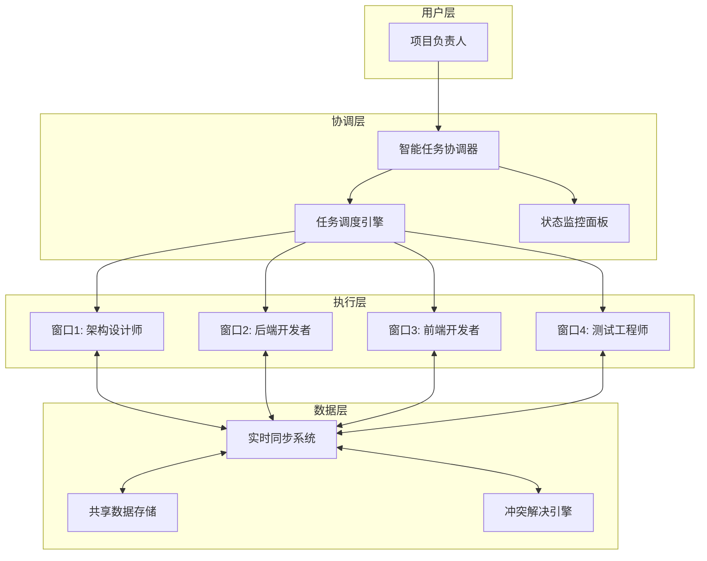

# MVP-1 多窗口并发执行准备指南

## 🎯 版本概述

**MVP-1目标**: 实现真正的AI开发团队 - 多个Claude Code窗口协同工作，并发开发完整项目

**核心突破**: 从单窗口智能助手升级为多窗口协作开发团队

---

## 🏗️ 技术架构设计

### 📊 系统架构图


### 🔧 核心组件设计

#### 1. 窗口管理系统 (Window Manager)
- **功能**: 管理多个Claude Code实例的生命周期
- **技术**: Claude Code API + 进程池管理
- **挑战**: 窗口稳定性、资源管理、故障恢复

#### 2. 智能任务分解引擎 (Task Decomposition Engine)
- **功能**: 基于OES方法论智能分解开发任务
- **技术**: AI驱动的任务分析 + 依赖关系图
- **挑战**: 任务粒度控制、依赖分析准确性

#### 3. 实时状态同步系统 (Real-time Sync System)
- **功能**: 多窗口间的代码、进度、状态实时同步
- **技术**: Redis Pub/Sub + WebSocket + 事件驱动架构
- **挑战**: 数据一致性、冲突检测、性能优化

#### 4. 冲突智能解决器 (Conflict Resolution Engine)
- **功能**: 自动检测和解决开发冲突
- **技术**: 语义分析 + 规则引擎 + AI辅助决策
- **挑战**: 冲突识别准确性、自动合并策略

#### 5. 代码生成引擎 (Code Generation Engine)
- **功能**: 生成可运行的项目代码
- **技术**: 模板引擎 + AI代码生成 + 质量验证
- **挑战**: 代码质量控制、框架适配、性能优化

---

## 📋 包级别任务设计

### 🗂️ 新增包结构
```
MVP-1/packages/
├── window-manager/           # 窗口管理系统
│   ├── src/
│   ├── tests/
│   └── tasks/
│       ├── claude-code-integration-01-base.task.md
│       ├── window-lifecycle-management-02-base.task.md
│       └── window-pool-optimization-03-integration.task.md
│
├── task-engine/             # 任务分解引擎
│   ├── src/
│   ├── tests/
│   └── tasks/
│       ├── oes-task-decomposition-01-base.task.md
│       ├── dependency-analysis-02-base.task.md
│       └── smart-scheduling-03-integration.task.md
│
├── sync-system/             # 状态同步系统
│   ├── src/
│   ├── tests/
│   └── tasks/
│       ├── real-time-sync-01-base.task.md
│       ├── conflict-detection-02-base.task.md
│       └── merge-resolution-03-integration.task.md
│
├── code-generator/          # 代码生成引擎
│   ├── src/
│   ├── tests/
│   └── tasks/
│       ├── template-engine-01-base.task.md
│       ├── ai-code-generation-02-base.task.md
│       └── code-validation-03-integration.task.md
│
├── coordinator/             # 总体协调系统
│   ├── src/
│   ├── tests/
│   └── tasks/
│       ├── task-coordination-01-base.task.md
│       ├── progress-monitoring-02-base.task.md
│       └── intelligent-scheduling-03-integration.task.md
│
├── integration/             # 跨包集成测试
│   └── tasks/
│       └── multi-window-workflow-01-integration.task.md
│
└── validation/              # MVP-1系统验证
    └── tasks/
        └── mvp1-system-validation-01-final.task.md
```

---

## 🔄 从MVP-0过渡准备工作

### 📊 MVP-0遗留系统分析
```yaml
可复用组件:
  - shared包: 类型定义系统 (100%复用)
  - core包: 需求解析和规划生成 (80%复用，需要接口改造)
  - api包: 基础HTTP框架 (60%复用，需要扩展为微服务)
  - frontend包: 基础UI组件 (70%复用，需要添加协作界面)

需要重构的部分:
  - 单体架构 → 微服务架构
  - 单窗口任务 → 多窗口协作任务
  - 简单状态管理 → 分布式状态同步
  - 基础错误处理 → 复杂的协作错误处理
```

### 🛠️ 技术预研需求
```
关键技术验证项目:
1. Claude Code API集成 (3天)
   - API能力和限制调研
   - 窗口管理可行性验证
   - 稳定性测试方案

2. 多窗口状态同步 (2天)
   - Redis Pub/Sub性能测试
   - WebSocket连接管理
   - 数据一致性方案验证

3. 智能任务分解算法 (2天)
   - OES方法论算法化
   - 依赖关系分析算法
   - 任务粒度控制策略

4. 冲突检测和解决 (2天)
   - 代码冲突识别算法
   - 自动合并策略设计
   - 人工介入机制
```

---

## 👥 团队配置升级

### 🎯 团队角色定义
```
MVP-1团队配置 (2-3人):

1. 系统架构师/技术负责人
   - 负责: 整体架构设计、核心技术难点攻关
   - 主要任务: window-manager + coordinator包
   - 技能要求: 分布式系统、进程管理、系统设计

2. AI工程师/算法专家
   - 负责: 任务分解算法、代码生成引擎
   - 主要任务: task-engine + code-generator包
   - 技能要求: AI应用、算法设计、代码生成

3. 协作系统工程师
   - 负责: 状态同步、冲突解决、实时通信
   - 主要任务: sync-system + integration包
   - 技能要求: 实时系统、数据同步、冲突解决
```

### 📈 技能要求评估
```yaml
技术技能需求:
  系统设计能力: ★★★★★ (分布式系统经验)
  AI应用经验: ★★★★☆ (Claude API、任务分解)
  实时系统开发: ★★★★☆ (WebSocket、状态同步)
  进程管理: ★★★☆☆ (多进程协调)
  冲突解决: ★★★☆☆ (合并算法)

协作技能需求:
  跨包协作: ★★★★★ (多人并发开发)
  API设计: ★★★★☆ (包间接口设计)
  测试驱动: ★★★★☆ (复杂系统测试)
  文档编写: ★★★☆☆ (技术文档)
```

---

## 📅 开发计划框架

### 🚀 三阶段开发计划 (总计8-12周)

#### Phase 1: 技术基础建设 (3-4周)
```
Week 1-2: 核心基础设施
├─ 窗口管理系统基础框架
├─ 状态同步基础架构  
├─ 任务分解算法原型
└─ 集成测试环境搭建

Week 3-4: 核心功能原型
├─ 多窗口生命周期管理
├─ 基础的任务分发机制
├─ 简单的状态同步
└─ 端到端流程验证
```

#### Phase 2: 核心功能开发 (4-5周)
```
Week 5-6: 智能化功能
├─ 智能任务分解引擎
├─ 冲突检测和解决机制
├─ 代码生成引擎基础
└─ 协调系统集成

Week 7-8: 高级功能完善
├─ 高级代码生成能力
├─ 智能的任务调度
├─ 复杂冲突处理
└─ 性能优化

Week 9: 功能完善和稳定性
├─ 边界情况处理
├─ 错误恢复机制
├─ 性能调优
└─ 稳定性验证
```

#### Phase 3: 集成测试和优化 (1-3周)
```
Week 10-11: 系统集成
├─ 跨包集成测试
├─ 端到端流程验证
├─ 性能压力测试
└─ 用户验收测试准备

Week 12: 发布准备
├─ 最终质量验证
├─ 文档完善
├─ 部署环境准备
└─ MVP-1正式发布
```

---

## 🎯 成功标准定义

### 📊 技术指标
```yaml
性能指标:
  - 支持4个并发窗口稳定运行
  - 窗口间同步延迟 <2秒
  - 端到端项目完成时间比MVP-0减少50%
  - 生成代码编译运行成功率 ≥90%

质量指标:
  - 自动冲突解决成功率 ≥80%
  - 任务分解准确率 ≥90%
  - 窗口存活率 ≥95%
  - 系统可用性 ≥99.5%
```

### 👥 用户体验指标
```yaml
易用性指标:
  - 多窗口协作上手时间 <10分钟
  - 项目启动时间 <5分钟
  - 用户满意度 ≥4.2/5.0
  - 功能完整度 ≥95%

协作效率指标:
  - 协作效率提升 ≥2倍
  - 代码质量提升 ≥30%
  - 开发错误率降低 ≥50%
  - 用户推荐意愿 ≥75%
```

---

## 🚨 风险识别和缓解

### 🔴 高风险项
```yaml
技术风险:
  1. Claude Code API稳定性
     风险: API不稳定导致窗口管理困难
     缓解: 开发备用的本地AI方案

  2. 多窗口状态一致性
     风险: 复杂的状态同步导致数据不一致
     缓解: 简化同步模型，建立强一致性保证

  3. 系统复杂度控制
     风险: 系统过于复杂导致不可维护
     缓解: 严格的模块化设计，清晰的接口契约
```

### 🟡 中风险项
```yaml
开发风险:
  1. 团队协作复杂度
     风险: 多人并发开发冲突
     缓解: 清晰的包边界，严格的接口设计

  2. 开发进度控制
     风险: 功能复杂导致延期
     缓解: 分阶段交付，核心功能优先

  3. 测试复杂度
     风险: 多窗口协作难以测试
     缓解: 建立完善的集成测试环境
```

---

## 📋 准备清单

### ✅ 技术准备
- [ ] Claude Code API账号和权限
- [ ] 开发服务器资源 (支持多进程)
- [ ] Redis集群配置
- [ ] 监控和日志系统
- [ ] 集成测试环境

### ✅ 团队准备
- [ ] 确认团队成员分工
- [ ] 建立协作流程和规范
- [ ] 设置沟通渠道和会议机制
- [ ] 制定代码审查标准
- [ ] 建立知识分享机制

### ✅ 流程准备
- [ ] Git工作流确定
- [ ] CI/CD流水线设计
- [ ] 版本发布流程
- [ ] 问题反馈机制
- [ ] 用户测试计划

---

## 🎉 启动标志

当以下条件全部满足时，正式启动MVP-1开发：

1. ✅ MVP-0完整验证通过
2. ✅ 用户反馈分析完成，需求确认
3. ✅ 技术预研完成，可行性确认
4. ✅ 团队配置到位，角色明确
5. ✅ 开发环境准备完成
6. ✅ 详细开发计划制定完成

**启动仪式**: MVP-1开发启动会 + 第一个sprint计划会

---

**💡 记住**: MVP-1是从智能助手到AI团队的关键跃迁，成功与否将决定天庭系统的技术壁垒和市场竞争力！