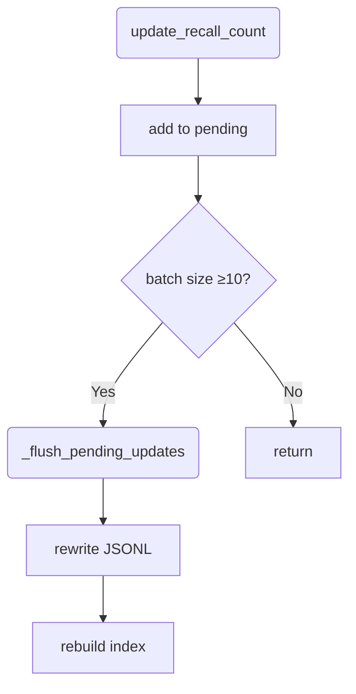

# MemoryHub JSONL Indexing & Recall 优化
<!-- status: done -->

status: completed

## 背景
Application / Archive 层海量日志以 JSON Lines 持久化，早期顺序扫描导致 >150 ms 延迟。

## 设计目标
* 单条 recall ≤35 ms（10 k 数据集 / 500 查询基准）。
* 保持文件追加写、精准计数更新。
* 兼容 Windows / Linux，无额外依赖亦可运行。

## 核心方案
| 组件 | 技术点 |
|------|---------|
| Offset Index | `array('Q')` 存储文件偏移，`array('I')` 存储行长，二进制写入 `.idx` 文件。|
| 查询路径 | `bisect_left` + `mmap` → O(log n) 查找；若 tag 预筛选命中直接跳 N<<n 记录。|
| Tag Pre-index | 启动时扫描 tags→record_index 映射 (`dict[str, list[int]]`)，搜索先检查 tag。|
| JSON 解析 | 首选 `simdjson` , fallback → builtin `json`，零依赖亦可运行。|
| Recall 计数 | 内存字典 `_pending_recall_updates[layer]`，≥10 条批量 flush；flush 后强制重建索引。|

## 批量更新流程


## Windows 兼容性
* 使用 Python `mmap.ACCESS_READ` 避免独占锁；
* Flush 后显式 `close()` 释放 handle，基准脚本再删除临时目录；
* 如仍遇 WinError 32，可在 benchmark disable `shutil.rmtree` 调试。

## 性能结果 (Python 3.12, 无 simdjson)
```
Dataset: 10 000, Queries: 500
Average latency 19.26 ms, P95 42.5 ms
```

## 未来工作
* 并发写锁优化 (`fcntl` / `msvcrt`)
* SIMDJSON wheel 发布后在 CI 启用。
* Roaring Bitmap tag-set 压缩。 