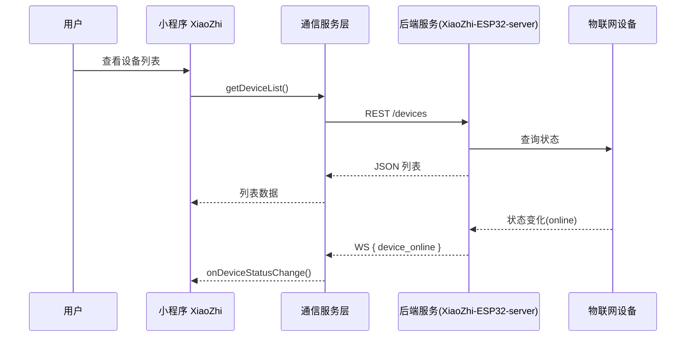

<!-- status: draft -->
# AI-XiaoZhi End-to-End Demo 需求与架构说明

> 本文档为"AI-XiaoZhi"项目在 Tianting-Lite 中的首个业务闭环 Demo 说明书，供产品负责人补充和最终确认。

## 1. 项目背景
1. XiaoZhi = XXX（请补充一句话的业务描述）。
2. 目标：在 Tianting-Lite 的自动化流水线上，演示"需求 → 任务分解(OES) → 代码生成 → 单测/基准 → Docker Compose 部署 → Web/小程序交互"的完整闭环。

### 1.1 现状回顾
硬件：ESP32 + 已改固件，可连本地 Python Server。
后端：基础连接/管理 OK，Coze 智能体已对接。
欠缺：
1) 面向客户的小程序 / App；
2) 后端高并发 & 低延迟重构；
3) 统一数据层；
4) 记忆系统升级。

### 1.2 EPIC 拆分与 Stream
> 以下内容依据历史讨论整理，后续可在 OES 任务卡中进一步拆解到 Story 级（≤4h）。

| Stream | 目标 | 主要任务包（示例） |
|--------|------|--------------------|
| **A. Mini-Program Frontend** | 提供聊天 / 配网 / 情绪面板 | • 需求 & UI 原型<br/>• 微信小程序 Skeleton<br/>• Chat 界面 WebSocket/MQTT SDK<br/>• 设备绑定 & OTA 页面 |
| **B. API & Gateway Backend** | 高并发、低延迟、统一鉴权 | • API 网关 (FastAPI + Uvicorn workers)<br/>• 会话 & 设备表设计<br/>• Async I/O + 缓存层 (Redis)<br/>• 压测 & 指标看板 |
| **C. Memory Upgrade** | MemoryHub 四层混合记忆 → V2.1 | • Layer-3 对话分片 & TTL<br/>• Layer-4 Neo4j 子图<br/>• Summarization 任务 & 存储策略 |
| **D. Connectivity** | WebSocket → MQTT 迁移 | • Mosquitto 部署脚本<br/>• ESP32 firmware param 更新<br/>• Server topic router |
| **E. Observability** | 全链路延迟 < 300 ms | • Prometheus Exporters<br/>• Grafana Dashboard 模板<br/>• Alert 规则 |

> 并发 & 调度：Dispatcher 先按 Stream 串行拆分，再对内部 Story 控制 `max_parallel`。

### 1.3 产品定位与目标用户
- **产品形态**：AI 情感陪伴潮玩（桌面类或手持类），强调"心理学 & 情感治愈"而非恋爱模拟。
- **目标客群**：25–35 岁单身男性（亚文化、二次元/数码爱好者），关注情绪价值与社交谈资。
- **差异点**：
  1. 垂直化心理学陪伴脚本（压力舒缓、工作复盘、睡前冥想）。
  2. **潮玩属性**——实体可收集/展示；盲盒涂装、限定款。
  3. **社交扩展**——设备互相感应触发"对话/对战/合作任务"，增强线下社交破冰。

### 1.4 功能构想（软件配套）
| 模块 | 核心功能 | 备注 |
|------|----------|------|
| Mini-Program / App | 首次配网、实时聊天 UI、情绪面板(日志/曲线)、固件 OTA | 微信小程序为首发渠道;
Native App（二期）|
| 用户社区 | 话题广场、使用心得、战报分享、配件商城 | 需账号体系；支持 Markdown；图片审核|
| 近场互动 | 设备遭遇 → 自动触发"交流/对战/合照" | 技术选项：NFC tag handshake、BLE 广播、局域网发现|
| 后端 Gateway | 高并发聊天转发、鉴权、会话存储、设备状态订阅 | FastAPI + Redis；WS / MQTT 代理|
| MemoryHub V2.1 | 对话分层缓存、情绪标签索引、长期记忆沉淀 | 与 Tianting 四层记忆对齐|

---
### 1.5 新增 Stream
| Stream | 目标 | 主要任务包（示例） |
|--------|------|--------------------|
| **F. Social Community** | 构建小程序内用户社区 | • 话题/帖子 API 设计<br/>• 社区首页 UI<br/>• 图片审核 & 举报流程 |
| **G. Proximity Interaction** | 近场感应交互（NFC/BLE/局域网） | • 技术选型 & 原型<br/>• ESP32 固件修改支持广播/扫描<br/>• 服务端事件路由 & 小程序动效 |

> F&G Stream 可在核心聊天功能稳定后并行开发。

### 1.6 虚拟形象 & 对战玩法构想

#### 1.6.1 Live2D / 3D 形象实现
| 方案 | 技术栈 | 适用端 | 说明 |
|------|--------|--------|------|
| **Live2D Cubism + WebGL** | PixiJS + live2d.js | 微信小程序、H5 | 资源体积小，2D 纸片效果；MVP 可用开源模型(BiliBili VTuber demo)。|
| **Spine/Lottie 动画** | spine-player / lottie-player | 小程序、原生 App | 动画帧合成，性能更优；与 UI 容易整合。 |
| **Three.js 低面数 3D** | Three.js + glTF | 原生 App (未来) | 真 3D、可换装；初期用低面数模型控制性能。 |

> MVP 建议：Live2D 占位模型 + 两套表情 (happy/neutral)，后续迭代换官方 IP 形象。

#### 1.6.2 对战/互动机制候选
| 模式 | 灵感来源 | 交互流程 | 技术要点 |
|------|----------|----------|----------|
| **情绪对撞 (Rock-Paper-Scissors 变体)** | 宝可梦招式克制 | A 设备广播情绪标签(🎉/😐/😴) → B 接收并随机/策略回应 → App 计算胜负 & 奖励心情值 | BLE/Broadcast + 云判定，玩法轻量。 |
| **技能卡片回合制** | Hearthstone Mini | 用户在 App 选 3 张卡（鼓励/吐槽/陪练） → 设备遇见广播 CardID → 云端模拟回合 → 推送战报 | MQTT 低延迟；卡片数据维护在后端。 |
| **合作任务 (Mood Sync)** | 任天堂 3DS 牵手 | 两设备握手成功 → 触发 5 分钟同步呼吸/冥想引导 → 完成奖励纪念徽章 | 需要精准时间同步；音频指导在 App 端播放。 |

硬件连接选型：
1. **BLE 广播 + 手机转发**：设备间用 BLE 广播 ID，手机 App 监听并通知服务器。优点：无需改动 WiFi 协议；功耗低。 
2. **ESP-NOW**：ESP32 自带近场 P2P，<10ms 延迟；缺点：需要固件升级，且与 WiFi 互斥。 
3. **NFC Tap**：最强线下仪式感，但需要额外 NFC 芯片或使用手机 Tap→服务器 Relay。

> 建议 MVP 选 **BLE 广播**：只需在 ESP32 增加 `nimBLE` 广播；小程序可在后台扫描（安卓）或通过蓝牙插件。服务器判定后把战斗结果通过 WS/MQTT 推送两端。

---

### 1.7 卡片对战大框架（待细化）
> PO 已确认整体方向，详细规则待天庭验证阶段再设计。

1. **实体载体**：PVC/NFC 对战卡 + 加密 QRCode；一卡一 Token。  
2. **激活流程**：小程序扫码/NFC → `/cards/activate` → 服务器绑定用户 & 下发技能 JSON → 设备同步。  
3. **对战触发**：设备 BLE/NFC 握手成功 → 小程序/服务器发起对战房间。  
4. **基础玩法**：回合制技能比拼（攻击/防御/辅助），战斗结果上传社区生成战报。  
5. **安全与公平**：服务器裁定胜负；技能冷却 & 使用次数在云端校验。  

> TODO（设计阶段）
> - 具体技能数值与克制关系
> - 卡片稀有度与掉落/购入逻辑
> - PVE 副本 / 沙盒 AI 逻辑
> - 社区排行榜与奖励系统

---

## 2. 高层目标与验收标准
| 编号 | 目标 | 定量指标 | 验收方式 |
|------|------|----------|----------|
| T-1 | 端到端自动交付 | `tianting run demo:xiaozhi` 一键完成编排、测试、打包 | CLI 输出 0 error |
| T-2 | 实时设备状态推送 | WebSocket 推送延迟 < 500 ms | Benchmark 脚本 & 手动观察 |
| T-3 | 多端一致数据 | 小程序 / Web Dashboard 同步率 100 % | E2E 测试脚本 |
| T-4 | 文档 & 任务卡完整 | Docs 状态 = done；tasks/demo-04 status = completed | CI AJV 校验 |

> *请 PO 在此表补充/修改业务指标。*

## 3. 场景流程概览


## 4. 技术架构
1. **前端**：微信小程序 + 可选 Web Dashboard（React）。
2. **通信服务层**：`deviceService.js` / `websocketService.js` / `apiService.js`，屏蔽具体协议。
3. **后端**：Python FastAPI，HTTP + WebSocket；将来可替换为 Java Service。
4. **数据存储**：SQLite (Core)、JSONL (Application)、内存 (Session)。
5. **CI/CD**：GitHub Actions + Tianting-Lite verify-all pipeline。

## 5. 分阶段计划
| Phase | 里程碑 | 主要任务 | Owner | 预计用时 |
|-------|--------|----------|-------|----------|
| P1 | WebSocket 能力 | 后端 WS 推送、定义消息格式 | ClaudeCode | 1d |
| P2 | 通信服务层 | services 目录搭建、全局状态管理 | ClaudeCode | 2d |
| P3 | UI 重构 | 页面改造、订阅机制 | ClaudeCode | 2d |
| P4 | E2E 测试 | Playwright / pytest-compose | O3 | 1d |
| P5 | 文档 & 交付 | CHANGELOG、Roadmap、task status 更新 | O3 | 0.5d |

> *周期与 owner 请 PO 审核后确认。*

## 6. 消息格式（示例）
```json
{
  "event": "device_online",
  "data": {
    "deviceId": "dev-001",
    "deviceName": "客厅的小智",
    "timestamp": "2025-07-10T12:34:56Z"
  }
}
```

## 7. 风险与缓解
1. **WS 连接不稳定** → 实现指数退避重连；离线缓存。
2. **设备模拟** → 提供 ESP32 模拟器脚本；CI 里跑 headless 模拟。
3. **依赖升级** → 使用 `requirements-lock.txt` 固定版本。

## 8. 待补充清单
- [ ] 业务 KPI & 角色描述（PO）
- [ ] 详细 API 列表（ClaudeCode）
- [ ] 设备虚拟化脚本路径（ClaudeCode）
- [ ] UI 线框图 / Figma 链接（设计）

---
更新时间：{{TODO:INSERT_DATE}} 