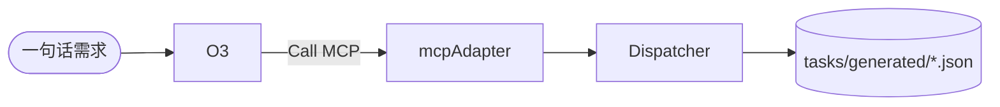

# Dispatcher – Design
<!-- status: done -->

## 架构概览

## MCP Adapter
1. 依赖 Sequential-Thinking MCP (`/ask_sequential`).
2. 流程：
   - 接收 `goal` 字符串。
   - 调用 MCP，获得步骤数组。
   - 根据步骤生成子任务草稿 JSON，并写入 Layer-2 MemoryHub & `tasks/generated/`。
3. 错误处理：
   - HTTP 失败重试 3 次。
   - 超时 >30s 时返回单步 fallback 任务。 