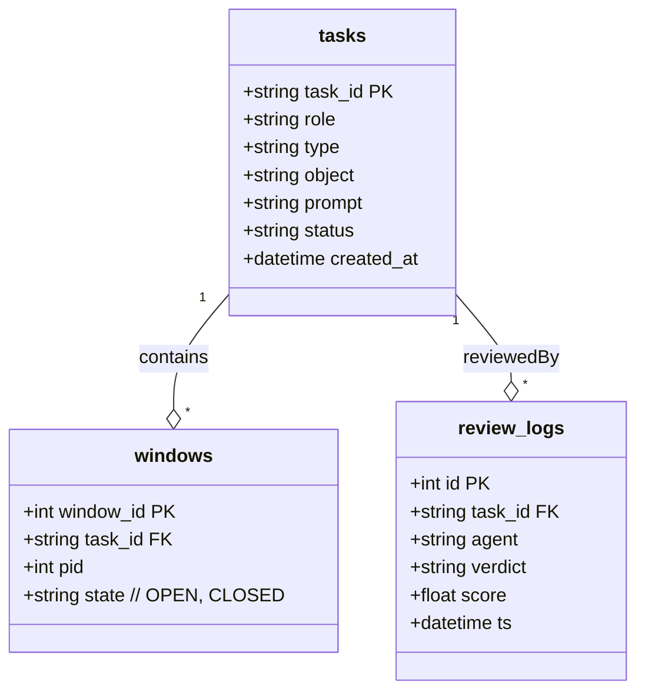

# MemoryHub – Design (Stub)

``mermaid
flowchart TD
  client -- API --> dao(SQLite)
  client -- API --> dao(JSONL)
  dao(JSONL) -- build --> RoaringBitmapIndex
```

> TODO: 移植 05-detailed-design.md §MemoryHub 内容到此处。 

## Data Model (SQLite Layer)



表说明：
- **tasks**：Layer-2 主表，记录所有 OES 任务及当前状态。
- **windows**：Launcher 产生的窗口实例，用于崩溃恢复。
- **review_logs**：AI 评审输出存档，供权重更新与审计。

> MemoryHub 通过 SQLite 触发器保障状态迁移合法，并将操作日志写入 Layer-0 JSONL 供审计备查。 