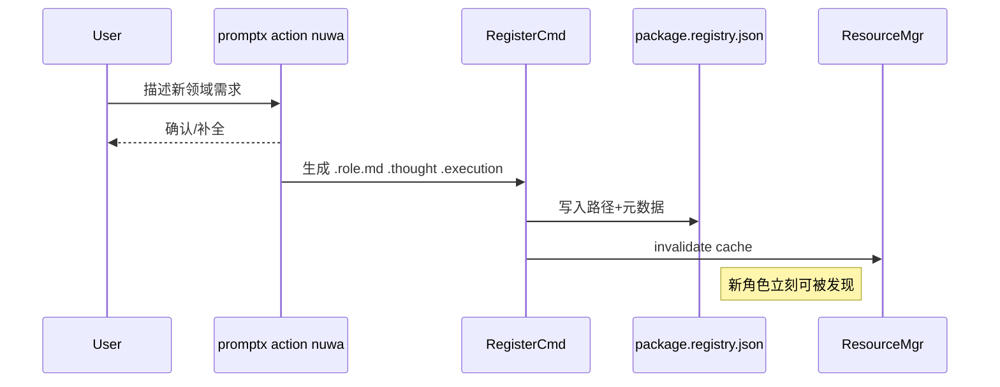

## PromptX 内核研究笔记

> 专注记录 PromptX 自身的代码结构、角色系统、女娲生成链路等**纯技术细节**，供后续快速查阅。与 Tianting 业务集成、运维、版本策略等内容请写入 `tianting-new.md`。

### 1. 目录与核心模块速览
- `prompt/`：角色资源（DPML 文件 + thought + execution）
- `src/lib/core/resource/ResourceManager.js`：解析 `@package://` 路径并发现角色/工具
- `src/lib/core/dpml/DPMLContentParser.js` + `SemanticRenderer.js`：DPML → System Prompt
- `src/package.registry.json`：系统注册表，新增角色必须写入
- `src/lib/core/pouch/commands/`：CLI/MCP 命令集合（`ActionCommand`, `RegisterCommand` 等）

### 2. 女娲角色创建链路

### 3. 关键源码入口
| 功能 | 文件 | 行数段 |
|------|------|-------|
| 角色注册逻辑 | `src/lib/core/pouch/commands/RegisterCommand.js` | 40-160 |
| 角色激活逻辑 | `src/lib/core/pouch/commands/ActionCommand.js` | *查看 parseRole* |
| DPML 渲染 | `src/lib/core/dpml/SemanticRenderer.js` | 全文件 |
| Nuwa 执行流程 | `prompt/domain/nuwa/execution/role-generation.execution.md` | 全文件 |

---
> 最后更新：2025-07-04
